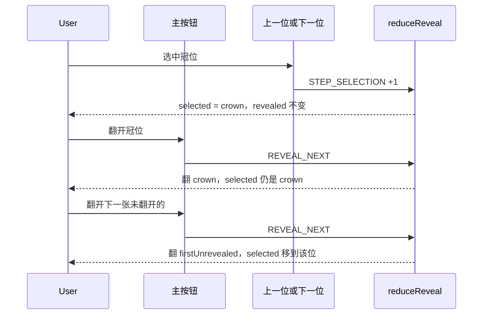
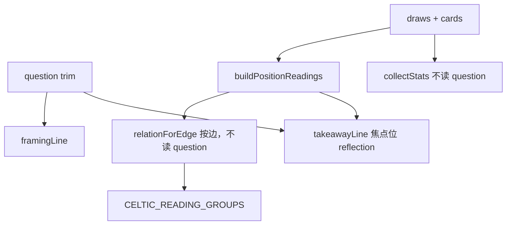

# 烛下塔罗审计修复实施计划

| 项 | 内容 |
| --- | --- |
| 作者 | （待填） |
| 日期 | 2026-09-24 |
| 状态 | Draft |
| 范围 | 实现修复。不改写 `docs/design.md` 的产品愿景 |
| 读者 | 将在本仓库落地修复、并补上 vitest / Playwright 的工程师 |

本文把 2026-09-24 走查出的 30 项缺陷收成可编码的行为、纯函数、句式和测试矩阵。生产愿景仍以 `docs/design.md` 为准。与该文档冲突的地方只限本文「Key Decisions」列出的呈现层修正，实施 PR 不要去重写 `docs/design.md`。

---

## Overview

走查确认：桌面凯尔特十字的控件叠在牌面上；主按钮「翻开这一张」翻的是牌序里第一张未翻的牌，不是当前选中位；写下的问题从未进入 `composeReading`，关系句和「为什么这样读」对读者不透明；放弃文案、对话框、焦点环、900px 视口上的洗切主操作、保存勾选、本机历史打开方式，以及若干页面文案与牌面标注，和用户实际看到的不一致。

修复保持 v1 约束：无账号、无付费、无 LLM、客户端洗牌、`fy-hkdf-2` 不变。问题只做镜片式框定，不进入抽牌、切牌或关系规则的选择。几何、揭示、保存耦合、历史链接、阵位 query、元素中文名都落成纯函数，由现有 vitest 锁住；浏览器才能看见的重叠、折叠和对话框，只在已有 `e2e/` 上补断言，不新开一套布局系统。

---

## Background & Motivation

### 当前状态

仪式是 `src/lib/ritual-machine.ts` 的 `reduce`。阶段为 `enter → question → spread → shuffle → cut → deal → reveal → read → close`。洗牌在 `SHUFFLE_COMMITTED` 进入 `cut` 时封存；`CONFIRM_CUT` 用 `cutDeck` + `drawTop` 一次抽完。揭示不改 `draws`。逆位开关在 `shuffleDeck`（`src/lib/shuffle.ts`）里强制正位。这些行为是正确的，本文所有 PR 都不得改它们。

解读在 `src/lib/reading.ts`。`composeReading(spreadId, draws, cards)` 没有问题参数。`RitualApp` 只把问题当作 `ReadingView` 的「问：…」回声。`relationForEdge` 的 `R2_TENSION` 写「一端…另一端…」，不写位置名。`ReadingView` 把 `ruleId` 和英文 `positionId` 直接渲染出来。凯尔特综合段的边分组和 UI 的 `position.group` 不是同一张表：`foundation->present` 被放进「当下核心」，而 `hopes_fears` 这张牌的 UI 分组是「内外视角」，它的关系句却在「条件性收束」。`focusPositionId` 为 `self`，所以「留给自己」是自我牌的 `reflection`，读者会把它当成整阵结局。

桌面凯尔特布局由 `CELTIC_SLOT_PERCENT`（`src/data/lexicons/zh-1/spreads.ts`）加 `Tableau.module.css` 决定。`.celtic` 高 1100px、槽宽 96px、`--card-ratio: 5 / 8`。`challenge` 与 `present` 同锚点，`.crossingSlot` 的 `z-index: 3` 盖住 `.presentSlot`（`z-index: 1`）的整棵子树，所以 `left: -58px` 的 `.presentAccess` 即使自己写了 `z-index: 4` 也在父级层叠上下文之下。右柱四张牌的「翻开这一张」在牌与牌之间。`Tableau` 同时挂上手机步进器和桌面棋盘，靠 `display: none` 藏起其中一套；藏起来的 `Card3D` 仍有自己的正逆状态和按钮。

`REVEAL_NEXT` 调用 `firstUnrevealed`，再走 `REVEAL_POSITION`，因此选中位被拉回牌序中的下一张未翻牌。`COPY.revealNext` / `revealPrev` 未使用。主按钮和每张牌的按钮都用 `COPY.revealAction`（「翻开这一张」）。

`ConfirmModal` 是 `main.shell` 里、各 `<section className={styles.stage}>` 之前的兄弟节点，不是 `.stage` 的子节点。它 `position: fixed; inset: 20% 12%`，没有遮罩，所以框外的「继续选阵」仍可点。这不是 `.stage` 动画 `transform` 造成的包含块。`COPY.abandonConfirm` 在 `question` 阶段也声称牌序已封存。`#stage-title` 是通栏 `h2`，`:focus-visible` 的金线框住右上角绝对定位的「放弃本局」。`src/` 里没有 `scrollIntoView`。阶段变化只 `focus()`。切牌确认按钮被点中时，是浏览器把该按钮滚进视口；换阶段后标题可以停在视口上方。

`TableScene` 的照片最宽 920px、16:9，洗切的主按钮在照片下面。1440×900 下按钮在首屏外。切牌 `hand` 恒为 `'cut'`（`tableHandMode`），滑杆不改照片。比例示意在折叠的 `details` 里，且 `visibleCutCounts` 把牌叠上限卡在 10，默认切口 39 与 20 的示意叠数相同。

`SET_SAVE_OPTIONS` 原样写入两个布尔值。`savePrivate === true && saveDevice === false` 时，`CLOSE_ACK` 的 `receipt.saved` 为 false，`pushHistory` 不运行，私密勾选没有效果。

`HistoryList` 的「打开」用 `encodeReading`，`q: item.question ?? null`，问题进入 `/r/` 且没有分享页那道警告。列表没有日期、没有是否含问题、没有牌名。「清空全部」直接 `clearHistory()`。「查看这几张牌的词条」只链到 `draws[0]`。

`/read` 不读 query。首页牌阵列表不是链接，`COPY.homeMeta` 只写三张牌的时长。选中阵只有边框色变化。页头「开始」是指向 `/read` 的 `Link`；`shouldConfirmLeave` 对 `/read → /read` 返回 false，仪式进行中点击等于无操作。页头「关于」打开标题为「方法」的 `/about`。`COPY.crisisResources` 未渲染，方法页「求助」没有具体号码。

`/r/[readingId]` 的 `ReadingView` 没有牌面图，并在 `Footer` 之外再画一次 `COPY.footerDisclaimer`。牌典详情把 `element` / `astrology` 的英文枚举直接印出。`/read/preview` 用 `CardBack` 占位，图说却写愚者、圣杯八、星币王后。关于、隐私、404、牌详情用 inline style。`asset-issues.ts` 仍把四张小牌标为计数可疑；牌面英文标题里的句点是像素，不是 `nameEn`。

### 痛点

用户无法按自己点中的位置翻牌，也无法在 900px 高的桌面上看见洗牌或切牌的主操作。问题被当成已经参与解读，实际只被复读。本机历史的「打开」会把问题放进可被服务端渲染的 URL。对话框不模态。这些都不是文案注释能修的。

---

## Goals & Non-Goals

### Goals

1. 主翻牌动作翻当前选中且未翻的牌；步进只改选中，不翻牌。桌面与手机只挂一套 `Card3D`。
2. 凯尔特十字的揭示控件不落在横跨牌的轴对齐包围盒内，右柱按钮不与下一张牌面相交。间隙在纯函数里 ≥ 8px。
3. 问题以固定中文句式进入框定和收束，不改变抽到的牌、规则 id、牌义正文。
4. 每条关系句包含两个中文位置名。「为什么这样读」是中文规则说明，测试仍能读到 `ruleId`。
5. 凯尔特四段分组只有一份表，每条关系句只出现在一个段里。「留给自己」明确来自「自我」，不是「结局」。
6. 放弃文案按封存前后分支。对话框进入 top layer，框外不可操作。章节焦点环不再套住「放弃本局」。阶段变化把 `#stage-title` 滚进视口。
7. 1440×900 下洗牌主按钮、切牌滑杆、比例和「让牌落在桌上」无需滚动即可见。滑杆每一步都改变可见比例。照片保持静止。
8. `savePrivate` 不能在 `saveDevice === false` 时为 true。本机历史打开不把问题写入 URL。清空全部要确认。词条链接覆盖每一张抽出的牌。
9. 页头、页脚、方法页 `h1` 都叫「方法」。`/read` 上的「开始」在仪式已离开 `enter` 时先确认再重置。首页可深链预选阵。
10. 分享页画出牌面并只显示一次免责声明。问题阶段显示指向方法页求助节的短句。牌典用中文元素名和星对应名。四张计数项以实施者的目视复核结果关闭或保留。句点标题记入 `asset-issues.ts`，不改 jpg、不改 `nameEn`。

### Non-Goals

- 不重写 `docs/design.md`，不引入账号、支付、LLM、新运行时依赖、Pages Router。
- 不改 `shuffleDeck`、`cutDeck`、`drawTop`、`fy-hkdf-2`、分享协议 `v: 1`、`lexiconVersion: 'zh-1'`、历史 localStorage 形状、`HISTORY_LIMIT`。
- 不把问题做语义分类、关键词加权或敏感配牌。关系规则的优先级和命中条件不变。
- 不手改 78 张 jpg，不重新生成桌面照片，不用 OCR。
- 不把 `/read/preview` 放进导航或站点地图；保持 `noindex`。
- 不把关于、隐私、404、牌详情改成另一套视觉。只套现有 token。
- 不在 `cut` 及之后提供「返回」来解除封存。退出仍是放弃。
- 不为旧分享链接保留旧综合句的第二套模板（见 Key Decisions）。

### 不得回退的行为

- 封存发生在切牌之前；揭示不改 `draws` 里的 `cardId` / `orientation`。
- `reversals === false` 时 `shuffleDeck` 全部正位。
- 逆位牌自动转正后仍有「逆位」字样；「看落牌方向」把画面转 180°。
- 分享勾选问题之前有 `COPY.shareQuestionWarning`。留笺永不进入 `ReadingPayloadV1`。
- `sessionStorage` 可恢复；历史最多 20 条；只有 `savePrivate` 时历史才写入 `question` / `note`。
- `CLOSE_ACK` 只有 `saveDevice` 为真时 `receipt.saved` 为真，`pushHistory` 才运行。

---

## Proposed Design

### 缺陷对照

| # | 缺陷 | PR |
| --- | --- | --- |
| 1 | 桌面凯尔特十字遮挡 | 2 |
| 2 | 主按钮翻错张；两套按钮同文案 | 1 |
| 3 | 问题不进解读 | 3 |
| 4 | 关系句不点名位置；展示 ruleId | 3 |
| 5 | 未封存却说已封存；对话框不模态 | 4 |
| 6 | 章节焦点环套住放弃 | 4 |
| 7 | 900px 高视口主操作在折线外；切牌滑杆不改变可见比例 | 5 |
| 8 | 私密勾选可脱离本机保存 | 6 |
| 9 | 历史打开把问题写入 URL；清空无确认 | 6 |
| 10 | 词条只链第一张 | 6 |
| 11 | 三张综合粘连；统计不点名 | 3 |
| 12 | 凯尔特分段两套标准 | 3 |
| 13 | 逆位徽章盖住牌面标题 | 2 |
| 14 | `dealSource` 压住中央牌 | 2 |
| 15 | 换阶段不滚动 | 4 |
| 16 | 问题阶段、洗牌 idle 没有返回 | 4 |
| 17 | 首页牌阵不可点；选中态弱；无深链 | 7 |
| 18 | 分享页无牌面、免责声明两次 | 8 |
| 19 | 「关于」/「方法」不一致 | 7 |
| 20 | 「开始」在 `/read` 上无操作 | 7 |
| 21 | 求助文案未渲染、无具体资源 | 8 |
| 22 | 照片花饰与几何牌背被当成同一物体 | 5 |
| 23 | 牌面英文标题多一个句点 | 9 |
| 24 | 元素、星对应显示英文代码 | 8 |
| 25 | 四张小牌计数说明可能过时 | 9 |
| 26 | 清空全部无确认（并入 9） | 6 |
| 27 | 字数只在接近上限时出现；留笺无字数 | 4 |
| 28 | 手机步进器只有序号 | 2 |
| 29 | 预览页牌背与图说不符 | 8 |
| 30 | 静态页 inline style | 8 |

### 1. 翻牌控制模型

`reduceReveal` 里 `REVEAL_NEXT` 改为：选中位合法且未翻则翻它，并且不改到别的位置；否则翻 `firstUnrevealed`（`SPREADS[spreadId].positions` 的数组顺序，即发牌顺序），选中位移到那一张。全部已翻则状态不变。

```ts
export function stepPositionId(spreadId: SpreadId, currentId: string, delta: -1 | 1): string {
  const ids = SPREADS[spreadId].positions.map((position) => position.id);
  const index = Math.max(0, ids.indexOf(currentId));
  const next = index + delta;
  if (next < 0 || next >= ids.length) return ids[index] ?? ids[0];
  return ids[next];
}
```

新事件 `{ type: 'STEP_SELECTION'; delta: -1 | 1 }` 只在 `reveal` 阶段生效，只改 `selectedPositionId`，不改 `revealed`，不改 `draws`。两端夹住，不循环。`read` 阶段忽略该事件。

`REVEAL_POSITION` 的语义不变：翻指定位，选中该位，满员则进入 `read`。

文案（`src/i18n/zh-CN.ts`）：

```ts
revealAction: '翻开',
revealSelected: (name: string) => `翻开${name}`,
revealNextClosed: '翻开下一张未翻开的',
stepPrev: '上一位',
stepNext: '下一位',
```

删除未使用的 `revealNext`（「下一位」）和 `revealPrev`（「上一位」），由 `stepNext` / `stepPrev` 取代，避免两套步进文案。牌上短按钮的可见字用 `revealAction`。主按钮在 `RitualApp`：选中未翻时用 `revealSelected(name)`，选中已翻且仍有未翻牌时用 `revealNextClosed`，全部翻完后不渲染。主按钮带 `data-reveal="primary"`。它 `dispatch({ type: 'REVEAL_NEXT' })`。步进按钮 `dispatch({ type: 'STEP_SELECTION', delta })`，到达端点时 `disabled`（用 `stepPositionId` 的返回值是否等于当前 id 判断）。

因此：手机上选中「冠位」再按主按钮，翻的是冠位，选中停留在冠位。再按主按钮，才翻发牌顺序上的第一张未翻牌（通常是「现状」）并把选中移过去。牌上的「翻开」仍是 `REVEAL_POSITION`，和主按钮在「该牌正是选中且未翻」时结果相同。



### 2. 只挂一套牌面

`Tableau` 在 `useClientReady` 之后才出现（`RitualApp` 已如此），可以用 `useSyncExternalStore` 订阅 `(min-width: 1024px)`。`getServerSnapshot` 返回 `false`。`dealing === true` 时只渲染棋盘，不渲染步进器，牌上不放揭示按钮（现有 `.dealingBoard` 的 `pointer-events: none` 保留）。非发牌且宽度 &lt; 1024 时只渲染 `.step`。否则只渲染棋盘。禁止两套 `Card3D` 同时挂载。CSS `display: none` 不再当作唯一手段。

手机步进按钮的可见文字是 `${drawOrder} ${nameZh}`，例如 `5 冠位`，不是只有序号。`min-width` / `min-height` 仍为 44px，一行放不下就换行。不另写 `aria-label`：可访问名就是这段可见文字。选中项 `aria-current="true"`。`e2e/lint-regressions.spec.ts` 里 `name: '2', exact: true` 改为 `name: '2 现在'`，`3` 改为 `3 未来`。手机冠位用例放在 PR 2 的 `e2e/celtic.spec.ts`：选可见文字 `5 冠位` 的按钮，按主按钮后，步进器上方已有的 `<p>`（`冠位 · 5/10`）仍含「冠位」。这条断言不放进 PR 1，因为 PR 1 还没有这段可见文字。

### 3. 凯尔特几何

删除 `CELTIC_SLOT_PERCENT` 和 `.presentAccess`。唯一几何来源是新文件 `src/lib/celtic-layout.ts`。`Tableau` 用它的矩形写 inline style。测试锁的是函数，不是另一份抄出来的 CSS 数字。

```ts
export type Rect = { x: number; y: number; w: number; h: number };

export type CelticSlotGeom = {
  positionId: string;
  face: Rect;
  label: Rect;
  reveal: Rect;
  rotated: boolean;
};

export type CelticLayout = {
  board: { w: number; h: number };
  card: { w: number; h: number };
  slots: CelticSlotGeom[];
};

export function rectsIntersect(a: Rect, b: Rect): boolean;
export function celticSlotLayout(
  boardWidth: number,
  options?: { interactive?: boolean },
): CelticLayout;
```

`interactive` 默认 `true`。发牌和揭示共用同一套骨架：同一宽度下 `face` 与 `label` 完全相同，节距也相同。`interactive: false` 只把每张 `reveal` 设为 `{ x: 0, y: 0, w: 0, h: 0 }` 并且不画按钮，不把按钮占用的 4px + 44px 从节距里拿掉。`DEAL_DONE` 因此只出现按钮，不把右柱整列挪走。`challenge.face` 永远是旋转后的轴对齐包围盒（宽 = 牌高，高 = 牌宽），中心与现状牌面重合，所以这两张 face 必须相交。不要为了让「face 两两不相交」把横跨牌挪开。

测量宽度写在 `Tableau`，不要只写在风险表里。对 `.celticWrap` 使用 `ResizeObserver`。第一帧 `clientWidth` 为 0 时用 `Math.min(720, document.documentElement.clientWidth - 48)`，不要在手机上先假定 720。非发牌且宽度 &lt; 1024 不调用这个函数，走步进器。`dealing === true` 时即使视口是 375 或 390 也调用它，并传入 `{ interactive: false }`。

牌高永远是 `Math.round(cardW * 8 / 5)`，对应 `--card-ratio: 5 / 8`。牌宽从 `width >= 680 ? 90 : width >= 520 ? 72 : 56` 起，每次减 2，直到行宽 + 16 ≤ `boardWidth`，且 `cardW >= 36`。发牌和揭示用同一条缩牌规则。行宽是 `cardW + 16 + cardH + 16 + cardW + 24 + cardW`（过去、横跨包围盒、未来、右柱），左右边距相等。标签高 22。每张牌面下依次留出 8px、标签、4px、44px、8px，再是下一张牌面。节距 = 牌高 + 86，两种 `interactive` 都是这个数。边与边相贴不算相交。不返回 `presentAccess`。

这样标签和徽章都在牌面之下，而不是塞进原来 16px 的牌面间隙。右柱和冠位不再把 22px 标签压进下一张牌。720 宽、`interactive: true` 时牌宽 90、牌高 144、行宽 470、左缘 125、棋盘高 960。下表是必须被单测锁住的矩形，不要再写一套百分比。

| 位置 | face | label | reveal |
| --- | --- | --- | --- |
| crown | 258, 24, 90×144 | 258, 176, 90×22 | 258, 202, 90×44 |
| outcome | 505, 24, 90×144 | 505, 176, 90×22 | 505, 202, 90×44 |
| past | 125, 254, 90×144 | 125, 406, 90×22 | 125, 432, 90×44 |
| present | 258, 254, 90×144 | 231, 406, 68×22 | 231, 432, 68×44 |
| challenge | 231, 281, 144×90 | 307, 406, 68×22 | 307, 432, 68×44 |
| future | 391, 254, 90×144 | 391, 406, 90×22 | 391, 432, 90×44 |
| hopes_fears | 505, 254, 90×144 | 505, 406, 90×22 | 505, 432, 90×44 |
| foundation | 258, 484, 90×144 | 258, 636, 90×22 | 258, 662, 90×44 |
| environment | 505, 484, 90×144 | 505, 636, 90×22 | 505, 662, 90×44 |
| self | 505, 714, 90×144 | 505, 866, 90×22 | 505, 892, 90×44 |

现状牌面 x = 258，不是横跨包围盒的左缘 231。横跨包围盒中心与现状牌面中心 (303, 326) 重合。现状和横跨的标签并排，宽 68+8+68，刚好等于包围盒宽 144，所以不会伸进过去或未来的标签列（间隙 16）。右柱四张的标签底到下一张 face 顶的间隙是 56（中间还有按钮），按钮底到下一张 face 顶是 8。冠位按钮底 246，现状 face 顶 254，间隙 8。徽章画在标签矩形内部，因此也在对应 face 之下。

720 的表是 `interactive: true`。`celticSlotLayout(720, { interactive: false })` 的 `face` 和 `label` 与表相同，每张 `reveal` 为 `{0,0,0,0}`。`rectsIntersect(present.face, challenge.face)` 在 320、360 和 720 都为 true。除这一对以外，face 两两不相交，且垂直相邻的非交叉牌间隙 ≥ 8。`label` 不与自己的 face 相交，也不与下一张非交叉 face 相交；有尺寸的 `reveal` 同样如此，间隙 ≥ 8。`challenge.face` 不与现状、横跨的 `label` / `reveal` 相交。520、640、680、760 不要求表中的绝对坐标，但遵守同一骨架，棋盘宽 ≤ 传入宽度。320 和 360 在 `{ interactive: false }` 下还要求 `board.w` ≤ 传入宽度、每张 face 落在棋盘内、`reveal` 宽高为 0。这覆盖 375 和 390 的发牌棋盘，发牌仍是十字，不是把横跨牌挪开。现有 `e2e/table-layout.spec.ts` 是在揭示之后、手机已经换成步进器时才检查 `scrollWidth`，锁不住发牌溢出，所以这条不变量以单测为准。

`Card3D` 增加可选 `controlsRoot: HTMLElement | null`。凯尔特互动棋盘把标签（含徽章）、`data-part="reveal"` 按钮、逆位切换按钮 `createPortal` 到棋盘末尾的控件层（`z-index: 5`，在所有牌面之后）。翻转和正逆状态仍留在 `Card3D`。三张牌的横排和手机步进器不传 `controlsRoot`。发牌阶段不门户、不渲染揭示按钮。

每个牌位根节点 `data-position={id}`，牌面节点 `data-part="face"`。现有 `e2e/table-layout.spec.ts` 的右柱断言改为：`self` 的 reveal 矩形与 `environment` 的 face 矩形不相交，并沿 `outcome → hopes_fears → environment → self` 检查按钮底 ≤ 下一张 face 顶。另外断言 `[data-position="present"] [data-part="reveal"]` 与 `[data-position="challenge"] [data-part="face"]` 的包围盒不相交。纯函数测试是锁定源；这条 e2e 防止 inline style 没接上函数。不要新开 `e2e` 文件。

### 4. 逆位徽章与发牌源

`.badge` 不再 `position: absolute` 盖在 `.front` 上。已揭示且逆位时，徽章排在牌面下方的标签行里，与位置名同一行，画面旋转时徽章不转。没有位置名时也渲染这一行，保证「逆位」始终可见。正位不显示徽章。

```tsx
{(label || (revealed && reversed)) ? (
  <p className={styles.label}>
    {label}
    {revealed && reversed ? <span className={styles.badge} data-part="badge">{COPY.reversed}</span> : null}
  </p>
) : null}
```

凯尔特门户出去的标签行使用同一结构，徽章落在该槽的 `label` 矩形里。三张牌和步进器上，`e2e/lint-regressions.spec.ts` 的逆位用例断言可见徽章的 `y >= face.bottom - 1`。凯尔特不靠这条 e2e 证明标签没压到下一张牌，那由 `celticSlotLayout` 的矩形断言负责。

删除 `RitualApp` 中 `.dealSource` 节点、对应 CSS 和只为它存在的 `CardBack` import。各牌已有 `dealIn` 动画，不再叠一张 72px 的假牌。不要换成会压住中央牌的牌堆。

### 5. 解读引擎

`composeReading` 增加第四参 `question: string`，没有默认值。漏改调用点应在类型检查时失败，而不是静默变成空问题。问题 `trim` 后为空视为没有问题。空问题的行为由调用方传入 `''`，包括现有三参数测试改成的第四参 `''`。

```ts
export function composeReading(
  spreadId: SpreadId,
  draws: Draw[],
  cards: Record<string, CardLexicon>,
  question: string,
): ReadingDocument
```

`ReadingDocument` 增加 `question: string`（trim 后）和 `framing: string`。`ReadingView` 改为只接收 `doc`。删除独立的 `question` prop，避免再画一条「问：…」。

框定与收束，逐字如下。反射句用「」包住，避免和后面的说明粘连。

```ts
export function framingLine(question: string): string {
  const q = question.trim();
  if (!q) return '这次没有写下问题。下面是按牌位读这组牌，不是对某个具体问题的回答。';
  return `你问的是「${q}」。下面不回答这个问题，只把这组牌当作看它的一副镜片：牌义来自词库，不根据问题改写。`;
}

export function takeawayLine(question: string, focus: PositionReading): string {
  const q = question.trim();
  if (!q) return focus.reflection;
  const orient = focus.orientation === 'reversed' ? '逆位' : '正位';
  return `若把「${q}」放在「${focus.positionNameZh}」这个位置上看，${focus.nameZh}（${orient}）留给你的仍是词库里的这句自问。「${focus.reflection}」牌没有根据问题改写这句，也没有替你作答。`;
}
```

`relationForEdge`、`collectStats` 的签名不加问题。同一 `draws` 配两个不同问题，`relations`、`stats`、每位 `meaning` / `reflection` / `keywords` 必须深度相等。只有 `framing` 和 `takeaway` 不同。渲染用 React 文本节点，禁止 `dangerouslySetInnerHTML`。问题里的 `」`、`<` 不剥离、不改写，只 `trim`。

`R2_TENSION` 句式改为（条件表不变）：

```ts
text: `${left.positionNameZh}关乎${THEME_ZH[leftM.theme]}，${right.positionNameZh}关乎${THEME_ZH[rightM.theme]}；先读作需要协调的两种需求，而不是互相抵消。`
```

`R1`、`R3`、`R4` 已经含两个 `positionNameZh`，不改条件。每条 `text` 仍以 `。` 结尾。

```ts
export const RULE_WHY_ZH: Record<RelationHit['ruleId'], string> = {
  R1_REPEAT: '这两张牌的主题标签相同，所以读成同一个主题在两个位置重复出现，而不是两件无关的事。',
  R2_TENSION: '这两张牌的主题是一对需要协调的张力，所以先并置两种需求，不把它们读成互相抵消。',
  R3_TURN: '这两张牌的表达方式不同，且至少一端偏向内在、受阻或过度，所以读成表达方式的转换。',
  R4_BRIDGE: '这两张牌没有命中重复、张力或转换，所以只把两个位置的关键词并置，不合成同一个答案。',
};

export function whyForRelation(rel: RelationHit, positions: PositionReading[]): string {
  const left = positions.find((p) => p.positionId === rel.sourcePositionIds[0])?.positionNameZh;
  const right = positions.find((p) => p.positionId === rel.sourcePositionIds[1])?.positionNameZh;
  return `${left}与${right}：${RULE_WHY_ZH[rel.ruleId]}`;
}
```

`ReadingView` 的 `<details>` 渲染 `whyForRelation` 的返回值，不渲染 `ruleId`，不渲染 `sourcePositionIds`。`ruleId` 留在 `RelationHit` 上。

统计句（仍最多两条，优先级不变：逆位占比 ≥ 一半，然后大牌占比 ≥ 一半，然后唯一众数元素且 ≥ 2。单张仍无统计。并列元素仍不选胜者）：

```ts
`这组 ${n} 张里有 ${reversed} 张逆位（${reversedNames}），读作较多内在、受阻或过度的表达，仍需结合各牌分别理解。`
`这组 ${n} 张里有 ${majors} 张大阿尔卡纳（${majorNames}），象征更偏向阶段性主题，不只是日常细节。`
`元素更偏向${ELEMENT_ZH[element]}（${count} 张：${elementNames}）。`
```

名字按 `draws` 顺序用 `、` 连接，用词库 `nameZh`。`ELEMENT_ZH` 仍是「行动与意志」这一类倾向短语，不是牌典上的「火 / 水 / 风 / 土」。

三张 `synthesis`：两条关系句用 `\n` 连接，避免 `join('')` 把两句粘成一段。有统计时再加一个 `\n`，然后拼接统计句。没有统计时不要尾部换行。`ReadingView` 已按 `\n` 分段。

黄金样例（`reading-golden.test.ts` 的三张：过去愚者正位、现在圣杯八正位、未来星币王后逆位）两条边都是 `R2_TENSION`，无统计。无问题时：

```ts
doc.framing === '这次没有写下问题。下面是按牌位读这组牌，不是对某个具体问题的回答。'
doc.synthesis === '过去关乎开端，现在关乎放下；先读作需要协调的两种需求，而不是互相抵消。\n现在关乎放下，未来关乎维持；先读作需要协调的两种需求，而不是互相抵消。'
doc.takeaway === CARDS.cups_08.upright.reflection
whyForRelation(doc.relations[0], doc.positions) === '过去与现在：这两张牌的主题是一对需要协调的张力，所以先并置两种需求，不把它们读成互相抵消。'
```

有问题「我在这段关系里忽略了什么？」时，`relations` 与上式相同，并且：

```ts
doc.framing === '你问的是「我在这段关系里忽略了什么？」。下面不回答这个问题，只把这组牌当作看它的一副镜片：牌义来自词库，不根据问题改写。'
doc.takeaway === '若把「我在这段关系里忽略了什么？」放在「现在」这个位置上看，圣杯八（正位）留给你的仍是词库里的这句自问。「你已经知道满了也不够，还在等谁来允许你离开？」牌没有根据问题改写这句，也没有替你作答。'
```

调用点只有两处，都要显式传第四参。`RitualApp` 的 `useMemo` 在 `read` 传入 `state.question`，在 `close` 传入 `state.receipt.question`（这是本局收据，不是历史行上的可选字段）。`src/app/r/[readingId]/page.tsx` 传入 `payload.q ?? ''`。没有问题的测试传入 `''`。预览页不走 `composeReading`。

### 6. 凯尔特分组只留一张表

新常量放在 `src/lib/reading.ts`（或同目录 `reading-groups.ts`，由 `reading.ts` 再导出）。`ReadingView` 删除本地 `CELTIC_GROUPS`。

```ts
export const CELTIC_READING_GROUPS = [
  { id: 'core', title: '当下核心', positionIds: ['present', 'challenge'], edgeIds: ['present->challenge'] },
  { id: 'path', title: '来处与走向', positionIds: ['foundation', 'past', 'crown', 'future'], edgeIds: ['foundation->present', 'past->future', 'crown->outcome'] },
  { id: 'people', title: '内外视角', positionIds: ['self', 'environment'], edgeIds: ['self->environment'] },
  { id: 'close', title: '条件性收束', positionIds: ['hopes_fears', 'outcome'], edgeIds: ['hopes_fears->outcome'] },
] as const;
```

相对今天真正写进字符串的分配，唯一移动的边是 `foundation->present`：从「当下核心」改到「来处与走向」。`hopes_fears` 的 `SpreadPosition.group` 从 `'people'` 改为 `'close'`。测试要求每个 `position.group` 等于这张表里的 id，六条 `relationEdges` 各出现一次，位置 id 各出现一次。

```ts
export type ReadingGroup = {
  id: string;
  title: string;
  positions: PositionReading[];
  relations: RelationHit[];
};

export function readingGroups(doc: ReadingDocument): ReadingGroup[] | null;
```

非凯尔特返回 `null`。凯尔特 UI 按组渲染位置正文、该组关系句、该组的「为什么这样读」。不要再把 `doc.synthesis` 整段打出来。`buildSynthesis` 用同一张表：

```ts
`${group.title}：${group.edgeIds 对应 text 直接拼接}`
```

四段用 `\n` 连接。有统计时再 `\n` 接统计句。每个 `rel.text` 在 `synthesis` 里非重叠出现次数为 1。

「留给自己」仍用 `takeawayLine`，焦点仍是 `SPREADS.celtic.focusPositionId`（`self`），不改成 `outcome`。凯尔特在收束段下额外一行：`焦点位置：自我。这不是「结局」的判决。` 其他阵保持 `焦点位置：${nameZh}`。文案常量 `COPY.focusNotOutcome = '这不是「结局」的判决。'`。

三张和单张仍用「整阵线索」标题渲染 `synthesis`（按 `\n` 分段，key 用索引）加上每条边的 why。凯尔特仅当 `stats.length > 0` 时渲染「整阵线索」，内容只有统计句。现有 e2e 要的「当下核心」「条件性收束」「整阵线索」（三张）都还在。



### 7. 放弃文案、对话框、焦点、滚动、返回、字数

新文件 `src/lib/ritual-copy.ts`。不放进 reducer。

```ts
export function abandonCopy(stage: RitualStage): string {
  if (stage === 'question' || stage === 'spread' || stage === 'shuffle') {
    return '牌序还没有封存。放弃只会结束这一局；现在离开不会丢掉一副已经洗好的牌。';
  }
  if (stage === 'cut' || stage === 'deal' || stage === 'reveal' || stage === 'read') {
    return '牌序已经封存。放弃本局将丢掉这副牌，无法恢复。';
  }
  return '';
}
```

`shuffle` 的 holding / committing 也算未封存：牌序要到 `cut` 才写进状态。`COPY.abandonConfirm` 改为调用方不再直接使用；可以删，或让它等于封存后那句并由 `abandonCopy` 引用。视图用 `abandonCopy(state.stage)`。

`ConfirmModal` 改为 `<dialog>`。`useEffect` 里 `dialog.showModal()`，卸载时 `close()` 并把焦点还给先前的元素。Esc 走 `cancel` 事件：`preventDefault()` 后 `onCancel()`，不要再挂一份 `window` keydown。`showModal()` 自带焦点圈，去掉现有 `trapTab` 监听，保留 `src/lib/a11y.ts` 给现有单测。点击落在对话框矩形外则 `onCancel()`：对话框关掉，阶段保持原样，后面的「继续选阵」不会被点到。这不是「点击遮罩却让对话框留着」。`::backdrop` 为 `rgba(16, 14, 12, 0.72)`。对话框 `width: min(100%, 420px)`，`height: fit-content`，`max-height: min(80vh, 480px)`，`margin: auto`，不要 `inset: 20% 12%`。用 top layer 是因为 `globals.css` 里 `body::before` 的颗粒层是 `z-index: 40`，并且避免以后把对话框放进带 `transform` 的祖先。今天的模态并不在 `.stage` 里面，不能把现状说成包含块问题。e2e 用 `getByRole('dialog')` 找这个放弃框。页头「开始」的 `window.confirm` 不是这个元素，见 §11。

`.chapter` 改为 `width: fit-content; margin-inline: auto; scroll-margin-top: 16px;`。保留 `:focus-visible` 的 2px 金线，不要 `outline: none` 一了之。

阶段效果：

```ts
title.focus({ preventScroll: true });
title.scrollIntoView({
  block: 'start',
  inline: 'nearest',
  behavior: matchMedia('(prefers-reduced-motion: reduce)').matches ? 'auto' : 'smooth',
});
```

返回按钮，reducer 已支持的才显示：

| 阶段 | 按钮 | 事件 |
| --- | --- | --- |
| question | 「返回入席」`COPY.backToEnter` | `BACK` → enter |
| spread | 已有「返回问题」 | `BACK` |
| shuffle 且 `shufflePhase === 'idle'` | 「返回选阵」`COPY.backToSpread` | `BACK` → spread |
| shuffle holding / committing、cut 及之后 | 不渲染返回 | 放弃是唯一出口 |

字数：问题字段在 `[...question].length > 0` 时始终显示 `COPY.questionCount`，不要再等「距上限 20 字」。留笺同样，新增 `noteCount: (n: number) => \`已写 ${n} / ${MAX_NOTE_CODEPOINTS} 字\``。两个函数都用 `src/config/site.ts` 的常量，不再把 200 写死在问题那条里。空字段不显示计数。

### 8. 900px 视口上的洗牌和切牌

DOM 顺序改成主操作在照片之前，Tab 顺序与视觉一致。不要用 `order: -1` 把按钮视觉上提前、键盘上仍在照片之后。

洗牌：`h1`、说明（`COPY.shuffleHold` 或封存中的句子）、主按钮「为我洗牌」、然后才是 `TableScene` 照片。示意 `ShuffleTable` 仍可留在折叠 `details`。

切牌：`h1`、封存短指纹、`COPY.cutHint`、滑杆、始终展开的比例文案、220px 高的牌叠框、「请为我切」、「让牌落在桌上」、然后才是照片。完整指纹仍放在 `details`。不要再把牌叠放进 `feedbackLabel="查看切牌比例示意"` 的折叠面板。那个 summary 删掉。洗牌示意如果还用 `details`，summary 保持「查看牌堆示意」，不要复用切牌这句。

`CutTable` 的 `.table` 是 `height: 100%`，牌叠是绝对定位。父级必须有确定高度，否则百分比高度相对 auto 父级塌掉，牌会叠到按钮上。沿用今天 `.diagram` 的尺寸，但不要包在 `details` 里：

```css
.cutFrame {
  width: min(100%, 320px);
  height: 220px;
  margin-inline: auto;
  position: relative;
}
```

比例文案和色条放在这个框下面，不要放进会被 `overflow: hidden` 裁掉的 220px 里。文案来自 `cutProportion`，不是来自旧的 details summary。

照片不再独占首屏。用宽度上限保住 16:9，不要另加一个会把高度压扁、从而破坏现有 `toBeCloseTo(16/9, 2)` 的 `max-height`：

```css
.photo {
  width: min(100%, calc(320px * 16 / 9));
  aspect-ratio: 16 / 9;
  height: auto;
}
```

满宽时高度正好 320。窄屏上宽度是容器的 100%，高度仍由 `aspect-ratio` 决定。

`tableHandMode` 不改。切牌照片继续是 `hands-cut`，滑杆不换照片。

`visibleCutCounts` 仍把 DOM 牌叠限制在 10，默认 39 和 20 的叠数都是 `{ top: 10, bottom: 10 }`，所以牌叠不能充当「每一步都变」的反馈。新增：

```ts
export function cutProportion(cutIndex: number): { top: number; bottom: number; topPct: number } | null {
  if (!Number.isInteger(cutIndex) || cutIndex < 1 || cutIndex > 77) return null;
  return { top: cutIndex, bottom: 78 - cutIndex, topPct: cutIndex / 78 };
}
```

放在 `src/lib/motion.ts`。`CutTable` 在牌叠下画一条轨道，金色段宽度为 `topPct * 100%`，文案 `上方 ${top} 张 · 下方 ${bottom} 张`。根节点 `data-cut-top`、`data-cut-bottom`。滑杆从 39 调到 20 时，文案从「上方 39 张」变为「上方 20 张」。这是可见比例。牌叠可以几乎不变。

照片下方一行 `COPY.tablePhotoCaption`：

`桌上的照片是场景。牌背印记以界面上的几何纹章为准，与照片里的花饰不是同一枚。`

洗牌、切牌、发牌后的 spread 布局，只要照片可见就显示。方法页「作品」加同一事实的一句，不写成长文：`桌面照片里的花饰是场景，不是正在使用的牌背；牌背以几何纹章为准。` 不生成新照片。

同一 PR 改 `e2e/table-layout.spec.ts`。现在每个宽度都会 `getByText('查看切牌比例示意')` 并期望 `details[open]`。切牌比例改为始终可见后，删掉这两步，改为断言「上方 39 张」一类的 `cutProportion` 文案不用打开 details 就可见。16:9 断言保留，并在 `max` 宽度被 cap 之后仍然成立。另加 1440×900：洗牌阶段「为我洗牌」的包围盒完全落在 `y ∈ [0, 900]`；切牌阶段滑杆、比例文案、「让牌落在桌上」同样在视口内；滑杆设为 20 后可见「上方 20 张」；`data-hand` 仍为 `cut`。

### 9. 保存勾选耦合

现有点击把「当前这一侧的新值」和「另一侧的旧值」一起派发。因此 `{ saveDevice: false, savePrivate: true }` 有两种来源：在两边都关时勾上私密，以及在两边都开时取消本机保存。只看事件载荷无法同时实现「勾私密则打开本机保存」和「关本机保存则清掉私密」。函数必须看前一状态。

```ts
export function coupleSaveOptions(
  prev: { saveDevice: boolean; savePrivate: boolean },
  next: { saveDevice: boolean; savePrivate: boolean },
): { saveDevice: boolean; savePrivate: boolean } {
  if (!prev.savePrivate && next.savePrivate) return { saveDevice: true, savePrivate: true };
  if (prev.saveDevice && !next.saveDevice) return { saveDevice: false, savePrivate: false };
  if (!next.saveDevice) return { saveDevice: false, savePrivate: false };
  return { saveDevice: true, savePrivate: next.savePrivate };
}

export function normalizeSaveOptions(input: { saveDevice: boolean; savePrivate: boolean }): {
  saveDevice: boolean;
  savePrivate: boolean;
} {
  if (input.savePrivate && !input.saveDevice) return { saveDevice: true, savePrivate: true };
  if (!input.saveDevice) return { saveDevice: false, savePrivate: false };
  return { saveDevice: input.saveDevice, savePrivate: input.savePrivate };
}
```

| 前一状态 | 事件 | 含义 | 结果 |
| --- | --- | --- | --- |
| false, false | false, true | 勾上私密 | true, true |
| true, false | true, true | 勾上私密 | true, true |
| true, true | false, true | 取消本机保存 | false, false |
| true, false | false, false | 取消本机保存 | false, false |
| true, true | true, false | 只取消私密 | true, false |
| false, false | true, false | 只打开本机保存 | true, false |

`SET_SAVE_OPTIONS` 只在 `read` 阶段处理，写入 `coupleSaveOptions(state, event)`，不写事件原值。勾选框仍派发原始 DOM 值。`CONFIRM_CUT` 把两枚旗标初始化为 false / false，所以 reveal 进入 read 的那一次转移看不到「私密真、本机假」。这个非法组合只会在旧的 `read` 会话被 `saveSession(persistable(state))` 之后留下来。

不要在 `CLOSE_ACK` 里再改旗标。否则用户一直看着「保存到这台设备」未勾选，收束时 `receipt.saved` 却变成 true，问题被写进历史。`CLOSE_ACK` 使用已经画在屏幕上的 `saveDevice` / `savePrivate`。

归一化放在 `persistable`。`RitualApp` 恢复会话时已经是 `persistable(loadSession())`，然后 `setState(pendingResume)`，所以 read 的第一帧就是归一化之后的勾选，发生在 `CLOSE_ACK` 之前。`persistable` 在每个阶段都保留现有清理：`abandonOpen` 置 false；`shuffle` 若处于 holding 或 committing，则回到 `idle` 且 `operationId` 为 null；`cut` 的 `operationId` 置 null。`read` 只在这套清理之后替换 `saveDevice` / `savePrivate`。其他阶段不改这两枚旗标，也不是把整个状态原样返回。`normalizeSaveOptions` 不能拿去解释点击，否则「取消本机保存」发出的 `{false, true}` 会被抬回 `{true, true}`。`pushHistory` 仍只看收据里的 `saved`，而该值等于用户看见的本机保存勾选。

### 10. 本机历史与词条链接

```ts
export function buildHistoryHref(entry: HistoryEntry, options: { includeQuestion: boolean }): string {
  const q = options.includeQuestion ? entry.question?.trim() || null : null;
  const id = encodeReading({
    v: 1,
    deckVersion: 'rws-1',
    lexiconVersion: 'zh-1',
    algo: 'fy-hkdf-2',
    spreadId: entry.receipt.spreadId,
    q,
    reversals: entry.receipt.reversals,
    cutIndex: entry.receipt.cutIndex,
    commit: entry.receipt.commitShort,
    draws: entry.receipt.draws,
    ts: Math.floor(entry.receipt.completedAt / 1000),
  });
  return `/r/${id}`;
}

export function formatHistoryWhen(ms: number): string {
  if (!Number.isFinite(ms)) return '时间未知';
  const date = new Date(ms);
  const pad = (n: number) => String(n).padStart(2, '0');
  return `${date.getFullYear()}年${date.getMonth() + 1}月${date.getDate()}日 ${pad(date.getHours())}:${pad(date.getMinutes())}`;
}

export function formatHistoryCards(draws: Draw[]): string; // 读 `@/data/lexicons/zh-1` 的 `CARDS`，不用调用方再传牌名字典

export function historyHasQuestion(entry: HistoryEntry): boolean;
```

`formatHistoryCards` 在函数内部读取 `CARDS[draw.cardId].nameZh`。按抽牌顺序输出，逆位加 `（逆位）`，用 `、` 连接。未知 `cardId` 跳过。它不读 `receipt.question`。`historyHasQuestion` 只看顶层 `entry.question` trim 后是否非空，不看 `receipt.question`。`buildHistoryHref` 和展开的 `ReadingView` 同样只读 `entry.question`。时间用本地时区；测试用 `new Date(2026, 8, 24, 21, 4)`，期望 `2026年9月24日 21:04`。

`HistoryList` 每一行：阵名、`formatHistoryWhen(receipt.completedAt)`、`已含问题` 或 `未含问题`、牌名、「打开」、「删除」。行内不展示问题原文。

「打开」不导航。组件状态记下 `sessionId`，在列表下方渲染 `ReadingView`，`composeReading(..., entry.question ?? '')`。URL 保持 `/read`。不要用 `<Link href={/r/...}>`。不要改成读 `receipt.question`：`CLOSE_ACK` 总会把问题放进收据，顶层 `question` 才表示用户同意保存。

另两个动作：「复制不含问题的链接」调用 `buildHistoryHref(entry, { includeQuestion: false })` 并写入剪贴板。仅当 `historyHasQuestion` 时显示复选框，文案用 `COPY.shareIncludeQuestion`，默认不勾。勾选的同一次渲染里显示 `COPY.shareQuestionWarning`，并启用「复制含问题的链接」。没有第二层确认。`encodeReading` 抛错时沿用现有「无法分享」兜底。

「清空全部」打开同一个 `ConfirmModal`。文案：`清空这台设备上的全部记录？清空后无法恢复。` 按钮「确定清空」「取消」。确定后才 `clearHistory()`。

收束页「查看这几张牌的词条」改为按 `draws` 顺序的链接列表，每条 `/deck/${cardId}`，文字 `${positionNameZh} · ${nameZh}`。不用 `?g=`，因为牌典筛选只有花色和大阿尔卡纳，表达不了任意 id 集合。`aria-label="这几张牌的词条"`。

e2e 写进 `localStorage` 的形状必须同时有顶层问题和收据里的问题。现有历史夹具只在 `receipt` 里放 `question`，照抄会让页面断言失败，或让错误的读取把字符串带进 URL：

```ts
{
  question: '不应出现在地址栏',
  note: '',
  savedAt: 1800000000000,
  receipt: {
    question: '不应出现在地址栏',
    sessionId: 'history-private',
    spreadId: 'single',
    reversals: false,
    cutIndex: 1,
    commitShort: 'a'.repeat(16),
    draws: [{ positionId: 'focus', cardId: '00_the_fool', orientation: 'upright' }],
    revealedOrder: ['focus'],
    completedAt: 1800000000000,
    saved: true,
    savePrivate: true,
    note: '',
  },
}
```

点击「打开」后 `page.url()` 仍匹配 `/read`，且不含该字符串，页面文本可见该问题。这是浏览器锁；纯函数锁在 `buildHistoryHref` 只读 `entry.question`。

### 11. 导航、首页、深链

`COPY.navAbout` 删除。页头「关于」按钮改为 `COPY.navMethod`（已是「方法」）。页脚和 `/about` 的 `h1`、`metadata.title` 已经是「方法」。仪式里的「先了解如何抽牌」不动。

```ts
export type RitualProgress = 'idle' | 'in-progress' | 'closed';

export function ritualProgress(stage: RitualStage | null): RitualProgress {
  if (!stage || stage === 'enter') return 'idle';
  if (stage === 'close') return 'closed';
  return 'in-progress';
}

function isRitualPath(path: string): boolean {
  const bare = path.split(/[?#]/)[0] ?? '';
  return bare === '/read';
}

export function startNavAction(input: {
  fromPath: string;
  toPath: string;
  progress: RitualProgress;
}): 'allow' | 'confirm-leave' | 'confirm-restart' {
  if (!isRitualPath(input.fromPath)) return 'allow';
  if (!isRitualPath(input.toPath)) return 'confirm-leave';
  if (input.progress === 'idle') return 'allow';
  return 'confirm-restart';
}
```

比较的是去掉 query 和 hash 之后的路径，必须等于 `/read`。`/read?spread=celtic` 仍是仪式页。`/read/preview` 不是。预览页也渲染页头；若用 `startsWith('/read')`，那里存着的进行中会话会让「开始」走 `confirm-restart`，`clearSession()` 清掉 `tarot.ritual.v2`，而 `RitualApp` 根本没挂上。`shouldConfirmLeave` 继续用原来的前缀判断，本函数不改它。

`shouldConfirmLeave` 保持原样，牌典、关于、品牌继续走它。页头「开始」从 `Link` 改为 `type="button"`，样式走已有 `.nav button`。点击时 `loadSession()`，用 `startNavAction({ fromPath, toPath: '/read', progress })`：

- `confirm-leave`：现有 `window.confirm(COPY.navLeaveHint)`，同意后 `router.push`。开始按钮本身的目标是 `/read`，这条分支不会由开始按钮触发。
- `confirm-restart`：`window.confirm(COPY.resumeRestartConfirm)`。同意后 `clearSession()`，`window.dispatchEvent(new Event('tarot:restart'))`。禁止只 `router.push('/read')`，同一路由不会重置已挂载的 `RitualClient`。
- `allow`：不在 `/read` 时 `router.push('/read')`；已经在 `/read` 且进度为 idle 时无操作可以接受。

`RitualApp` 监听 `tarot:restart`：`clearSession()`、`setPendingResume(null)`、`setState(createSession())`。单测只测 `startNavAction` 和 `ritualProgress`，不测 `Link`。e2e 用 `page.once('dialog')` 接 `window.confirm`，不要用 `getByRole('dialog')`，那是放弃本局的 `<dialog>`。停在问题阶段，点击「开始」，取消 confirm 后仍能看见「继续选阵」；accept 之后回到「我准备好了」。

首页 `COPY.homeMeta` 改为 `时间随牌阵而不同 · 可不写问题`。三种方式的 `<li>` 改为 `Link` 到 `/read?spread=${spread.id}`，保留各自的 `durationZh`。

```ts
export function parseSpreadQuery(value: string | string[] | null | undefined): SpreadId | null {
  if (typeof value !== 'string') return null;
  if (value === 'single' || value === 'three' || value === 'celtic') return value;
  return null;
}
```

牌典页的类型是 `Promise<{ g?: string }>`，没有 `string[]`。`/read` 沿用 Promise 这个写法，但值更严，因为重复的 query 可能是数组：

```tsx
type Props = { searchParams: Promise<{ spread?: string | string[] }> };

export default async function ReadPage({ searchParams }: Props) {
  const params = await searchParams;
  return <RitualApp initialSpread={parseSpreadQuery(params.spread)} />;
}
```

`RitualApp` 的 prop 就叫 `initialSpread: SpreadId | null`。非法值、数组、空串都是 `null`，然后默认三张。只在 `useState` 初始化时调用 `seedSession(initialSpread)`：

```ts
export function seedSession(spreadId: SpreadId | null): RitualSession {
  const session = createSession();
  if (!spreadId) return session;
  return { ...session, spreadId };
}
```

不把 `initialSpread` 穿进 `reduce`。`ABANDON_CONFIRM` 和 `NEW_READING` 仍是 `createSession()`，默认三张。已有可恢复会话时，恢复数据盖过 query。选中阵的按钮 `aria-pressed={state.spreadId === id}`，可见「当前」（`COPY.spreadCurrent`）。`.chosen button` 增加 `background: rgba(196, 163, 90, 0.12)` 和 `box-shadow: inset 3px 0 0 var(--candle)`，不只改边框色。

### 12. 分享页、求助、牌典标签、预览、散文宽度

`/r/[readingId]` 在 `ReadingView` 之上按 `payload.draws` 顺序渲染 `CardFaceStatic`。图始终正放，便于阅读。方向写在说明里：`${positionNameZh} · ${nameZh}（正位或逆位）`。`alt` 含牌名和方向。清单缺失时 `CardFaceStatic` 返回 `null`，页面仍显示文字，不抛。删掉页面底部那份 `COPY.footerDisclaimer`，只留 `Footer`。

方法页 `<section id="help">`：

- 保留「若你正处于即时危险…」
- 紧急医疗 `120`，`href="tel:120"`
- 紧急报警 `110`，`href="tel:110"`
- 全国心理援助热线 `12356`，`href="tel:12356"`，注明 24 小时

这些是公开紧急号码，不是新的 npm 依赖，也不要再链到未核实的第三方文章。`COPY.crisisResources` 改为 `若你正处于即时危险，请先联系当地紧急援助，而不是用抽牌做决定。` 另加 `crisisResourcesLink: '求助资源见方法页'`。只在 `question` 阶段、输入框上方渲染这句话和指向 `/about#help` 的链接。不要做成每步都弹出的模态。

`src/data/lexicons/zh-1/labels.ts`：

```ts
export const ELEMENT_LABEL_ZH: Record<Element, string> = {
  fire: '火',
  water: '水',
  air: '风',
  earth: '土',
};

export const ASTROLOGY_LABEL_ZH: Record<Astrology, string> = {
  uranus: '天王星', mercury: '水星', moon: '月亮', venus: '金星',
  aries: '白羊座', taurus: '金牛座', gemini: '双子座', cancer: '巨蟹座',
  leo: '狮子座', virgo: '处女座', jupiter: '木星', libra: '天秤座',
  neptune: '海王星', scorpio: '天蝎座', sagittarius: '射手座', capricorn: '摩羯座',
  mars: '火星', aquarius: '水瓶座', pisces: '双鱼座', sun: '太阳',
  pluto: '冥王星', saturn: '土星',
};

export function formatCardMeta(card: { element: Element; astrology: Astrology | null }): string;
```

`formatCardMeta`：无星对应时 `元素 水`；有则 `元素 风 · 星对应 天王星`。愚者必须得到后者，圣杯八必须得到前者，且结果不含 `air`、`uranus` 等枚举原文。`reading.ts` 的 `ELEMENT_ZH` 不要改成这两个字，那是统计句的倾向短语。牌详情页用 `formatCardMeta`，英文牌名 `nameEn` 保留。

`/read/preview` 用 `CardFaceStatic` 画 `00_the_fool`、`cups_08`、`pents_queen`。图说不变。星币王后仍标注逆位，图不旋转。删除 `CardBack`。`robots` 保持 `noindex, nofollow`。不要把该路由加进 `sitemap` 或页头。

`src/styles/globals.css` 增加 `.prose`：`max-width: 720px`，水平 `var(--phone-gutter)`，垂直 `var(--space-7)` / `var(--space-8)`，正文 `var(--font-body)`，`h1` 用 `var(--font-display)`、字重 400、`clamp(32px, 5vw, 44px)`。`.proseKicker` 用 `var(--candle)`，`.proseEn` 用 `var(--ash)` 和 `var(--font-latin)`。关于、隐私、404、牌详情、分享页外壳去掉 inline style，改挂 `.prose`。分享页的牌面横排可以新开 `src/app/r/[readingId]/page.module.css`，只放这一行布局。不新建页面，不改牌典网格的模块。

### 13. 资产登记

句点不是逻辑缺陷。在 `ASSET_ISSUES` 追加，状态 `reported`，不要给 `nameEn` 加句点，不要改 jpg：

- `01_the_magician`：摄入画面英文标题为 `THE MAGICIAN.`，词库 `nameEn` 保持 `The Magician`。
- `03_the_empress`：画面为 `THE EMPRESS.`，词库保持 `The Empress`。

实施者若在打开四张计数图时明显看到更多标题句点，同一 PR 里按同样 note 追加 `cardId`。不做 OCR，不为此加依赖。单测断言这两条存在、状态为 `reported`，且对应 `nameEn` 不以 `.` 结尾。

四张计数（`cups_08`、`cups_09`、`swords_10`、`pents_10`）本设计不宣布数过。实施者必须打开 `public/cards/rws-1/` 里对应的 480 宽 jpeg（或 zip 内 `RWS_78/aligned` 原件）自己数，并在 PR 描述里写下每张的数量。传统对照是 8、9、10、10。数对了就把该条 `status` 改为 `resolved`，note 写 `Verified on ingested 480px face: traditional count. Lexicon unchanged.` 数错了就保持 `reported`，note 写实际数量和牌名。关于页现在的「已知四张小牌物件计数可能不准」必须与登记一致：四条都 `resolved` 时，这句话改成「释义按传统牌名。四张曾被怀疑物件计数有误的小牌，已按摄入画面复核为传统张数。」仍有 `reported` 时，关于页点名仍存疑的那张 `nameZh`，未存疑的不要再被说成错的。单测只锁这条一致性，不锁某个具体根数。未看图就标 `resolved` 是错误的 PR。

---

## API / Interface Changes

| 符号 | 变化 |
| --- | --- |
| `reduce` / `REVEAL_NEXT` | 选中未翻则翻选中；否则翻下一张未翻并移动选中 |
| `RitualEvent` | 增加 `STEP_SELECTION` |
| `stepPositionId` | 新，纯函数 |
| `composeReading` | 第四参 `question: string`，无默认值；返回值增加 `question`、`framing` |
| `framingLine` / `takeawayLine` / `whyForRelation` / `readingGroups` | 新 |
| `CELTIC_READING_GROUPS` | 新；`ReadingView` 与 `buildSynthesis` 共用 |
| `ReadingView` | 只收 `doc` |
| `abandonCopy` | 新 |
| `coupleSaveOptions(prev, next)` / `normalizeSaveOptions` | 新；前者只用于 `SET_SAVE_OPTIONS`；后者只用于 `persistable` 的 `read` 阶段 |
| `celticSlotLayout(boardWidth, { interactive })` / `rectsIntersect` | 新；`CELTIC_SLOT_PERCENT` 删除 |
| `cutProportion` | 新；`visibleCutCounts` 不改 |
| `buildHistoryHref` / `formatHistoryWhen` / `formatHistoryCards` / `historyHasQuestion` | 新 |
| `parseSpreadQuery` / `seedSession` | 新 |
| `ritualProgress` / `startNavAction` | 新；`shouldConfirmLeave` 不改 |
| `formatCardMeta` / `ELEMENT_LABEL_ZH` / `ASTROLOGY_LABEL_ZH` | 新 |
| `Card3D` | 可选 `controlsRoot`；徽章离开牌面 |
| `ConfirmModal` | `<dialog>.showModal()` |
| `ReadPage` | `searchParams: Promise<{ spread?: string \| string[] }>`，把 `initialSpread` 传给 `RitualApp`。牌典页只有 `Promise<{ g?: string }>` |
| `ReadingPayloadV1` | 不改 |

`HistoryEntry`、`ReadingReceipt`、sessionStorage key `tarot.ritual.v2`、history key `tarot.history.v2` 都不改。

---

## Data Model Changes

没有迁移。`SpreadPosition.group` 里 `hopes_fears` 从 `people` 改为 `close`，这只影响当次渲染。已保存的历史和已发出的 `/r/` 链接仍用同一协议解码；综合句在打开时用当前模板重算。见 Key Decisions 里对 `zh-2` 的决定。

`ASSET_ISSUES` 增加两条 `reported`，四条计数的 `status` 仅在目视之后改变。

---

## Alternatives Considered

1. **只把凯尔特 CSS 再往下 `translateY`。** 现有 76px 平移没有解决父级层叠上下文，`.presentAccess` 仍在横跨槽下面。纯函数加控件层可以把间隙写进单测。多写一个布局模块的成本低于再调一轮像素。
2. **删掉主按钮，只留每张牌上的按钮。** 手机步进器需要一个明确的主操作；审计要求的是主操作与选中位一致，不是去掉主操作。改 `REVEAL_NEXT` 并让步进成为单独事件。
3. **用问题关键词去改 theme 或挑牌。** `docs/design.md` §3.2 禁止语义分类，v1 也没有模型。框定句和收束引用是呈现，规则表不动。
4. **历史「打开」继续去 `/r/`，只是把 `q` 设为 null。** 这样本机已经保存的问题在打开后看不见，和「保存时包含问题」相反。本地展开 `ReadingView` 既不发布 URL，又看得到问题。复制链接仍走现有警告。
5. **「开始」在仪式中禁用。** 禁用没有解释，和「点了没反应」是同一类缺陷。沿用页头已有的 `window.confirm`，重置靠事件而不是同路由导航。
6. **`<div>` 遮罩加 `inert`。** 能挡住今天这个没有 backdrop 的框。当前模态是 `main` 里 stage 之前的兄弟，并没有被 `.stage` 的 `transform` 困住；真正的洞是 `inset: 20% 12%`。仍选 `<dialog>.showModal()`，因为 top layer 盖过 `z-index: 40` 的颗粒层，也免得以后把对话框挪进带动画的祖先。没有新依赖。
7. **切牌按切口换照片，或重画 78 张桌面图。** 仓库不能在本计划里生成新照片，`tableHandMode` 也没有切口维度。比例条对 1..77 每一步都变；牌叠继续受 `visibleCutCounts` 限制。
8. **为旧综合句发 `zh-2` 并保留旧模板。** 仓库没有按 `lexiconVersion` 切换模板的实现。已发出的载荷也无法标记「生成时的句式」。见 Key Decisions。
9. **在牌面上盖一层无句点的英文标题。** 会和绘画抢位置，也是另一套视觉。句点记入资产登记即关闭逻辑侧缺陷。

---

## Security & Privacy Considerations

威胁都在浏览器里，没有新的服务端写接口。

- **问题进入 URL。** 这是本次唯一会把私密文本交给 `/r/` 的路径。`buildHistoryHref(..., { includeQuestion: false })` 必须得到 `q: null`。含问题的复制默认关闭，且先显示 `COPY.shareQuestionWarning`。单测解码 href 断言 `q`。e2e 断言地址栏没有问题原文。
- **框定句注入。** 问题只作为 React 子文本插入。不拼 HTML。`<>`、引号、`」` 都不解释为标记。
- **留笺。** 仍不进入 `encodeReading` 的载荷。本地展开可以直接显示留笺，因为它不出设备。
- **深链 `spread`。** 只接受三个枚举。数组和未知字符串丢弃，不能成为选阵 id，也不能进 `innerHTML`。
- **求助 `tel:`。** 只链到 120、110、12356。不增加第三方脚本或外链统计。
- **重置仪式。** `tarot:restart` 是同源页面上的普通事件，没有权限提升。它只清空本标签的仪式状态。
- **对话框。** top layer 加 `cancel` 防止焦点落到仍可点击的「继续选阵」。不要在修复时把问题写进 `console`。隐私页已声明应用日志不记录问题原文，新代码遵守这一点。洗牌失败继续只派发 `SHUFFLE_FAILED`。

---

## Observability

没有账号，也没有指标管道。不要为这次修复加分析、埋点或问题日志。

可观察性就是测试和已有的 Playwright 截图：

- vitest 锁纯函数和黄金句。
- `e2e/table-layout.spec.ts` 继续在失败时写出 `table-*.png` 和 `celtic-desktop.png`。
- 分享页继续由 `e2e/share-assets.spec.ts` 截整页。句式变化会使截图内容变化，断言仍是 OG 尺寸、字体路径和 meta 不含问题，不把截图像素当快照测试。
- 对话框、900px 折线和历史 URL 用本文点名的 e2e 断言。失败信息要包含按钮名或 `data-cut-top`，不要只靠截图。

不新增告警。生产仍是静态导出加现有 `healthz`。

---

## Rollout Plan

仓库没有功能开关，不要为这 30 项加旗标。PR 按文末的总顺序合并，不要并行开 `RitualApp.tsx`、`zh-CN.ts` 或 `ritual-machine.ts`。每一份在自己合并时可以单独评审。后一份已经落地再 revert 前一份时，共享文件要手工解冲突，不是干净的单文件回退。不要把句式修改和几何修改打进同一个提交。

协议和 storage key 不变，所以不需要双写或清洗历史条目的形状。

已打开的 `/r/` 链接会在部署后显示新的关系句、统计句和框定。牌图、牌义和 `ruleId` 的命中不变。若必须在部署前通知，在 PR 3 的说明里写一句即可，不要做版本化模板。

已经写成 `savePrivate && !saveDevice` 的 `read` 会话，下次经过 `persistable`（恢复按钮走的就是这条）后，两枚勾选都变成真，并且先于 `CLOSE_ACK` 画出来。用户若就这样收束，会 `pushHistory`，因为屏幕上的本机保存已经是勾选的。`CLOSE_ACK` 不再改旗标。取消本机保存仍走 `coupleSaveOptions` 的前一状态。

---

## Risks

| 严重度 | 风险 | 缓解 |
| --- | --- | --- |
| 高 | 所有 `getByRole('button', { name: '翻开这一张' })` 的 e2e 在 PR 1 变红 | 同一 PR 改成 `[data-reveal="primary"]`，列在 PR 1 的文件清单里 |
| 中 | 旧分享链接的综合段落文字变化，与 `docs/design.md`「旧链接保持原综合」不一致 | 不发 `zh-2`；PR 说明写明呈现修正。牌义字符串不动 |
| 中 | `showModal()` 与残留的 `trapTab` 抢焦点 | 模态改用原生焦点圈，`a11y.ts` 单测保持不动 |
| 中 | 发牌棋盘在窄屏上横向溢出 | 第一帧不用 720 作为手机宽度；`interactive: false` 的单测锁 320 和 360。揭示之后的 e2e 已经换成步进器，锁不住这一帧 |
| 低 | 问题正文含「」时框定句难读 | 不改写用户文本；这不是注入 |
| 低 | `formatHistoryWhen` 依赖测试机时区 | 用本地 `Date` 构造器，不用 UTC 字符串 |
| 低 | 未看图就把四张计数标成 resolved | PR 9 要求描述里写实际数量；单测不代替目视 |

---

## Test Matrix

单元测试沿用 vitest，放在现有 `src/**/__tests__`，不引入 Testing Library。浏览器断言只改现有 spec。

### `src/lib/__tests__/ritual-machine.test.ts`

- 三张默认选中 `past`。一次 `REVEAL_NEXT` 后 `revealed` 为 `['past']`，`selectedPositionId` 仍为 `past`，`stage` 仍为 `reveal`。
- 凯尔特：`SET_SPREAD` 为 `celtic`，发牌后 `SELECT_POSITION` 为 `crown`，`REVEAL_NEXT` 使 `revealed` 等于 `['crown']`，选中仍为 `crown`。不得变成 `present`。
- 上一步之后再 `REVEAL_NEXT`，翻开的是 `present`（第一张未翻），选中变为 `present`。
- `STEP_SELECTION` 从 `present` 加一到 `challenge`，`revealed` 仍为空。在第一张上 `delta: -1` 保持不动。在最后一张上 `delta: 1` 保持不动。
- `question` 上 `BACK` 到 `enter`。`shuffle` idle 上 `BACK` 到 `spread`。holding 上 `BACK` 仍是 `shuffle`。`cut` 上 `BACK` 仍是 `cut`（已有用例保留）。
- `coupleSaveOptions` 覆盖 §9 的六行转移。其中 `{false, true}` 从 `{false, false}` 来得到 `{true, true}`，从 `{true, true}` 来得到 `{false, false}`。
- `persistable` 作用于 `read` 且 `{ saveDevice: false, savePrivate: true }` 时，返回的两枚旗标都是 true，`draws` 不变，`abandonOpen` 仍为 false。对这个结果再派发「取消本机保存」`{ saveDevice: false, savePrivate: true }`，得到两边都 false。`CLOSE_ACK` 不调用 `normalizeSaveOptions`；收据的 `saved` 等于派发前已经画出来的 `saveDevice`。
- 原有用例必须继续通过，包括「parks shuffle on idle」：`AUTO_SHUFFLE` 之后 `persistable` 仍是 `shuffle`、`shufflePhase === 'idle'`、`operationId === null`。未全翻不能进 read。逆位关闭仍在 `shuffle.test.ts`。放弃确认仍换 `sessionId`。不要把「其他阶段原样返回」写成实现，那会让 committing 的洗牌被恢复出来。

### `src/lib/__tests__/ritual-copy.test.ts`

- `abandonCopy('question' | 'spread' | 'shuffle')` 含「还没有封存」，不含「已经封存」。
- `abandonCopy('cut' | 'deal' | 'reveal' | 'read')` 等于「牌序已经封存。放弃本局将丢掉这副牌，无法恢复。」
- `abandonCopy('enter' | 'close')` 为 `''`。

### `src/lib/__tests__/reading.test.ts` 与 `reading-golden.test.ts`

- 每个 `ruleId` 的句子都包含左右 `positionNameZh`。`R2` 用上面的逐字句，不用「一端」「另一端」。
- `whyForRelation` 不含 `/R[1-4]_/`，不含 `' / '`，含两个中文位置名。`rel.ruleId` 仍是枚举。
- 空问题与非空问题：`framing` / `takeaway` 用上文黄金字符串；`relations` 与 `stats` 深度相等。
- 统计仍最多两条。一个三张夹具同时满足 2 张逆位、2 张大牌、2 张同一元素时，`stats.length === 2`，顺序是逆位句然后大牌句，没有元素句。另一个夹具只有元素规则（逆位和大牌都不到一半，且唯一众数 ≥ 2），`stats` 只有那一条元素模板，数字和 `、` 分隔的 `nameZh` 都写上。单张 `stats` 仍为空。黄金句保持上文逐字结果，不要改成 `docs/design.md` §7.5 的语气样例。
- `readingGroups` 对凯尔特返回四段；六条 `edgeId` 两两不交；每个 `rel.text` 在 `synthesis` 里出现一次；`hopes_fears` 只在 `close`。
- 无问题时三张 `takeaway` 仍是圣杯八正位 `reflection`。凯尔特无问题时 `takeaway` 是自我位的 `reflection`。
- 黄金文件在同一 PR 更新为逐字 `framing`、`synthesis`、`takeaway`、第一条 why。不要只断言 `length > 10`。

### `src/lib/__tests__/celtic-layout.test.ts`

- `celticSlotLayout(720)` 的十个 face / label / reveal 与 §3 的表一致。至少锁住 `present.face` 为 `{ x: 258, y: 254, w: 90, h: 144 }`、`challenge.face` 为 `{ x: 231, y: 281, w: 144, h: 90 }`、`crown.label`、`outcome.label`、`self.reveal`。`rectsIntersect(present.face, challenge.face)` 为 true。
- `celticSlotLayout(720, { interactive: false })` 的 face 与 label 等于上表，每张 reveal 为 `{0,0,0,0}`。
- 除现状与横跨这一对以外，face 两两不相交。每张 `label` 与自己的 face、与下一张非交叉 face 都不相交；有尺寸的 `reveal` 同样如此，垂直间隙 ≥ 8。徽章在标签矩形内。
- 520、640、680、760 同样满足这些间隙，棋盘宽不超过传入宽度。不要求表中的绝对坐标。
- `celticSlotLayout(320, { interactive: false })` 与 `celticSlotLayout(360, { interactive: false })` 的 `board.w` 不超过传入宽度，face 都在棋盘内，`reveal` 宽高为 0，并且 `rectsIntersect(present.face, challenge.face)` 为 true。不要断言全部 face 两两不相交。
- 返回的 `positionId` 集合等于十个凯尔特 id。没有额外的 present-access 矩形。

### `src/lib/__tests__/motion.test.ts`

- `cutProportion(1)` → top 1、bottom 77、`topPct === 1/78`。
- `cutProportion(39)` → 39 / 39。
- `cutProportion(77)` → 77 / 1。
- `cutProportion(0)`、`78`、`1.5` 为 `null`。
- 现有 `visibleCutCounts` 用例不改。

### `src/lib/__tests__/history-href.test.ts`（新）或放进 `reading-codec.test.ts`

- `includeQuestion: false` 时解码 `q === null`，即使 `entry.question` 非空。
- `includeQuestion: true` 时 `q` 等于 trim 后的问题。
- `formatHistoryWhen(new Date(2026, 8, 24, 21, 4).getTime())` 为 `2026年9月24日 21:04`。
- `formatHistoryCards` 对逆位样例含 `（逆位）`。
- `historyHasQuestion` 对空串和空白为 false。

### `src/lib/__tests__/spread-query.test.ts`

- `single`、`three`、`celtic` 通过。
- `''`、`'Celtic'`、`'three '`、`null`、`undefined`、`['three']` 为 `null`。
- `seedSession('single').spreadId === 'single'` 且 `stage === 'enter'`。`seedSession(null)` 为 `three`。

### `src/data/lexicons/zh-1/__tests__/labels.test.ts`

- `Element` 的四个键都有中文标签，值不等于英文键。
- `Astrology` 在 `types.ts` 里的 22 个键全部有标签。用一张 `satisfies Record<Astrology, string>` 让漏键无法编译；测试再 `Object.keys` 长度为 22。
- `formatCardMeta` 愚者为 `元素 风 · 星对应 天王星`，圣杯八为 `元素 水`。

### `src/lib/__tests__/nav-guard.test.ts`

- 现有四条 `shouldConfirmLeave` 不改。
- `ritualProgress('enter')` 与 `null` 为 `idle`；`question`、`shuffle`、`reveal` 为 `in-progress`；`close` 为 `closed`。
- `/read` → `/read` 且 idle 为 `allow`；in-progress 与 closed 为 `confirm-restart`。`/read?spread=celtic` 与 `/read` 同样对待。
- `/read/preview` → `/read` 即使 progress 为 `in-progress` 也是 `allow`。
- `/read` → `/deck` 为 `confirm-leave`。`/deck` → `/read` 为 `allow`。`shouldConfirmLeave` 的旧四条不改。

### `src/data/__tests__/spreads.test.ts` 或 labels 旁的资产测试

- `CELTIC_READING_GROUPS` 与每个 `position.group` 一致。
- `01_the_magician`、`03_the_empress` 在 `ASSET_ISSUES` 中为 `reported`，`nameEn` 不以 `.` 结尾。
- 若四条计数都是 `resolved`，`about/page.tsx` 源码不含「可能不准」。若仍有 `reported`，关于页源码包含这些牌的 `nameZh`，且不含已 resolved 牌的「可能不准」笼统四张说法。实施者在看图之前不要让这个测试靠改预期蒙混。

### `src/app/__tests__/copy-pages.test.ts`

- 关于页含 `12356`、`120`、`110`、`即时危险`、几何纹章那句。
- 预览页源码含 `CardFaceStatic`、`00_the_fool`、`cups_08`、`pents_queen`，且不再 import `CardBack`。

### Playwright（都在现有文件）

| 文件 | 断言 |
| --- | --- |
| `e2e/single.spec.ts`、`three-card.spec.ts`、`celtic.spec.ts`、`share-assets.spec.ts`、`table-layout.spec.ts`、`lint-regressions.spec.ts` | 主翻牌改为 `[data-reveal="primary"]`，点击次数仍等于张数 |
| `e2e/lint-regressions.spec.ts` | 步进器可见名称为 `2 现在`、`3 未来`；三张牌上的逆位徽章 `y >= face.bottom - 1` |
| `e2e/table-layout.spec.ts` | 删掉 `查看切牌比例示意` / `details[open]`。右柱与现状/横跨不相交；16:9 仍成立；1440×900 主按钮与「上方 N 张」在视口内；滑杆 20 显示「上方 20 张」；`data-hand="cut"` |
| `e2e/celtic.spec.ts`（PR 2，不是 PR 1） | 手机宽 390：选可见文字为 `5 冠位` 的按钮后按主按钮，步进器上方的 `<p>` 仍含「冠位」，不是跳回「现状」 |
| `e2e/keyboard.spec.ts` 或 `lint-regressions.spec.ts` | 问题阶段放弃文案含「还没有封存」。点对话框外之后，放弃文案消失，阶段仍是问心，「继续选阵」没有被激活。洗牌 idle 有「返回选阵」。问题阶段有「返回入席」 |
| `e2e/lint-regressions.spec.ts` | 用 §10 的夹具。历史「打开」不离开 `/read`，地址栏不含顶层问题原文，页面文本可见它 |
| 页头 e2e，放在 `keyboard.spec.ts` | 「开始」用 `page.once('dialog')` 接 `window.confirm`。取消后仍在问心。页头按钮名是「方法」不是「关于」 |
| `e2e/keyboard.spec.ts` | `emulateMedia({ reducedMotion: 'reduce' })` 后，从切牌进入揭示，`#stage-title` 的 `y` 在 0 与 80 之间。不要在 `behavior: 'smooth'` 尚未结束时立刻量 `y` |

CSS 重叠没有单测替代品之外的第二套系统。几何以 `celticSlotLayout` 为准，e2e 只抽样防接错。

---

## Open Questions

1. 方法页要不要在实施完成后另开文档 PR，注明本计划对 §7.1、§7.3 R2、§7.4 统计句和 §7.7 求助号码的呈现修正？这一系列实现 PR 不改 `docs/design.md`。
2. 12356 的对外名称以「全国心理援助热线」写入页面。若维护者有更具体的主管机构页，可以替换说明文字，不要换成未核实的商业热线。号码本身按本审计固定。
3. 四张小牌的实际根数以 PR 9 的目视为准。本文不预填 resolved。

---

## References

- `docs/design.md` §3.2 问题不对随机和关系加权；§7.1 问题仅作标题；§7.3 规则优先级；§7.4 统计句不点名；§7.5 焦点是 self 的 reflection；§7.7 求助只链核实过的机构页面。偏离分别记在 Key Decisions 3、4、16、17。实现 PR 不改该文件。
- `src/lib/ritual-machine.ts`：`reduce`、`reduceReveal`、`firstUnrevealed`、`SET_SAVE_OPTIONS`。
- `src/lib/reading.ts`：`relationForEdge`、`collectStats`、`buildSynthesis`、`composeReading`。
- `src/components/ritual/Tableau.tsx`、`Tableau.module.css`、`Card3D.tsx`、`RitualApp.tsx`、`ReadingView.tsx`、`HistoryList.tsx`、`ConfirmModal.tsx`、`TableScene.tsx`、`CutTable.tsx`。
- `src/lib/nav-guard.ts`、`src/i18n/zh-CN.ts`、`src/data/asset-issues.ts`、`src/data/lexicons/zh-1/spreads.ts`、`src/data/lexicons/zh-1/types.ts`。
- `src/lib/motion.ts` 的 `visibleCutCounts`；`src/lib/table-hands.ts` 的 `tableHandMode`。
- `e2e/table-layout.spec.ts`、`e2e/lint-regressions.spec.ts`、`e2e/celtic.spec.ts`。
- 牌典页已经使用 `searchParams: Promise<{ g?: string }>`（`src/app/deck/page.tsx`）。`/read` 同样用 Promise，值的类型另加 `string[]`，不要改回同步 `searchParams`。

---

## Key Decisions

1. **主按钮与 `REVEAL_NEXT` 绑定选中位，步进是另一个事件。** 同文案不同行为是缺陷本身。选中未翻时主按钮和该牌按钮做同一件事；选中已翻时主按钮才按发牌顺序前进。步进永不翻牌。
2. **凯尔特坐标只存在于 `celticSlotLayout`。** 百分比表和「现状」专用按钮删除。标签和徽章放在牌面下方，垂直节距加大到放得下 22px 标签和 44px 按钮，而不是塞进原来 16px 的牌缝。控件门户到牌面之后的层。不变量是标签、按钮与下一张非交叉牌面的 8px 间隙。现状与横跨的 face 必须相交，发牌也不把横跨牌挪开。`interactive: false` 只把 reveal 变成零矩形，节距不变，所以 `DEAL_DONE` 不重排。第一帧宽度来自容器，不在手机上先画 720。
3. **问题是镜片，不是权重。** `framingLine` 与 `takeawayLine` 是仅有的消费者。关系命中、统计阈值、洗牌和切牌不读问题。没有问题时收束仍是焦点牌的 `reflection`，与现在的黄金断言一致。这是对 `docs/design.md` §7.1「问题仅作标题」的有意收窄修正，不改产品里「不假装回答问题」的原则。
4. **R2 补上位置名，规则表不改。** 「一端 / 另一端」无法对照棋盘。`ruleId` 留在数据里，读者只看见 `whyForRelation`。
5. **凯尔特四段共用 `CELTIC_READING_GROUPS`。** `foundation->present` 归「来处与走向」，`hopes_fears` 与 `outcome` 同在「条件性收束」。焦点仍是「自我」，并写明这不是结局的判决。不把 `focusPositionId` 改成 `outcome`，否则会把条件性收束说成判决，和愿景相反。
6. **不发 `zh-2`，不保留旧综合模板。** 没有第二套模板可切换，旧载荷也没有句式版本。牌义正文和规则命中不变，变的是 R2 措辞、统计点名、分段和框定。分享协议仍是 `v: 1`、`zh-1`。
7. **对话框用 `showModal()`。** 今天的洞是没有遮罩的 `inset: 20% 12%`，模态并不在 `.stage` 里。top layer 用来盖过颗粒层。框外点击和 Esc 都是 `onCancel()`，对话框关掉，阶段不变。焦点圈交给原生 `<dialog>`。
8. **切牌的可见比例是整宽比例条，不是照片，也不是被 10 张封顶的牌叠。** 照片保持 `cut` 静止。主操作放到照片之前，用来满足 900px 视口，而不是把 16:9 照片再放大。
9. **保存耦合看前一状态，不看单次事件里的两个布尔值。** 勾上私密和取消本机保存都会派发 `{ saveDevice: false, savePrivate: true }`。`coupleSaveOptions(prev, next)` 才能同时实现两条规则。已经写进 storage 的矛盾组合只在 `persistable` 的 `read` 分支里替换两枚保存旗标。shuffle 回到 idle、cut 清掉 `operationId`、每个阶段清掉 `abandonOpen` 都保持原样。恢复路径本来就会走 `persistable`，所以 read 的第一帧已经是两边都真。`CLOSE_ACK` 不再改旗标，避免屏幕上未勾选的本机保存却把问题写进历史。
10. **历史「打开」是本地 `ReadingView`。** 问题进入 `/r/` 只能来自带警告的显式复制。这和收束页的分享勾选是同一条隐私规则。
11. **「开始」只在路径恰好是 `/read` 时确认重启。** 比较前去掉 query 和 hash，所以 `/read?spread=celtic` 仍算仪式页，`/read/preview` 不算，也不会 `clearSession()`。确认后发 `tarot:restart`。同路由 `router.push` 不会卸掉客户端状态。离开 `/read` 去牌典、关于、首页仍走原来的 `shouldConfirmLeave`。
12. **导航名词统一为「方法」。** 页面本来就是方法页。深链只预选阵，不跳过入席和问心，恢复中的会话优先于 query。
13. **牌面句点和四张计数不做成运行时分支。** 句点登记为 `reported`。计数必须由实施者看 480px 画面后写进 PR；测试只检查关于页和登记状态是否一致。
14. **元素中文名与统计倾向短语分开。** 牌典写「风」「天王星」。统计句仍写「思想与辨别」。不要合并这两个映射。
15. **发牌源牌删除，不另做动画牌堆。** 现有 `dealIn` 已经表达落牌。再叠一张绝对定位牌背会继续挡住中央牌。
16. **统计句写上张数和牌名。** 这偏离 `docs/design.md` §7.4 里不点名的三句。优先级和「最多两条」不变。`ELEMENT_ZH` 仍是「思想与辨别」这类长短语，不改成牌典上的「风」。这一系列 PR 不改愿景文档。
17. **求助是三个公开紧急号码，不是机构网页。** 方法页写 `tel:120`、`tel:110`、`tel:12356`。这偏离 §7.7「只链接上线时核实的机构页面」。不新增依赖，也不改 `docs/design.md`。12356 的显示名称仍见 Open Questions 2。

---

## PR Plan

共享文件按这个顺序合并，不要并行：1 → 2 → 4 → 5 → 6 → 7 → 3 → 8 → 9。`RitualApp.tsx` 出现在 1、2、4、5、6、7、3、8。`zh-CN.ts` 出现在 1、4、5、7、3、8。`ritual-machine.ts` 出现在 1、6、7。`about/page.tsx` 出现在 5、8、9。`src/app/r/[readingId]/page.tsx` 出现在 3、8。后一个 PR 的依赖写的是这份总顺序，不只是逻辑上的最小前置。

### PR 1 — fix(ritual): reveal the selected card

- **依赖：** 无。总顺序的第一份。
- **文件：** `src/lib/ritual-machine.ts`，`src/lib/__tests__/ritual-machine.test.ts`，`src/i18n/zh-CN.ts`，`src/components/ritual/RitualApp.tsx`，`src/components/ritual/Card3D.tsx`，`src/components/ritual/Tableau.tsx`（只处理「一套挂载」和按钮文案；几何留给 PR 2），`e2e/single.spec.ts`，`e2e/three-card.spec.ts`，`e2e/celtic.spec.ts`，`e2e/share-assets.spec.ts`，`e2e/table-layout.spec.ts`，`e2e/lint-regressions.spec.ts`（仅把「翻开这一张」换成主按钮选择器）
- **内容：** `REVEAL_NEXT` 优先翻选中未翻牌；新增 `STEP_SELECTION` 与 `stepPositionId`。主按钮 `data-reveal="primary"`，文案为 `翻开${位置}` 或「翻开下一张未翻开的」。上一位 / 下一位只移动选中。牌上按钮可见字为「翻开」。桌面棋盘与手机步进器不同时挂载。`e2e/celtic.spec.ts` 在本 PR 只把「翻开这一张」改成 `[data-reveal="primary"]` 的点击次数。选中「冠位」后不跳回现状的浏览器断言留到 PR 2，因为那时步进按钮的可见文字才是 `5 冠位`。reducer 单测已经锁住选中冠位再 `REVEAL_NEXT`。不改洗牌和 `draws`。

### PR 2 — fix(tableau): celtic geometry, badge, and deal stack

- **依赖：** PR 1（控件层和 `data-part` 建立在单一挂载之上）
- **文件：** `src/lib/celtic-layout.ts`，`src/lib/__tests__/celtic-layout.test.ts`，`src/data/lexicons/zh-1/spreads.ts`（删除 `CELTIC_SLOT_PERCENT`），`src/components/ritual/Tableau.tsx`，`src/components/ritual/Tableau.module.css`，`src/components/ritual/Card3D.tsx`，`src/components/ritual/Card3D.module.css`，`src/components/ritual/RitualApp.tsx`（删除 `dealSource`），`src/components/ritual/RitualApp.module.css`，`e2e/table-layout.spec.ts`，`e2e/lint-regressions.spec.ts`（步进器 `2 现在` 与徽章位置），`e2e/celtic.spec.ts`（冠位断言）
- **内容：** `celticSlotLayout` 驱动 inline 坐标，720 的矩形表含每张牌的 label。发牌与揭示共用 face 和 label，节距都是牌高 + 86；`interactive: false` 只把 reveal 变成零矩形。现状与横跨的 face 相交是预期。标签在牌面下，与下一张非交叉牌的间隙 ≥ 8。用 `ResizeObserver` 量宽。揭示控件门户到牌面层之外；删除现状专用按钮。逆位徽章在标签行内。删除发牌中央的 72px 牌背。步进按钮可见文字是 `${drawOrder} ${nameZh}`，最小 44px。同一 PR 在 390 宽的 `celtic.spec.ts` 里选 `5 冠位`，按主按钮后 `<p>` 仍含「冠位」。

### PR 3 — fix(reading): frame the question and name both positions

- **依赖：** 总顺序上在 PR 7 之后。共享的是 `RitualApp.tsx` 和 `zh-CN.ts`，不是 `ReadingView`。逻辑上只依赖新的 `composeReading` 调用点，但不要和 PR 1–7 并行改这两个文件。
- **文件：** `src/lib/reading.ts`，`src/lib/__tests__/reading.test.ts`，`src/lib/__tests__/reading-golden.test.ts`，`src/data/lexicons/zh-1/spreads.ts`（仅 `hopes_fears.group`），`src/components/ritual/ReadingView.tsx`，`src/components/ritual/RitualApp.tsx`（传入问题），`src/app/r/[readingId]/page.tsx`，`src/i18n/zh-CN.ts`（`focusNotOutcome`）
- **内容：** 第四参问题；逐字框定、R2、why、统计、三张综合和黄金断言。`CELTIC_READING_GROUPS` 与 `readingGroups` 同时喂给综合段和 UI。同一边的句子只出现一次。无问题时收束仍是焦点 `reflection`。不改规则优先级，不改 `zh-1`，不改分享载荷。

### PR 4 — fix(ritual): modal, abandon copy, focus, scroll, back, counts

- **依赖：** PR 2。总顺序在几何 PR 之后，避免和它同时改 `RitualApp.tsx`。
- **文件：** `src/lib/ritual-copy.ts`，`src/lib/__tests__/ritual-copy.test.ts`，`src/components/ritual/ConfirmModal.tsx`，`src/components/ritual/RitualApp.module.css`，`src/components/ritual/RitualApp.tsx`，`src/i18n/zh-CN.ts`，`e2e/keyboard.spec.ts` 或 `e2e/lint-regressions.spec.ts`
- **内容：** `abandonCopy`。`<dialog>.showModal()`。框外点击和 Esc 调用 `onCancel()`，文案消失，阶段仍是问心。章节标题收缩到文字宽度并保留焦点环。换阶段 `scrollIntoView`，尊重 reduced motion；量标题位置的 e2e 打开 reduced motion。问题阶段「返回入席」，洗牌 idle「返回选阵」，封存后无返回。问题和留笺在非空时显示字数。

### PR 5 — fix(table): keep shuffle and cut actions on a 900px screen

- **依赖：** PR 4。
- **文件：** `src/lib/motion.ts`，`src/lib/__tests__/motion.test.ts`，`src/components/ritual/CutTable.tsx`，`src/components/ritual/CutTable.module.css`，`src/components/ritual/TableScene.module.css`，`src/components/ritual/RitualApp.tsx`，`src/i18n/zh-CN.ts`，`src/app/about/page.tsx`（只加几何纹章一句），`e2e/table-layout.spec.ts`
- **内容：** 说明、滑杆、比例文案和主按钮移到照片之前。牌叠放进 220px 的 `.cutFrame`，不再放进「查看切牌比例示意」的 `details`。同一 PR 删掉 e2e 里对这句 summary 和 `details[open]` 的点击。照片用宽度上限保住 16:9，不加会压扁比例的 `max-height`。`cutProportion` 驱动「上方 N 张 · 下方 M 张」和色条。`visibleCutCounts` 与 `tableHandMode` 不变。照片下和关于页说明花饰不是牌背。1440×900 的 e2e 锁视口，并把滑杆调到 20。

### PR 6 — fix(history): local open, coupled save, every card link

- **依赖：** PR 1（`ritual-machine.ts` 的揭示改动）和 PR 4（清空确认复用 `<dialog>`）。总顺序也在 PR 5 之后。
- **文件：** `src/lib/ritual-machine.ts`，`src/lib/__tests__/ritual-machine.test.ts`，`src/lib/history-href.ts`（或 `reading-codec.ts` 旁的新模块），对应 `__tests__`，`src/components/ritual/HistoryList.tsx`，`src/components/ritual/HistoryList.module.css`，`src/components/ritual/RitualApp.tsx`（收束页链接列表），`e2e/lint-regressions.spec.ts`
- **内容：** `coupleSaveOptions(prev, next)` 进入 `SET_SAVE_OPTIONS`。`normalizeSaveOptions` 只放进 `persistable` 的 read 分支，不放进 `CLOSE_ACK`。`buildHistoryHref` 和展开视图只读顶层 `entry.question`。历史「打开」在页内渲染 `ReadingView`。勾选分享框的同一次渲染显示警告并启用第二个复制按钮，没有额外确认。行内有日期、是否含问题、牌名。清空全部走确认框。收束页为每一张抽出的牌提供 `/deck/[cardId]` 链接。

### PR 7 — fix(nav): method label, restart confirm, spread deep link

- **依赖：** PR 6。`seedSession` 和 PR 6 的保存耦合都改 `ritual-machine.ts`，并且 PR 1 已经改过揭示。
- **文件：** `src/lib/nav-guard.ts`，`src/lib/__tests__/nav-guard.test.ts`，`src/lib/spread-query.ts`，`src/lib/__tests__/spread-query.test.ts`，`src/lib/ritual-machine.ts`（只加 `seedSession`），`src/components/chrome/Header.tsx`，`src/components/ritual/RitualApp.tsx`（prop 名 `initialSpread`），`src/app/read/page.tsx`，`src/app/page.tsx`，`src/i18n/zh-CN.ts`，`src/components/ritual/RitualApp.module.css`，`e2e/keyboard.spec.ts`
- **内容：** 页头使用「方法」。`startNavAction` 只把去掉 query 和 hash 后恰好等于 `/read` 的路径当仪式页；`/read/preview` 返回 `allow`，不 `clearSession()`。进行中或已收束时发 `tarot:restart`，不要靠同路由导航。首页牌阵链到 `/read?spread=`。`ReadPage` 把 `initialSpread` 传进 `RitualApp`。`parseSpreadQuery` 只接受三个 id。选中阵 `aria-pressed` 和「当前」。`homeMeta` 不再把所有仪式说成 5–8 分钟。`shouldConfirmLeave` 的旧断言保持不变。

### PR 8 — fix(pages): share faces, crisis line, lexicon labels, prose

- **依赖：** PR 3（`composeReading` 的第四参和分享页调用）和 PR 5（关于页已有纹章那一句）。总顺序在二者之后。
- **文件：** `src/app/r/[readingId]/page.tsx`，`src/app/r/[readingId]/page.module.css`，`src/app/about/page.tsx`，`src/app/privacy/page.tsx`，`src/app/not-found.tsx`，`src/app/deck/[cardId]/page.tsx`，`src/app/read/preview/page.tsx`，`src/data/lexicons/zh-1/labels.ts`，`src/data/lexicons/zh-1/__tests__/labels.test.ts`，`src/styles/globals.css`，`src/i18n/zh-CN.ts`，`src/components/ritual/RitualApp.tsx`（只在问题阶段加求助句），`src/app/__tests__/copy-pages.test.ts`
- **内容：** 分享页用 `CardFaceStatic` 按方向写说明，图不旋转，免责声明只留页脚。方法页 `#help` 写出 120、110、12356。问题阶段链接到该节，其他阶段不显示。牌典使用 `formatCardMeta`，英文牌名保留。预览页换成三张真实牌面并保持 noindex。`.prose` 替换这些静态页的 inline style，不重做品牌。

### PR 9 — chore(assets): track painted periods and re-check minor counts

- **依赖：** PR 5 与 PR 8（都碰 `about/page.tsx`，本 PR 最后改计数那一句）
- **文件：** `src/data/asset-issues.ts`，`src/app/about/page.tsx`，`src/data/__tests__/spreads.test.ts` 或新的 `src/data/__tests__/asset-issues.test.ts`，PR 描述中的目视记录
- **内容：** 为魔术师和女皇追加 `reported` 句点登记，不改 `nameEn`、不改 jpg。实施者查看 `cups_08`、`cups_09`、`swords_10`、`pents_10` 的 480px 画面并写下数量。与传统 8、9、10、10 一致的改为 `resolved`；不一致的保留 `reported` 并写明实际数量。关于页的计数句子与登记状态一致。单测锁一致性，不代替看图。
