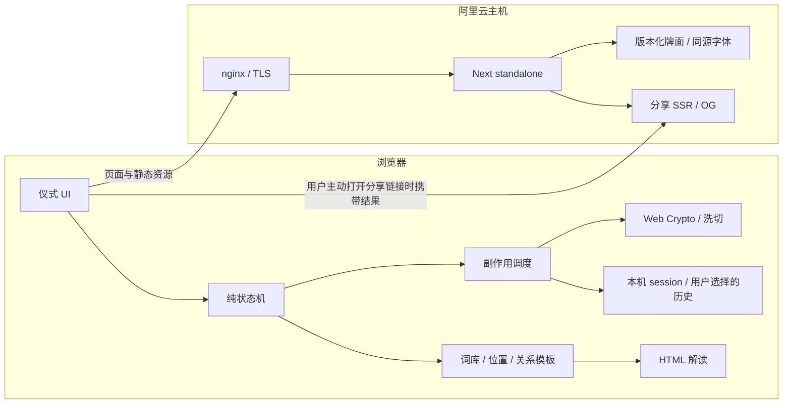

# 烛下塔罗 · 产品与体验设计

> **让随机负责相遇，让结构帮助理解，把决定留给自己。**
>
> 一张深色书桌，七十八幅纸上的故事。这里不是给命运盖章的地方，而是让一个问题，慢慢显出轮廓的地方。

| 项目 | 决策 |
| --- | --- |
| 版本 | 重构稿 2.0 · 2026-09-16 · 待按里程碑实施 |
| 品牌 | **烛下塔罗** |
| 生产地址 | **https://tarot.xieyw.top** |
| 宿主 | 所有者的阿里云服务器；nginx + HTTPS + Next.js standalone + systemd |
| 已有材料 | `RWS_78_aligned.zip`；78 张原创初版牌面；本设计文档 |
| v1 原则 | 中文优先；无账号、无付费、无 LLM；客户端抽牌；本地词库与确定性解读 |
| 本次工作 | **重构计划，不代表网站已经开发、部署或通过上线验收。** |
| 历史 | 原稿逐字保存在 `docs/history/design.original-2026-09-16.md`；冲突以本稿为准 |

## 阅读导航

1. 产品定义与边界
2. 美术指导：夜间书房，不是神秘学仪表盘
3. 仪式编排：五幕，九个状态
4. 三套牌阵与阅读顺序
5. 状态机、异步副作用与恢复
6. 随机性与封存契约
7. 解读引擎：从牌义到关系
8. 牌面、字体与资产管线
9. 分享、本机历史与隐私
10. 技术架构与路由
11. 阿里云发布与回滚
12. 验收矩阵
13. 实施里程碑与范围控制
14. 上线前的实际填空
15. 附录：内容基准、元数据与来源

## 0. 本次重构改了什么

这不是在原稿末尾再追加功能，而是将设计、算法、内容、运维各自收回一份契约。

| 原稿的问题 | 本稿的处理 | 位置 |
| --- | --- | --- |
| 各处反复锁定同一决策，产品体验被工程细节淹没 | 先写用户会经历什么，再写实现与验收；所有实现合同集中 | §1–§5 |
| “静心一分钟”容易成为等待关卡 | 自愿停留，无倒计时门槛；支持即时继续与减少动态效果 | §3 |
| 解读主要是各牌关键词串联 | 单牌、位置、关系、收束四层；每句模板都能追溯输入 | §7 |
| 纯 reducer 的松手事件又要异步生成随机数与指纹 | reducer 只转移；effects 生成结果；sessionId + operationId 防陈旧回调 | §5 |
| 固定 624 字节随机池与严格均匀整数取样不相容 | uint32 拒绝采样；HKDF 分块补充；生产随机源与测试源隔离 | §6 |
| 指纹容易被理解成“第三方验证公平” | 明确仅能检查本标签页牌序一致性；分享没有来源认证 | §6、§9 |
| “服务器从不接收牌”和 SSR 分享页面矛盾 | 服务器不参与选牌；打开分享链接时会接收链接内的结果 | §9 |
| 三张、十张都要求综合 120–220 字 | 分牌阵预算；十字分组阅读，所有十个位置都有正文 | §7 |
| 固定 GB2312 覆盖与很小字体预算互相挤压 | UI + 全词库真实字符子集；用户任意输入由本地回退字体承接 | §8 |
| 同一可变图片 URL 又要求长期缓存与旧分享稳定 | 牌组资源版本 + 内容版本；哈希资源路径；旧版本保留 | §8–§9 |
| 页面 noindex 与 robots 禁爬混用 | 让爬虫读到 noindex；明确它不是私密访问控制 | §9 |
| SSG 页脚却期待运行时 ICP 环境变量即时更新 | 备案号与站点配置在构建时注入并校验；变更后重新构建 | §11 |
| 预先写 TLS 路径，初次 nginx 启动可能缺证书 | HTTP/ACME 引导 → 申请证书 → HTTPS 切换 | §11 |
| 把宏观愿景当成已完成验证 | 分开“设计合同”“文档检查”“待实现验收” | §12–§14 |

---

## 1. 产品定义与边界

### 1.1 我们究竟在做什么

**一个适合独处十分钟的在线塔罗书房。** 用户带来一件事，通过提问、洗切、观看与阅读，获得一组重新理解处境的视角，并带走一个自己愿意继续思考的问题。

用户价值依次是：

1. **安定注意力**：从日常页面节奏进入一张安静的桌子。
2. **把事问清**：从“会不会”靠近“我正面对什么、还有什么可留意”。
3. **有参与地遇见随机**：洗与切是真操作；等待、光效和点击位置都不暗改抽牌。
4. **获得有结构的阅读**：知道是哪张牌、在哪个位置、为何出现这句解读。
5. **留下而不是沉迷**：用一条留笺结束本局，不用好运倒计时或连续抽卡奖励催促回访。

**“逻辑严密”指抽样、位置、方向、推导及复现的一致性，不指塔罗具有经科学验证的预测能力。** 仪式语言可以有诗意；算法说明使用普通、诚实的语言。

### 1.2 v1 必需与明确留后

| v1 必需 | 完成后再考虑 |
| --- | --- |
| 原有 78 张牌；单副、无放回抽样；默认开逆位 | 替换个别初版画面、其他牌组 |
| 单张、三张、凯尔特十字 | 其他牌阵、牌阵编辑器 |
| 完整引导、键盘路径、移动端逐位阅读 | 环境声、复杂桌面物理模拟 |
| 原创 78 × 正逆词库、位置框架、确定性关系模板 | 可选 LLM 增强；单独立项，不在 v1 预埋空事件 |
| 当场恢复、用户主动保存的本机历史、分享结果 | 账号同步、云端短链接、跨设备日记 |
| 牌典、方法、隐私、同源字体与图片、阿里云发布 | 商业功能、真人咨询、社区 |

首发不做日签连胜、付费解锁“坏牌解法”、吉凶分数、复合概率、命定提示。所有人的抽样规则相同。

### 1.3 用户与产品成功标准

- 第一次接触者：不懂阿尔卡纳，也能顺利走完三张牌。
- 熟悉塔罗者：能看到逆位规则、牌阵定义与随机方法，不受强制教程打断。
- 移动端用户：单手点击就能完成；拖拽、长按、声音都不是唯一入口。
- 上线前邀请 5 位体验者，其中至少 3 位塔罗新手：至少 4 位独立完成三张流程；至少 4 位能说清“未来是条件性方向”；记录卡住的步骤，不以加快抽牌为唯一优化目标。

---

## 2. 美术指导：夜间书房，不是神秘学仪表盘

### 2.1 从现有牌出发

已检查 zip：78 张 aligned JPEG，全部 **800 × 1280**；牌面合计 **32,614,930 字节**。联系表可见奶油边、双细框、复古平涂与木刻式轮廓。原图色彩已经足够丰富，界面不再与之争夺注意力。

**三个视觉母题：**

- **烛心**：桌面中央的一小片暖光，代表注意力，不代表能量检测。
- **书页**：结果区从深色桌面过渡到温暖纸页，代表从观看进入理解。
- **书签**：进度是细竖线上的刻度，完成后化为留笺页角的一条金线。

不是把整个页面做成真实房间照片。用少量光、纸纹、细线与真实牌面创造空间，避免高体积背景、粒子星空、烟雾与发光球。

### 2.2 色彩、字体、尺度

```css
:root {
  --ink: #100e0c;
  --ink-2: #1a1612;
  --parchment: #f4ecd5;
  --parchment-dim: #cbbd9a;
  --frame: #191202;
  --candle: #c4a35a;
  --candle-soft: #e8c84a;
  --ash: #8a7d68;
  --blood: #7a2e24;
  --grain-opacity: 0.07;
}
```

- 主标题用霞鹜文楷 Screen，正文用 Noto Serif SC，拉丁数字点缀用 Cormorant Garamond；全部自托管并保留许可。回退为本机宋体/衬线字体。
- 标题 32–56px；正文 16–18px，行高 1.85–2；解读行长约 24–32 个汉字。
- 正文深底用 `parchment`，浅纸用 `frame`；`ash` 只作满足对比的辅助字或装饰。逆位用文字和边线表达；`blood` 不直接作为深底小字色。
- 容器最大宽度 1200px，手机边距 20px；界面间距基于 4/8px 节奏；主按钮高度 48px。
- 强调色只出现在焦点、当前刻度、主按钮细边与少量纹章。牌面保持原色，不统一套棕色滤镜。
- 不用玻璃卡片、紫白渐变、后台式统计面板；不把英文装饰字放到中文信息之前。

### 2.3 关键画面构图

**首页：安静而不是空。**

```text
烛下塔罗                                      开始   牌典   关于
────────────────────────────────────────────────────────────

       给此刻，留一盏灯。                 微微错开的三张牌背
       不急着寻找答案。                   暖光从纸的边缘透出
       先听见你真正想问的事。

       [ 入席，开始一次抽牌 → ]
       约 5–8 分钟 · 可不写问题

                 洗一副牌   /   看一个处境   /   留一句给自己
────────────────────────────────────────────────────────────
象征与自我观照 · 非命运判决                  方法 / 隐私 / 备案
```

桌面文字在左，牌在右；手机标题与牌背纵向排列。首页展示固定牌背构图，不伪装成一次“今天为你选出的牌”。低于首屏才介绍三套牌阵与牌典，首屏只有一个强行动。

**仪式桌面：** 中间牌桌占约三分之二，右侧为当前位置的纸色解读页（窄栏每行约16–22字，完整书页再放宽）；选问题和牌阵时将焦点收至中央 560px。十字只有在空间足够时使用完整阵图。

**完成页：** 牌阵缩为页眉中的索引；下面是一张长书页，包含本局问题、位置解读、整阵线索与个人留笺。分享不是海报广告，页脚不放“再测一次会更准”。

### 2.4 原创牌背

实现时创作 `src/assets/card-back.svg`，800 × 1280，直角；外框 inset 28、内框 inset 40，沿用原稿基准，视觉里程碑再与原图叠图校准。这是设计基准，不标称本轮做过像素测量。

深墨内场 + 金线圆轮 + 原创白玫瑰几何纹章；细纹 opacity ≤ 0.12，SVG < 8KB。**整体必须 180° 旋转对称**，无文字、无单向月牙，避免牌背先泄露方向。小尺寸仍以双框和中心轮廓识别，不堆细碎符号。

### 2.5 动效是标点，不是节目

| 场景 | 设计目标 | 减少动态效果 |
| --- | --- | --- |
| 入席 | 240–400ms 光心淡入；不锁按钮 | 静态呈现 |
| 洗牌 | 12–18 张牌背分成两叠，1.2s 循环 | 静止牌堆，文本显示操作状态 |
| 切牌 | 叠间位移 160–240ms；滑杆直接响应 | 即时位置变化 |
| 发牌 | 单张 300–420ms，间隔 100–140ms；十字总时长 ≤ 1.8s | 立即完成 |
| 翻牌 | rotateY 500–600ms，背后暖光收住 | 瞬间切换 |
| 解读 | 保持文档流，只轻淡入；不逐字打字 | 直接显示 |
| 留笺 | 金线在页角停住，出现“这一局，到这里” | 直接显示 |

grain overlay 恰用 `opacity: var(--grain-opacity)`，pointer-events: none；文本上不再叠第二层纹理。没有无限摆动的烛火控件。环境声放到后续，可选开且切后台暂停；v1 不出现空的声音按钮。

---

## 3. 仪式编排：五幕，九个状态

```text
第一幕 入席        第二幕 问心          第三幕 洗切
enter         →  question → spread  →  shuffle → cut

第四幕 见牌                              第五幕 留笺
deal → reveal → read                →    close
```

这是用户可理解的五幕，工程层仍保留九态。顶端只显示“问心 / 洗切 / 见牌”等章节，不把 9 个技术状态平铺成繁琐表单。

### 3.1 入席 enter

**标题：** 请把这一刻，留给自己。

**正文：** 让视线在这张桌上停一会儿。你不必相信塔罗，也不必准备一个完美的问题。

**主按钮：** 我准备好了。**次入口：** 先了解如何抽牌。

停留时长由用户决定；可直接继续。已有进行中记录时优先出现“继续这局 / 放下，重新开始”，新局选择需确认，不自动覆盖旧局。

### 3.2 问心 question

**标题：** 此刻，什么事占着你的心？

- 可留空；最多 200 个 Unicode 码位；保留用户原意，只 trim 首尾空白，不静默改写。
- 简短可点例句：“我在这段关系里忽略了什么？”“面对这个选择，我需要看清什么？”点击只填入输入框，不自动提交。
- 辅助提示：“试着问一个关于处境和选择的问题，而不是一个绝对的是或否。”
- 不做文本语义分类、人格判断和敏感问题自动配牌；问题对随机与关系规则都没有权重。
- 私密说明：“问题默认只留在当前浏览器。你可以不保存，也可以在分享前去掉它。”
- 继续按钮与“这次不设问题”并列但主次分明。输入框中的 Enter 保留换行；提交使用按钮或 Ctrl/Cmd + Enter。

### 3.3 选阵 spread

三个选择用**小型阵图 + 名称 + 适合情境 + 预计投入**呈现，选中时只有金线变化：

| 牌阵 | 显示名与引导 | 大致阅读时间 |
| --- | --- | --- |
| single | **一束微光** · 单张；给此刻一个观察的焦点 | 2–3 分钟 |
| three | **时间之河** · 三张；看见过去、现在与可能的走向；默认 | 5–8 分钟 |
| celtic | **处境之镜** · 凯尔特十字；认真展开一件复杂的事 | 10–15 分钟 |

时间是阅读参考，不是倒计时，也不是“准确度等级”。十张不比一张更准，只是提问框架更细。

逆位默认开。文案：“把内在、受阻或过度的状态也纳入阅读。逆位不等于坏牌。”关闭后所有牌正位；从这里开始洗牌后锁定问题、牌阵、逆位。

### 3.4 洗牌 shuffle

**标题：** 把问题放轻，把牌打散。

两条等价路径：

1. 按住牌堆，松手封存；指针移动可混入随机源。Space 按住/松开同样有效。
2. “为我洗牌”普通按钮，一次点击完成同样的密码学洗牌；适合触屏辅助技术与不便长按者。

不设最低按住时长，也不暗示按得久更准。短按也有效；动画是操作反馈，不是随机质量进度条。

松手后短暂显示“正在封存”，按钮锁定；成功后转入切牌，上方出现折叠信息“牌序已封存 · 指纹 {16 hex}”。面向普通用户不默认展开技术细节。

### 3.5 切牌 cut

**标题：** 在这里，为这一局落一个切口。

滑杆 min=1、max=77、step=1，默认 **39（中点，不称随机）**；显示“将上方 {k} 张移到牌底”。方向键每次一张；牌堆拖动只是滑杆的等价输入。

“请为我切”均匀选择 1–77 的切点；可再次选择，也可手动调整，在确认前不显示任何牌面。确认按钮“让牌落在桌上”。切只旋转已封存的牌序，绝不再洗牌。

### 3.6 见牌 deal / reveal

发牌为非交互短过场，然后等待用户。每个空位先给位置含义，再给翻牌动作：

> **过去** · 已经形成、仍在影响你的部分。  
> [ 翻开这一张 ]

- 桌面可点任意未翻开位置，默认按钮始终指向发牌顺序中的第一张未翻牌。
- 手机一次查看一个位置，有“上一位 / 下一位”和阵位导航；切换位置不等于翻牌。
- 每次翻开后，先看到完整牌面、中文名和正逆标签，再阅读短牌义；不自动切走、不自动滚到底。
- 已揭示牌始终保留；重复点击不重复发牌。全部翻开才进入完整解读。
- 牌面加载失败时保留抽到的 cardId，显示中文名、方向、正文和“重试图片”；重试只请求同一 URL。

### 3.7 读牌 read

用户可在“桌上看牌 / 书页阅读”间切换，二者共用同一局数据，切视图不追加图片变体或重算抽样。

默认顺序：问题 → 每位含义 → 整阵线索 → 一个反思问题。十字按 §4 分组，而不是十段一样长的墙。

主行动为“写一句，留给自己”；不把继续抽牌放在每张牌义旁。

### 3.8 留笺 close

可写最多 200 码位的个人留笺，也可跳过。**留笺不参与解读，不进入分享链接。**

主动选择“保存到这台设备”（默认未选）与“保存时包含问题和留笺”（默认未选）。完成时写历史仅一次，清除进行中 session 和切前完整牌序；当前完成页保留结果收据。

**标题：** 这一局，到这里。

**收束：** 牌已经说完它的部分。接下来，轮到你慢慢生活。

按钮层级：复制本局链接 → 查看这几张牌的词条 → 再开始一局。复制失败时给可选中链接文本；新局动作明确重置。

---

## 4. 三套牌阵与阅读顺序

阵位定义是产品合同；中文美名不改变 CardId、SpreadId 或传统位置含义。未来与结局永远加上**“若沿当前轨迹”**的条件，不给时间精确到某天的承诺。

### 4.1 单张 single

| positionId | 位置 | frameZh |
| --- | --- | --- |
| focus | 此刻 | 把它读作此刻值得注意的一股力量，而不是整个问题的裁决。 |

所有单张结果固定提示：“这一张给出的是倾向、条件与值得注意的力量，不是绝对的是或否。”

### 4.2 三张 three

| drawOrder | positionId | 位置 | frameZh |
| --- | --- | --- | --- |
| 1 | past | 过去 | 把它读作已发生、仍托住或正在消退的影响；别把它当作正在发生的事实。 |
| 2 | present | 现在 | 把它读作你此刻所站的位置：什么在运作，什么需要看见。 |
| 3 | future | 未来 | 若当前的方式延续，这可能是接下来值得留意的方向；改变行动也会改变处境。 |

桌面三张横排，牌宽 160–180px；手机卡宽 200–240px，逐位查看，底部 1/3 与有文字的阵位导航。屏幕宽度变化只改变布局，不改变当前位置与揭示状态。

### 4.3 凯尔特十字 celtic

抽 **10 张，不另抽 significator**；第 1 张就是核心处境。

| 顺序 | positionId | 位置 | 阅读职责 |
| --- | --- | --- | --- |
| 1 | present | 现状 | 此事的核心场，你当前被什么包围 |
| 2 | challenge | 横跨 | 与现状交织的力量；可能阻碍，也可能要求回应 |
| 3 | foundation | 根基 | 更深的原因，以及身体、资源与现实条件 |
| 4 | past | 过去 | 正在离开、却仍留下作用的一章 |
| 5 | crown | 冠位 | 你所设想的目标或最好可能；不是已经到手的结果 |
| 6 | future | 近未来 | 若当前动力延续，将进入视野的变化 |
| 7 | self | 自我 | 你对自身位置的态度，不是人格诊断 |
| 8 | environment | 环境 | 外部条件与互动视角；不声称读到他人的隐秘思想 |
| 9 | hopes_fears | 希望与恐惧 | 期待与担忧如何指向同一件事 |
| 10 | outcome | 结局 | 若前述力量延续，一种可能的收束；不是命定结局 |

**读牌分四段：** 当下核心（1、2）→ 来处与走向（3、4、5、6）→ 内外视角（7、8、9）→ 条件性收束（10）。各位独立正文都保留，综合不重复抄十遍词库。

桌面位置中心坐标（百分比）：

```text
                  5 (38,16)                         10 (80,18)
                                                     9 (80,40)
4 (18,48)       1 + 2 (38,48)      6 (58,48)
                                                     8 (80,62)
                  3 (38,80)                           7 (80,84)
```

容器至少约 640 × 650px；牌约 96 × 154px，依容器收敛。第 1 位被横跨部分遮挡时仍提供旁侧文字按钮与键盘访问；点击已翻开牌可聚焦查看，不调整抽样顺序。

- `≥1024px` 且牌桌容器足够：完整十字 + 右侧阅读；否则走逐位布局，不把“桌面”当可溢出的理由。
- `<1024px`：一个全尺寸槽位 + 迷你十字图；第二位在迷你图中画横杠，序号导航的实际点击区域至少 44px。
- 第 2 位槽位顺时针 `rotateZ(90deg)`；逆位只在牌面图层 `rotate(180deg)`；手机横跨位保留同样方向。把 CSS 变换拆为 **槽位 / 翻牌层 / 方向层**，分别测试。
- 中文标签、解释与按钮不跟着旋转；净角度 270° 的图不等于“第二种逆位”。

---

## 5. 状态机、异步副作用与恢复

### 5.1 状态与事件契约

`ritual-machine.ts` 是纯函数；Web Crypto、计时器、存储和 DOM 由 `ritual-effects.ts` / UI adapter 负责。v1 不预留没有 UI 与行为的模型事件。

| 状态 | 合法主要事件 | 结果 |
| --- | --- | --- |
| enter | ACK_ENTER | question |
| question | SET_QUESTION / SUBMIT_QUESTION / BACK | 保存输入；spread；enter |
| spread | SET_SPREAD / SET_REVERSALS / BACK / CONFIRM_SPREAD | 更新设置；question；shuffle |
| shuffle idle | HOLD_START / AUTO_SHUFFLE / BACK | holding；committing；spread |
| shuffle holding | HOLD_SAMPLE / HOLD_RELEASE / HOLD_CANCEL | 样本由 adapter 维护；committing；idle |
| shuffle committing | SHUFFLE_COMMITTED / SHUFFLE_FAILED | cut；idle 并显示重试 |
| cut | SET_CUT / AUTO_CUT_REQUEST / AUTO_CUT_DONE / AUTO_CUT_FAILED / CONFIRM_CUT | 同态选切点；失败保留原切点；deal |
| deal | DEAL_DONE | reveal |
| reveal | SELECT_POSITION / REVEAL_POSITION / REVEAL_NEXT | 更新视图或揭示集合；集合满才 read |
| read | SET_NOTE / SET_SAVE_OPTIONS / CLOSE_ACK | 更新留笺或保存选择；close |
| close | SHARE / NEW_READING | 生成分享收据；enter |

进行中各态有 `ABANDON_REQUEST / ABANDON_CANCEL / ABANDON_CONFIRM`；确认框是 overlay，不另造牌局。问题/牌阵可退；从启动洗牌起设置冻结。shuffle idle、尚未创建指纹且没有 operation 时可退回 spread；封存后只允许放弃整局。

非法事件返回原状态；开发环境只记录事件类型与状态，不打印问题或整个 session。

### 5.2 异步一致性

- 每局有 `sessionId`，每次封存或自动切牌有 `operationId`；成功/失败事件携带两者。
- 开始 committing 后禁用重复提交；只接受当前 session、当前 operation、当前合法状态的回调。
- 放弃、重开或更换切点时令相应 operation 失效；已发出的 Crypto Promise 即使返回也丢弃其旧结果。
- `AUTO_CUT_REQUEST` 期间锁定切点与确认按钮，失败解锁并保留原值；这样人工拖动与迟到的自动值不会互相覆盖。
- React Strict Mode 的 effect 重放和双击应幂等：同一 operation 使用同一 Promise；结算按 sessionId 去重；绝不因为重新 render 就生成随机数。
- `visibilitychange`、pointercancel、窗口失焦、lostpointercapture 都停止洗牌动画。正常 pointerup/Space keyup 才封存；取消手势回到 idle，让用户重新操作。
- 键盘 Space `preventDefault()`，忽略 `event.repeat` 的重复开始；“为我洗牌”保留普通按钮 click 路径。
- 发牌完成有一次性计时兜底；进入后台可直接标记动画完成。逻辑不依赖 `animationend` 一定触发。

### 5.3 数据边界

```ts
type Orientation = 'upright' | 'reversed';
type SpreadId = 'single' | 'three' | 'celtic';
type Rank = '01_ace' | '02' | '03' | '04' | '05' | '06' | '07'
  | '08' | '09' | '10' | 'page' | 'knight' | 'queen' | 'king';
type ShuffledCard = { cardId: CardId; orientation: Orientation };
type Draw = ShuffledCard & { positionId: string };
```

`CardId` 从固定 78 项清单推导；ace 的数据主键统一 `01_ace`，消除原稿 Rank 与文件名不一致。

Session 用按 stage 区分的联合类型，不以一大堆随时可空字段绕开约束：

- 未封存：没有 deck、draws 或 commit。
- cut：有 78 张 `deckPreCut`、完整 hash、合法 cutIndex，尚无 draws。
- deal/reveal/read：保留 `deckPreCut`、cutIndex、draws、实际揭示顺序与去重集合；切后 deck 可推导，省去重复持久化。
- close：只有 `ReadingReceipt`（结果、版本、完成时间、保存状态）；完整牌序和随机种子已清除。
- `operationId`、pointer samples、动画进度和 Crypto 对象只在内存中，不持久化。

### 5.4 刷新与异常恢复

键：`tarot.ritual.v2`。进入或写入前均 schema 校验；版本不兼容则说明“这局来自旧版，可重新入席”，不半恢复。

| 刷新点 | 恢复方式 |
| --- | --- |
| question / spread | 恢复文本与选择，不自动前进 |
| shuffle 的任意子态，尚未成功封存 | 恢复 shuffle idle，丢弃样本与未完成操作 |
| cut 及之后 | 验证 78 唯一、方向、完整指纹，再从切点推导并逐项校验 draws |
| deal | 直接 reveal，不重播发牌 |
| reveal | 恢复实际揭示集合与当前位置；已揭示集合只含本阵合法位置 |
| read | 恢复完整结果、留笺草稿与保存选择 |
| close 后 | 不恢复切前序；用户若主动保存，可从历史重读结果 |

`sessionStorage`、`localStorage` 均 try/catch，拒绝或配额不足时只留内存，安静提示“本次仅在当前页面保留”。JSON 损坏、非有限数字、未知版本、伪造位置、draws 与 deck 不一致都走恢复失败画面，提供重开入口。

进行中结果从本地恢复时做的是一致性检查，不宣称抵御用户自己改写浏览器存储。多标签页不互相抢夺 session；本机历史是便捷记录，不是事务数据库；并发保存可能受浏览器存储竞争影响，优先保留用户可见导出结果。

---

## 6. 随机性与封存契约

### 6.1 哪些事情影响结果

| 输入或操作 | 是否影响抽出的牌 | 规则 |
| --- | --- | --- |
| 浏览器 CSPRNG | 是 | 每次正式洗牌产生新的 32 字节种子材料 |
| 按住时的指针样本 | 是，可选 | 与种子材料混合；不分析人格、不赋予方向偏好 |
| 逆位开关 | 是 | 决定是否生成独立方向比特 |
| 牌阵 | 决定取几张 | 不按问题内容筛牌，不改变 78 张池 |
| 切点 | 是 | 对同一已封存牌序作旋转 |
| 翻开顺序、鼠标点击位置 | 否 | 只展示预先确定的 draw |
| 提问文本、留笺、系统日期、历史结果 | 否 | 不进入选牌条件、排序和关系规则 |
| 动画帧数、音效、额外的时长权重 | 否 | 不因按得久而增加某牌概率；样本中的 t 仍属于可选手势材料 |

### 6.2 生产随机源

保留 Web Crypto + HKDF-SHA-256 + Fisher–Yates 的路线，但将接口从浮点 `rng()` 调整为**异步 uint32 流 + 均匀整数抽样**，避开 `floor(float * n)` 在有限位数上产生的微小偏差，也避免拒绝采样把固定池耗尽。

规范：

1. `seed = crypto.getRandomValues(new Uint8Array(32))`。
2. 最多 1024 个 `{x,y,t}` 样本；约每 32ms 一笔，按时间顺序存 Float32 little-endian，坐标相对牌堆；丢弃非有限值。键盘与普通按钮路径样本为空。
3. `ikm = seed || packedSamples`，通过 Web Crypto importKey 导入 HKDF。
4. 每块 HKDF salt 是 32 字节全零，hash SHA-256，info 为 UTF-8 `tarot/fy-hkdf-2/{purpose}/block/{counter}`；purpose 为 `shuffle` 或 `cut`，counter 从 0 递增，无前导零。
5. 每块 deriveBits 生成 **1024 字节**；按 `DataView.getUint32(offset, false)` 大端读取。池空时 await 派生下一块，不重复使用旧字节。
6. HKDF 单次长度受 RFC 限制，1024 字节低于 SHA-256 的 8160 字节上限；分块使用不同 info。这里是本产品的派生协议，不把它宣传为独立受认证的随机数标准。[RFC 5869](https://www.rfc-editor.org/info/rfc5869/)
7. Crypto 缺失、非安全上下文或派生出错：保留当前页面并提示使用 HTTPS/受支持浏览器重试；不改用 `Math.random()`。

```ts
// 设计接口；实现须另有单测，本文不是已接入的运行代码。
declare const productionBrand: unique symbol;
type ProductionRng = {
  readonly [productionBrand]: true;
  nextUint32(): Promise<number>;
};

async function uniformInt(rng: ProductionRng, n: number): Promise<number> {
  // n 为整数，范围 1..2^32。
  const range = 2 ** 32;
  if (!Number.isInteger(n) || n < 1 || n > range) throw new RangeError('n');
  const limit = range - (range % n);
  for (;;) {
    const x = await rng.nextUint32();
    if (x < limit) return x % n; // [0, n)，拒绝尾部不完整区间
  }
}
```

底层 nextUint32 保证输出整数 `[0, 2^32)`；operation 取消后停止继续取样。测试可给底层纯算法注入固定 uint32 序列，但生产组件只接收品牌类型；构建产物不包含 URL seed、localStorage 开关或可切换 TestRng 的隐藏入口。

### 6.3 洗、方向、切、取的唯一顺序

```text
固定 CARD_IDS（78 项）
  → Fisher–Yates：i 从 77 到 1，j = uniformInt(i+1)，交换 i 与 j
  → 方向：开逆位则对每张独立 uniformInt(2)，0=正位，1=逆位
  → 固定 deckPreCut，计算完整 SHA-256，显示前 16 hex
  → 用户确认 cutIndex=k，deck = preCut[k:] + preCut[:k]
  → 从 deck 顶部取 N 张，按阵位 drawOrder 一次绑定 Draw[]
  → 发牌 / 揭示 / 阅读，全程不再取随机数
```

切点为 1..77 的整数，语义为上方 k 张移到底部，新顶牌是原数组 `deckPreCut[k]`。自动切牌使用独立 purpose=cut 的生产随机源（新鲜种子、空样本），`1 + uniformInt(77)`；不改变封存的牌序或方向。

单副无放回：同局 78 个 cardId 各出现一次，抽出的 N 张唯一。跨局出现同一张是正常现象，不用“避免重复好运牌”的规则修正随机。切点固定甚至由用户自行选择也不破坏既有随机置换的等机会性质；这里不承诺概率意义之外的“命中”。

### 6.4 指纹是什么、不是什么

完整 hash 的规范字节：UTF-8、JSON 无空格；键序 `algo, deckVersion, cards`；每张键序 `id, o`；o 为 `u/r`。

```json
{"algo":"fy-hkdf-2","deckVersion":"rws-1","cards":[{"id":"00_the_fool","o":"u"}]}
```

上面仅示意编码形状；正式输入必须全部 78 张切前牌。保存 64 hex 的完整 SHA-256 做本标签页一致性复核；UI 与分享显示前 **16 hex**。实现时保存固定 78 张规范测试向量与预期摘要。本轮已用独立契约探针生成参考向量，详见 `docs/plan-review/spec-probe.mjs` 与核对记录；它不是生产随机源的上线验收。

“查看封存”折叠面板包含算法版本、16 位指纹、切点和“复核这一局”按钮；复核完整牌序摘要，并验证切点与 draws 的关系。

- 这能帮助发现**本局数据是否自洽**，不是服务端签名、公证或防篡改认证。
- 分享只含抽出的牌与短指纹，不含 78 张 preCut；第三方只能复现结果，不能由短指纹复核整副牌或证明谁抽的。
- 完成收束/放弃后销毁 preCut；本机历史和分享均仅为结果收据。
- 浏览器客户端掌握完整牌序；隐藏 face 请求是防提前观看与控制网络，不是防开发者工具作弊。

---

## 7. 解读引擎：从牌义到关系

### 7.1 内容不是算法的装饰

v1 用人工审校的原创中文词库和固定模板；没有接口密钥，也没有等模型返回的加载态。**同一结果 + 同一内容版本 → 同一解读**。问题仅作标题，用户留笺完全由用户写，不假装系统理解了问题细节。

每张牌每个方向需要：

```ts
type MeaningEntry = {
  keywords: [string, string, string, ...string[]]; // 建议 3–5 个
  meaning: string;       // 2–4 句，约 60–130 汉字
  reflection: string;    // 一个具体、开放的自问句
  theme: Theme;          // 恰好一个，供关系引擎使用
  mode: 'flow' | 'inward' | 'blocked' | 'excess';
};
type Theme = 'begin' | 'act' | 'pause' | 'release'
  | 'connect' | 'discern' | 'sustain' | 'integrate';
```

CardLexicon 另含 id、中英文名、arcana、number、suit、rank、element、astrology、upright、reversed。theme 和 mode 是本项目编辑标签，不声称全体塔罗流派统一认同。每个方向恰好一个主题，避免多标签相互组合导致规则失控。

逆位不是机械否定：由该张具体牌义选择内化、阻滞、过度或流动；某些逆位也可代表松动和释放。大牌与小牌都不直接推断生死、疾病、忠诚或财富结局。宫廷牌优先读为行动方式或角色姿态，不预设人物性别。

### 7.2 四层阅读

**A · 看到什么：** 实际牌面、中文名、正逆、方向对应的词库；折叠“牌面细看”可以解释传统象征，不按初版多画/少画物体另造含义。

**B · 放在哪里：** 显示位置名与 frameZh，再呈现牌义。位置框架明确过去/现在/条件性未来，防止用户把所有句子都理解为正在发生的事实。

**C · 它们如何对话：** 只比较牌阵内指定关系边，不对全部 78 张或所有抽到牌两两做人格推断。每条输出带来源位置与 ruleId，用户点“为什么这样读”可回看依据。

**D · 带走什么：** 选定焦点位置的 reflection，一句收束 + 可选个人留笺。不用另一次随机或第三方模型生成“更好的答案”。

### 7.3 关系规则：有限、可审、可复现

关系边：

- single：没有边；直接进入焦点反思。
- three：`past → present`、`present → future`。
- celtic：`present → challenge`、`foundation → present`、`past → future`、`crown → outcome`、`self → environment`、`hopes_fears → outcome`。

每条边只命中一条规则，按以下优先级：

| ruleId | 条件 | 句式骨架；正式措辞按边的角色编写 |
| --- | --- | --- |
| R1_REPEAT | 两端 theme 相同 | “{位置A}与{位置B}都谈到{主题}，可留意这个主题如何在两个位置重复出现。” |
| R2_TENSION | 无序主题对是 act/pause、begin/release、connect/discern、sustain/release 之一 | “一端关乎{主题A}，另一端关乎{主题B}；先读作需要协调的两种需求，而不是互相抵消。” |
| R3_TURN | 两端 mode 不同，且至少一个是 inward/blocked/excess | “从{位置A}到{位置B}，表达方式从{模式A}转向{模式B}；结合各位正文，看转换发生在何处。” |
| R4_BRIDGE | 其余 | “{位置A}提示{关键词A}，{位置B}提示{关键词B}；这两处可以放在一起观察，不必急于合成同一个答案。” |

非时间边（如现状/横跨、自我/环境）使用“并置”句式，不用“后来”“将会”；时间边才用“从……到……”。“主题相同”只是词库标签一致，不是用牌的元素来认定吉凶。

每边生成结构化结果 `{edgeId, ruleId, sourcePositionIds, sourceCardIds, text}`。先枚举合法输入，再渲染 HTML，别先造一段大字符串再用牌名正则“证明”没有幻觉。

### 7.4 统计只做辅助

全阵完整揭示后计算大牌数、逆位数、四元素计数。附加总结最多两句，优先级：逆位占比 ≥ 一半 → 大牌占比 ≥ 一半 → 唯一元素众数且出现 ≥ 2 张。按优先级取前两条；并列元素不选胜者；单张不做统计总结。

- 逆位多：“这组牌有较多内在、受阻或过度的表达，值得结合各牌分别理解。”
- 大牌多：“这组象征更偏向阶段性主题，不只是日常细节。”
- 元素倾向：火＝行动与意志；水＝情感与联系；风＝思想与辨别；土＝日常资源与节奏。

不用百分比显示“未来成功率”，也不把元素对应当自然科学解释。星对应仅在牌典作为一种阅读传统注释，v1 不进入关系规则。

### 7.5 各牌阵的综合长度与焦点

| 牌阵 | 各位正文之外的“整阵线索” | 留给自己的问题来源 |
| --- | --- | --- |
| single | 60–120 字，不硬凑牌间关系 | focus 的 reflection |
| three | 180–320 字：两条关系 + 最多两句辅助总结 | present 的 reflection |
| celtic | 350–650 字，四小段：核心/脉络/内外/收束；六条关系分配到段中 | self 的 reflection |

长度是编辑预算，**不含用户问题、不含完整位置牌义**；实现时先保全所有关系与信息，再人工压缩模板，而非截断生成文本。内容测试报告超预算样例；没有“十张少写几张以凑长度”的分支。

### 7.6 一局阅读应当是什么感觉

以下为**排版与语气样例，不是实际抽牌或个性化预测**：三张，过去＝愚者正位，现在＝圣杯八正位，未来＝星币王后逆位。

> **过去 · 愚者（正位）**  
> 把这张牌放在已经形成的影响里：一个开端曾让你愿意轻装尝试。这里首先谈的是起步的方式，而不是保证此刻仍应继续向前。
>
> **现在 · 圣杯八（正位）**  
> 杯还在，但已经喂不饱你。此刻的主题是辨认：哪些曾经足够的东西，如今值得重新衡量。
>
> **未来 · 星币王后（逆位）**  
> 若维持当前轨迹，值得留意的是照顾与资源分配。园子还在，园丁也需要被算进照顾的名单。
>
> **整阵线索**  
> 过去谈开端，现在谈离开；这可以是需要协调的两种需求，而不必被读成一次出发“失败了”。当现在的转身与未来的操劳并置，值得留意的不是是否走得够快，而是新的安排有没有给自己的日常留出位置。这里没有替你决定去留，只把两个需要辨认的关系放在桌上。
>
> **留给自己**  
> 如果暂时不清点已经拥有的东西，我真正想靠近的是什么？

正式引擎必须由已审校词条和模板得到这些类型的句子；本样例不是要求为任意输入伪造同样的叙事。若未命中特别关系，使用朴素连接句，优于编造故事。此处为人工编排的语气示范，不是声称四条规则已直接生成该段文字；M2 另提交由真实引擎逐字输出的 golden fixture。

### 7.7 内容验收

完整 78 × 2 个方向全部非空，每条至少 3 个关键词，reflection 恰好一个开放问题，theme/mode 属于枚举。先审校附录四条，再完成大牌、四花色与关系句库。

审核关注：原创新汉语、正逆区分、位置时态、传统物体计数、不过度安慰、不过度恐吓、不把特定疾病/诉讼/交易当作塔罗能作出的判断。若用户处在即时危险中，方法页提示优先联系现实中的紧急援助；不以抽牌引导紧急决定。求助资源只链接上线时核实的机构页面，不沿用未核实号码。

---
## 8. 牌面、字体与资产管线

### 8.1 源文件是作品，不是运行时包

`RWS_78_aligned.zip` 保留原件，不重写、不重新压缩。构建只读取 `RWS_78/aligned/*.jpg`；README 中提及但未包含的 originals/、preview/ 不纳入依赖。

实施时 `scripts/ingest-cards.mjs`：

1. 按白名单路径读取 zip，不直接将任意条目解压至 public；限制条目数、总展开大小与路径穿越。
2. 断言 78 张 JPEG，全部 800×1280；文件名与 CARD_IDS 双射。
3. 输出 320/480/800 宽 WebP；JPEG 作为兼容回退。初始 quality 78/82，按实测清晰度与体积迭代，不写成已达预算。
4. 生成含源 SHA-256、尺寸、文件字节数、牌组版本的 manifest；版本 `rws-1`。
5. 输出路径带资源内容哈希，例如 `/cards/rws-1/{cardId}/{digest}/480.webp`；只有这种内容不变的路径设置长期 immutable 缓存。
6. 先生成至临时目录，全部通过后原子替换生成目录；失败令 build 失败，避免混合新旧牌图。
7. 原 zip 提交仓库；可重建的 faces 与生成 manifest 不手工编辑；备份旧版本 manifest/衍生图，保持旧分享的资源解析。

**已知画面问题：** zip README 标注 cups_08、cups_09、swords_10、pents_10 的计数/堆叠待复核；本轮联系表用于美术观察，未对四张逐一给出修复结论。取消原稿 cups_08 同段里“6+3”和“已确认八杯”的冲突记录。实现时在 `asset-issues.ts` 区分 reported / reviewed / resolved，不把“已报告”写成“已证实”。这些不阻挡 v1 体验原型；词库仍按传统牌义，不按错误物体数改义。

### 8.2 隐藏的牌，既不画也不下载

- 洗/切/未揭示槽位只引用 back.svg；即使 `loading=lazy` 也不提前创建 face img。
- 用户确认揭示后才挂载对应 `<picture>`；已显示的卡片以稳定 key 保留。
- `<source type="image/webp" srcSet=...>` + ``；不把可选 JPEG source 放在图片之后当作有效回退。
- width/height=800/1280；CSS `aspect-ratio: 5/8`；sizes 对齐真实槽位，而非无论何时都写 70vw。
- 仪式只下载已揭示 cardId 的图；牌典列表可 lazy-load 全部缩略图，那是明确的浏览行为。
- 设备像素比/缩放/窗口变化可能请求同牌的不同尺寸，因此网络主不变量是**唯一 face cardId 数 ≤ 已揭示数**。固定视口、固定 DPR、无切视图升级的受控测试再要求三张至多 3 个 face URL。
- 同一张牌在桌面、长阅读区与结果收据中复用同尺寸/URL，避免双份组件造成无意义升级。

### 8.3 自托管字体不是三份整库

实现时下载官方字体与许可证，记录来源、版本与 hash；运行期不连境外字体 CDN。

1. 从 UI 文案、78 词库、位置、模板、导航提取真实字符集；用户自由输入不参与生成固定字体。
2. 标题文楷只涵盖标题集；正文宋体覆盖已知阅读文本；生僻输入由系统衬线回退。
3. 字体目标：文楷 ≤220KB、正文宋体 ≤450KB、拉丁装饰 ≤40KB；先测再定是否拆分 unicode-range，放弃“GB2312 全覆盖仍必定落在这些体积内”的硬保证。
4. 字体 `display: swap`，对本机回退做 metric 调整；只 preload 首屏关键字体，避免三字体全抢首屏带宽。
5. OG 另备小型 CJK 字体，只含品牌、位置、78 牌名与正逆标记，随产物打包。

---

## 9. 分享、本机历史与隐私

### 9.1 先把三种“保留”分清

| 信息 | 默认存在哪 | 何时离开当前浏览器 |
| --- | --- | --- |
| 正在写的问题 | 当前标签页 sessionStorage（失败则内存） | 只有用户显式选择把问题放入分享链接，并打开/发送链接时 |
| 78 张切前序、完整指纹 | 当前局 sessionStorage + 内存 | 不进入分享和历史；完成/放弃时清除 |
| 已抽出的牌 | 当前局；用户主动保存后进入本机历史 | 打开/发送分享链接后，访问方与站点服务端可读 |
| 个人留笺 | 当前局；保存时另行选择才持久化 | v1 不进入分享链接 |
| 指针采样/随机种子 | 短时内存 | 不上传、不进历史/日志；封存结束丢弃 |

**无账号不等于无隐私风险。** 本机历史可被同设备使用者看到；分享 URL 可被收件人转发、截图或记录。base64url 是编码，不是加密。只承诺“默认本机；分享是用户主动公开结果”，不写“任何场景数据都不出域”。

### 9.2 分享格式与版本

保留无数据库的路径型分享：`/r/1.{base64url(utf8(canonicalJson))}`。`1` 是**首次正式发布的分享协议版本**，与设计稿 2.0、session v2、算法 fy-hkdf-2 各自独立；当前绿场没有已上线旧 payload 需要迁移。

```ts
interface ReadingPayloadV1 {
  v: 1;
  deckVersion: 'rws-1';
  lexiconVersion: 'zh-1'; // 同时版本化牌义、阵位、关系模板
  algo: 'fy-hkdf-2';
  spreadId: 'single' | 'three' | 'celtic';
  q: string | null;      // 默认 null；显式选择才带入
  reversals: boolean;
  cutIndex: number;      // 1..77
  commit: string;       // 信息性 16 hex
  draws: Draw[];        // 按固定位置顺序
  ts: number;           // 完成时 Unix 秒；有限、安全整数
}
```

规范键序按接口顺序；每个 draw 按 `positionId, cardId, orientation`。所有字段由 encoder 显式构造，不直接 stringify 整个 session。题目只 trim；超过 200 码位就给长度错误，不在分享时悄悄删掉后半句。

**readingId 上限 1500 ASCII 字符**，编码后检查；超长时提示去掉问题再生成，不悄悄丢掉牌或位置。实现时实测十字、最长 cardId、所有逆位、边界时间戳、200 汉字及 emoji，不能只用估算表当验收。

本轮按此 schema、最长牌名组合、全逆位和十位时间戳实算：无问题单张 358、三张 568、十字 1292 字符；十字加200个汉字为2089，加200个四字节 emoji 为2356，均需提示去掉问题。该结果验证协议预算，不代表微信真机验收。

分享 UI 先显示结果摘要；“包含我的问题”默认未选。选择时明确：“问题会出现在链接中，收件人、站点及处理该链接的服务都可能看到。”提交前展示完整预览；个人留笺永不打包。

### 9.3 解码是一道严格边界

先检查长度、`1.` 前缀与 base64url 字符集，再有界解码、UTF-8 fatal 校验、JSON/schema 校验：

- 精确支持的 v、deckVersion、lexiconVersion、algo；未知版本不给当前词库冒充旧词库。
- draws 长度等于阵位数，位置 ID **按顺序完全等于该阵定义**，不可缺位、重复或错配。
- 每张是有效 CardId、同局唯一；orientation 精确枚举；关逆位时全 upright。
- cutIndex 为 1..77 整数；commit 精确 `[0-9a-f]{16}`；ts 在产品设定的合理时间范围（2020–2100）内。
- q 仅 null 或 ≤200 Unicode 码位字符串；其余字段类型严格，不接受未知额外字段、HTML 或嵌套扩展对象。
- React 按文本转义，不使用 `dangerouslySetInnerHTML`；失败页面不回显原 payload 或异常堆栈。

页面名为“本局记录”，明确“链接由浏览器生成，可复现所列结果，未验证抽牌来源”。**结果字段固定不等于来源可信**；unsigned 链接可以人为修改。

### 9.4 稳定复现的真正条件

分享同时固定牌组与内容版本。牌名 ID 稳定；修图发 rws-2；改变含义/关系/阵位文案发 zh-2，保留旧版本查找表和资源。只要对应版本仍被支持，旧链接显示原来的牌图、含义与综合。

站点停服后，链接依然是一段可解码数据，**不等于网页还能离线访问**。v1 无 Service Worker 离线承诺。数据编码可读性与在线服务可用性分开描述。

### 9.5 SSR、OG、索引与日志

- `/r/[readingId]` 逐请求渲染，不尝试枚举 payload 做 SSG；页面与 OG 使用同一校验器。
- OG 只出现品牌、牌阵、位置牌名与正逆，**永不出现 q 或 note**；非法链接的 OG 返回固定中性图或 404，不触发昂贵渲染。
- 敏感结果页禁用主动预取链接、公开缓存；HTML/OG 使用 `Cache-Control: private, no-store`，在代理与应用两层验响应头。
- robots metadata / `X-Robots-Tag` 设 `noindex, nofollow`；不在 sitemap 收录 `/r/`。robots.txt 不用 Disallow 阻断读取 noindex 的机会。noindex 是爬虫指令，不是鉴权或隐私屏障。[Google Search Central](https://developers.google.com/search/docs/crawling-indexing/block-indexing)
- 全站 `Referrer-Policy: no-referrer`，包括牌图、字体、外链点击；否则同源资源访问日志也可能间接记录完整分享路径。[W3C Referrer Policy](https://www.w3.org/TR/referrer-policy/)
- nginx access log 对 `/r/*` 只记固定路由标签 `/r/[redacted]`；全站不记 query、Referer 和请求行；应用/APM 也不记录完整 URL。error log、WAF、负载均衡等可能含 URI，上线前逐层检查/限制保留，不仅改 access_log 就宣称解决。
- 无模型 API 不代表服务器零成本：对公开结果/OG 设 IP 请求速率、并发与尺寸限制；不使用以整条 payload 为 key 的无限内存缓存。超限给 429 和重试提示，不改变抽牌。

### 9.6 本机历史

`tarot.history.v2` 最多 20 条，以 sessionId 去重，按保存时间移除最旧；只有 `pushHistory` 一个写入入口。保存 `ReadingReceipt` + 用户选择的本地 question/note，不保存 preCut、种子和样本。

支持读回、单条删除、清空全部；记录里能看到“仅这台设备”。导出/分享使用独立白名单 encoder，不能将带私密留笺的历史对象直接传给分享函数。

---

## 10. 技术架构与路由

### 10.1 选技术，不把过期版本锁成美术决策

保留 **Next.js App Router + TypeScript + React + CSS tokens + standalone**。实施时选择处于官方支持期、带当前安全修复的稳定版本，精确锁定 lockfile；Node 选择与其兼容的受支持 LTS。原稿的“Next.js 15 / Node 20+”不再永久锁死。当前支持表列出 16.x Active LTS、15.x Maintenance LTS，开工与上线都需重新核对。[Next.js Support Policy](https://nextjs.org/support-policy)

样式优先 CSS Modules + tokens；团队若沿用 Tailwind，只作工具层，不影响美术语义。动画 CSS/WAAPI，不引入大型动效库。输入 schema 使用小型验证库或有测试的显式解析器；图片 sharp；Vitest + Playwright。无业务数据 API、无数据库、无 Redis、无模型环境变量；健康检查属于运维端点。



### 10.2 路由清单

| 路由 | 职责 | 渲染与索引 |
| --- | --- | --- |
| `/` | 入席前的首页 | SSG，允许索引 |
| `/read` | 单页状态机，标签页恢复 | 静态壳 + 客户端；不索引 |
| `/r/[readingId]` | 版本化结果与分享 | 动态 SSR；noindex、no-store |
| `/deck` | 78 张牌典，按大牌/四花色筛选 | SSG；允许索引 |
| `/deck/[cardId]` | 牌面、正逆、反思、传统元素对应 | SSG ×78；允许索引 |
| `/about` | 方法、随机边界、逆位、作品说明 | SSG |
| `/privacy` | 本机存储、分享出域、删除说明 | SSG |
| `/healthz` | 运维健康状态，只回固定状态 | 动态小响应；不进入导航 |

元数据主机固定 `https://tarot.xieyw.top`，`lang=zh-CN`。仪式内导航若会离开当前局，先提示“会保留本标签页进度 / 放弃并清除”，不要把所有离开都误当确认销毁；放弃按钮才执行清除。

### 10.3 模块单一职责

```text
src/app/                         路由、metadata、错误页、healthz
src/components/ritual/           五幕 UI、牌组件、阵图、确认框
src/components/deck/             牌典浏览
src/components/chrome/           导航、Footer、文案复用
src/data/card-ids.ts             固定 78 项；与 zip 双射
src/data/decks/rws-1/             资源版本 manifest
src/data/lexicons/zh-1/           cards、spreads、relations、copy（阅读相关）
src/data/asset-issues.ts          初版美术问题的状态记录
src/lib/ritual-machine.ts        纯转移；无网络、无 crypto
src/lib/ritual-effects.ts        operation 生命周期、计时器与存储协调
src/lib/rng.ts                   品牌生产源；HKDF 分块
src/lib/shuffle.ts               均匀整数、置换、旋转、取顶、指纹
src/lib/reading.ts               方向词库 + 位置 + 关系 + provenance
src/lib/reading-codec.ts         同构白名单分享编解码与版本解析
src/lib/storage.ts               恢复、保存、去重、删除
src/i18n/zh-CN.ts                通用 UI / 提示 / 免责声明单源
src/config/site.ts              构建期域名与备案配置
src/styles/                     tokens + 各组件样式
src/fonts/                      自托管子集与许可
scripts/                         ingest、subset、check-content、package-release
public/                          生成的版本化资源
```

牌典全量静态词库不要被首页 import 拉入首包；仪式在读牌前按需加载对应内容版本。词库加载失败可以重试，已抽结果不丢失。已完成结果不再调用随机模块。

---

## 11. 阿里云发布与回滚

### 11.1 上线是独立门槛

已有备案域名是重要前提，但还要核对实际服务器地域/接入、备案网站信息与当前内容是否匹配，以及适用的后续备案要求；不要将“父域有备案”当作对任意新站内容的自动批准。依阿里云控制台与实际主管要求逐项确认，本稿不代替审核。[阿里云网站备案要求](https://www.alibabacloud.com/help/en/icp-filing/basic-icp-service/product-overview/icp-filing-requirements-for-a-regular-website)

`SERVER_HOST`、备案号和服务器凭据目前都未填；本轮不连接生产机、不更改 DNS。生产不用 Vercel；本地预览也不默认上传第三方站点。

### 11.2 配置只放在正确时机

**构建时：** `SITE_URL=https://tarot.xieyw.top`、`ICP_NUMBER`（实际值）、可适用的公安备案显示信息。SSG 页脚从 `site.ts` 注入；生产 release 检查空值和占位符，未填不得标记可发布。修改备案号后重新构建，不期待只改 systemd 环境文件就更新静态页。

**运行时：** `/etc/tarot.env` 权限 0600，含 `NODE_ENV=production`、`HOSTNAME=127.0.0.1`、`PORT=3000`。本项目 v1 没有模型 key。服务器地址与 SSH 密钥不进入仓库、public 或客户端环境变量。

页脚：品牌版权 + “塔罗用于象征阅读与自我观照，不替代专业判断” + 隐私链接 + 真实备案链接。明确作品来源与使用许可；不因风格参考早期 RWS 就替当前图包自动宣告公版身份。

### 11.3 发布步骤（待实施的运行手册）

1. **环境预检**：服务器发行版、CPU 架构、内存、磁盘、Node 支持版本、监听端口与现有 nginx 站点；不覆盖同机其他站点。
2. **同平台构建**：在 Linux 服务器或匹配 CPU/系统的 CI 构建，避免把 macOS 的 sharp/native 依赖直接复制到 Linux。
3. **构建与打包**：`npm ci` → 静态检查/内容校验/单测 → `npm run build`（自动 ingest/font 检查）→ 发布包。以下为未来仓库脚本合同，不代表现在已有 package.json。
4. **补全 standalone**：将 `public/` 放至 `.next/standalone/public/`，`.next/static/` 放至 `.next/standalone/.next/static/`；默认 standalone 不自动包含两者。[Next.js output](https://nextjs.org/docs/app/api-reference/config/next-config-js/output)
5. **预演**：新产物放 `/srv/tarot/releases/RELEASE_ID`，用 127.0.0.1:3001 临时运行；验 healthz、首页、全部牌典资源、已知分享 fixture 与 CJK OG。
6. **域名与初次 TLS**：确认 tarot 的 A/CNAME 指向实际主机；AAAA 只有 IPv6 服务已配置才添加。先启用不引用证书文件的 HTTP/ACME 配置，再申请证书；采用 HTTP-01 时域名须公开解析可达，或单独选择 DNS-01 预签路径。hosts 文件只能帮助人工预览，不能替证书机构完成域名验证。
7. **HTTPS**：证书就绪后安装 443 配置，80 对非 ACME 请求转 HTTPS；`nginx -t` 通过再 reload。用固定站点主机做跳转，不开放任意 Host 反射。
8. **切换**：记录旧 current 目标 → 将 current 原子切到新 release → 重启 systemd → localhost 与公网健康检查；失败则回到旧 release。本方案允许单机重启的短暂中断，不宣称零停机。
9. **收尾**：验证证书自动续期及 dry-run、告警、日志脱敏、备案页脚和安全头；HTTPS 稳定后再逐步启用 HSTS，不贸然影响父域及其他子域。

Node 仅绑定回环地址；systemd 使用独立低权限用户、明确 WorkingDirectory/EnvironmentFile、Restart=on-failure。防火墙收敛到所需管理入口与 80/443；SSH 管理规则以现有接入条件为准，变更前验证备用会话。

### 11.4 发布产物与回滚合同

- release 包内有 server.js、静态目录、public、hash manifest、版本清单和 smoke-test fixture。
- 上线脚本记录上一个 release；`rollback.sh PREVIOUS_RELEASE` 切回已验证目录并重启、再验 healthz + 牌图 + 分享。
- 至少保留前两份可启动 release。另保留仍被旧分享引用的 rws/zh 内容版本，不把“删旧 release”误当可以删旧牌组。
- 旧浏览器页面可能继续引用旧 Next chunk；静态发布保留一段过渡期的旧 `_next/static` 哈希文件并测试，否则部署后旧标签页会遇到资源 404。
- TLS 证书与 env 在 release 外；数据无服务端迁移，不用数据库回滚脚本。
- 验证环境与生产分开；每次发布都记录命令、版本、字节摘要和 smoke test 实际结果。

---

## 12. 验收矩阵

下列是**实施验收标准，不是本轮已通过的测试结果**。通过文档校验不等于通过浏览器、算法或生产测试。

### 12.1 P0：任何一项失败都先修复

| ID | 测试 | 通过条件 |
| --- | --- | --- |
| A01 | 资产清点与尺寸 | 78 张、文件名双射、800×1280、manifest 可重建；原 zip 不变 |
| A02 | 完整词库 | 156 个方向的正文/关键词/反思/主题/模式完整；版本可定位 |
| R01 | Fisher–Yates 固定输入 | 已知 uint32 向量输出固定 78 顺序；无丢牌、无重复、无输入原地突变 |
| R02 | 均匀整数拒绝分支 | 注入上限附近值触发拒绝；不使用不均匀 floor 映射；每次消费可复核 |
| R03 | HKDF 与补池 | 已知种子/样本/块序向量固定；空样本、全零样本、跨块补池、有限值校验覆盖 |
| R04 | 方向与切点 | 关闭逆位全正；开逆位固定向量匹配；1、77、默认39、指定23符合旋转；0/78/小数被拦截 |
| R05 | 指纹 | 固定规范 78 张向量预期值；改一张/一方向/版本改变摘要；完整与短摘要一致 |
| S01 | 状态非法事件 | 未封存不发牌、未翻完不 read、封存后无退回改设置、未知位置无效 |
| S02 | 双击与陈旧 Promise | 连续点击/Strict Mode/放弃后回调不改新局；同一封存只提交一次 |
| S03 | 恢复与结束 | 各阶段刷新不重抽；坏存储提示重开；关闭/放弃清除 preCut；历史只主动写一次 |
| L01 | 解读依据 | 每句 provenance 只指向实际 draws；固定版本同输入同输出；全部阵位完整 |
| L02 | 关系优先级 | 每边至多一规则；并列元素省略；非时间边不用时间推断；single 无统计总结 |
| P01 | 分享边界 | 三阵 round-trip；十字无问题最长样例可分享；200 字/emoji 超长提示；未知字段/版本/重复位置等全部拦截 |
| P02 | 数据外泄检查 | 默认问题/留笺不出网络；分享开关行为与预览一致；access/error/APM 日志样例不含问题或整条路径 |
| P03 | 分享渲染 | HTML/OG noindex、no-store、no-referrer；OG 不含题目；旧内容版本仍复现 |
| U01 | 三阵端到端 | 空问题→选择→洗→切→全揭→阅读→留笺→分享；单张/三张/十字均通过 |
| U02 | 输入等价 | 鼠标长按、Space、普通按钮三条都可完成；取消/失焦不误封存 |
| U03 | 图片时机 | 未翻开的 cardId 零 face 请求；每次揭示新增至多该 cardId；坏图重试不换牌 |
| U04 | 十字旋转 | 第2位正位90°/逆位270°；文本不旋转；手机/桌面一致；被遮的第1位可操作 |
| D01 | 发布包 | 仅从 unpack 的 release 启动；CSS/字体/牌图/OG 全可访问 |
| D02 | 生产门槛 | HTTPS、真实备案信息、受支持依赖、外网健康、续期演练、回滚演练均留证 |

算法的频次统计只能作健全性检查，不能单靠跑几万次“看起来平均”证明均匀。严格均匀性来自取样逻辑；密码学安全依赖 Web Crypto 与标准原语；二者在方法页分开说明。

### 12.2 美术、无障碍与性能

**美术验收图：** 首页、问心、选阵、洗牌、三张揭示、十字横跨、完整阅读、留笺、牌典九类；至少覆盖 390×844 和 1440×900。横向 320px 与 200% 文字缩放不丢主要操作；十字切逐位模式不裁剪。

**交互验收：** 键盘全流程、VoiceOver 至少三张路径；stage 标题可聚焦，翻牌 aria-live polite；失败提示读出；modal 焦点锁定/Escape取消/关闭还原焦点；focus-visible 不被固定底栏遮挡。正文对比 ≥4.5:1，大字/关键非文本对比 ≥3:1；主要交互区域至少 44×44 CSS px（项目目标，高于 WCAG 2.2 AA 的一般 24px 最小目标）。减少动态效果时全部流程仍可操作。[WCAG 2.2](https://www.w3.org/TR/WCAG22/)

**浏览器：** 桌面 Chrome/Edge、Safari，Android Chrome，iOS Safari，微信 iOS/Android 内置浏览器；实施时记录具体版本。分享 OG 在微信的呈现受平台行为影响，需要真机记录，不能只凭 curl 存在就标记已验收。

| 性能项 | 目标与测试条件 |
| --- | --- |
| 首屏体验 | Lighthouse 移动 profile，首页与 read-enter 各 3 次，记录中位数；LCP <2.5s、CLS <0.05 |
| 实际交互 | 完成流程中检查 INP；现场测试目标 ≤200ms；无真实用户数据时不写成线上 P75 |
| 首包 JS | 首页/read-enter 分开测，gzip ≤300KB 为目标；content lazy import 前后各报告 |
| 三张牌网络 | 固定 390px、DPR2、冷缓存、同一布局；face 合计目标 <300KB；最多3个cardId |
| 未揭示隐私/预算 | 页面直接进入 /read 的独立测试，不混入之前看牌典的请求；每个时点只下载已揭示牌 |
| 动画 | 中档真机观察帧率与长任务；无持续后台动画；reduce-motion 零循环 |
| 字体 | 如 §8 子集预算；实际缺字截图与体积记录；不用无字方框换取分数 |

### 12.3 用户理解检查

邀请体验者用自己的话回答：

1. 牌是什么时候确定的？（应回答：洗好并切好后，翻开只是展示。）
2. “未来”意味着一定会发生吗？（应回答：一种条件性阅读。）
3. 分享链接里会有什么？（应能分清牌、可选问题、私密留笺。）
4. 逆位是什么？（至少理解不等于坏兆。）

若用户频繁误解，先修改文案与信息层级，而不是再加一段折叠的长免责声明。

---

## 13. 实施里程碑与范围控制

按“先看见正确的美，再证明一次完整的局，最后扩全与上线”的次序推进。下列是依赖顺序，不是本轮自动开工的任务。

| 里程碑 | 交付内容 | 验收后再进入下一步 |
| --- | --- | --- |
| M0 · 一张正确的桌子 | 项目骨架、tokens、自托管字体试样、原创对称牌背、真实牌图 ingest；首页与三张阅读静态版 | 390/1440 两尺寸视觉评审；图不变形、文字舒服、原画是主角 |
| M1 · 一局可信的牌 | RNG/指纹/切牌/状态机/恢复；单张全流程；附录四条词义先落地 | R01–R05、S01–S03；普通点击与键盘都可走通 |
| M2 · 一套完整的阅读 | 78×2词库、三张默认阵、关系模板、逐位揭示、收束留笺 | A02、L01–L02、三张 E2E、内容审校；仍只内部验收 |
| M3 · 一面完整的镜子 | 凯尔特十字桌面与逐位版、四组阅读、旋转与重排 | 全10张不遗漏；手机横跨、第1位可操作；视图切换不换牌 |
| M4 · 一份可带走的记录 | 主动本地保存、版本化分享 SSR/OG、78牌典、方法/隐私 | 分享编解码、旧版本fixture、日志隐私、真机浏览 |
| M5 · 一个可靠的站点 | 同平台release、nginx/TLS/systemd、备案配置、性能与无障碍收口 | P0全通过、生产信息真实、发布/回滚演练、公开URL实测 |

每个里程碑包含相应测试和文档；不等所有界面写完才补无障碍或随机引擎测试。每个 PR 说明变化、截图/命令、未完成项；不延续原稿空缺的“PR7”编号。

**遇到时间不足时：** 先推迟环境声、3D花活与额外牌阵，不削减牌义覆盖、逆位一致性、隐私、恢复、键盘路径或发布检查。若十字尚未完成，只能标记内部预览，不能把三张原型称为本稿 v1 全量上线。

未来模型增强另写 ADR：必须显式用户触发、独立隐私告知、保留确定性解读、永不选牌；品牌、域名和当前完成路径均不依赖它。此处不锁定未来供应商、模型型号或费用。

---

## 14. 上线前的实际填空

这些是实施阶段的输入，不阻挡本次计划重构：

| 项目 | 当前状态 | 需要确认的内容 |
| --- | --- | --- |
| 品牌与地址 | 沿用原稿 | 烛下塔罗 / tarot.xieyw.top |
| 服务器 | 阿里云方向已定，具体信息未提供 | 公网主机、系统/CPU、内存、现有端口/反代、可用部署方式 |
| 备案与接入 | 用户说明域名已备案；本轮未核验控制台 | 实际备案号、网站信息/接入与当前服务匹配、适用的展示信息 |
| DNS/TLS | 未执行改动 | tarot 记录、IPv6选择、证书签发/续期路径 |
| 作品说明 | 原 zip 保留 | 署名方式、使用许可范围、四项初版绘制问题后续复核 |
| 美术签收 | 本稿给出方向，尚无实现截图 | M0 实际首页/牌背/阅读页的桌面与移动视觉评审 |
| 内容签收 | 词库规范与样例已定义 | 156 方向词条及关系规则人工审校 |
| 性能/无障碍/微信 | 仅定义门槛 | 实机、实际网络、实际版本下的验收记录 |

**可以开始实现的条件：** 接受本稿产品与视觉方向后从 M0 开始。  
**可以对公网发布的条件：** M5 门槛通过，不以“域名已有备案”或“本地 build 成功”替代整体验收。

---

## 15. 附录：内容基准、元数据与来源

### 15.1 四条既有语气基准

保留原稿的四条核心正文作为内容起点；新增 reflection/theme/mode 需要同批审校。正式词库每个方向仍须满足至少三关键词，以下列出完整的原有关键词与正文。

**愚者 · 00_the_fool**

- 正位｜开端、轻装、信任、跃入：你站在一条尚未命名的路的起点。这张牌不保证安全，它只指出：带着最少的行李出发，往往比带着完整计划观望，更接近你真正要去的地方。
- 逆位｜鲁莽、停在崖边、恐惧、未准备：悬崖仍在。你或是把脚收回来，或是闭着眼跳。逆位的愚者要你分清哪一种叫勇敢，哪一种叫把责任推给「反正会有人接住」。

**圣杯八 · cups_08**

- 正位｜离开、放下、转向、不再够：杯还在，但已经喂不饱你。正位是转身离开那一排仍旧漂亮的杯，去走更暗、更没人保证的路。不是被赶走，是自己发现满了也不够。
- 逆位｜徘徊、怕空、回头、未走成：你站在该走的路口，却还在清点杯子。逆位谈的是徘徊、对空的恐惧，或把「再忍一忍」误当成忠诚。

**宝剑三 · swords_03**

- 正位｜刺痛、说清楚、心碎、必要的伤：痛是具体的，往往也是可命名的。正位要你让那句话被说出来，而不是在心里反复磨。澄清本身就是这张牌给的药，尽管苦。
- 逆位｜淤着、不出口、延迟的痛、自我控诉：伤还在，但被压到日常下面。逆位警告：不出口的剑会向内长。先承认疼，再决定要不要对谁说。

**星币王后 · pents_queen**

- 正位｜滋养、实际、家园、把资源变成稳定：王后坐在自己建成的园子里。正位谈把照顾、金钱与身体当成同一件事来打理：稳定来自日常，而不是一次爆发。
- 逆位｜操劳、自我耗尽、把价值绑在产出上、忽视身体：园子还在，园丁空了。逆位是为所有人把日子撑住、却不把自己算进预算。先恢复身体节奏，再谈慷慨。

这些是象征性语句，不是现实医疗/决策指令；例如宝剑三的“药”是修辞。内容审校时如认为会被误读，随首发 zh-1 一并调整，而不是沿用模板后在页脚补救。

### 15.2 大牌元数据（沿用原稿约定）

这里是一套阅读传统的编辑对应，不是天体对抽牌施加影响的机制。8=力量，11=正义；`judgement` 用英式拼写。

| CardId | 中文名 | 英文名 | element | astrology |
| --- | --- | --- | --- | --- |
| `00_the_fool` | 愚者 | The Fool | air | uranus |
| `01_the_magician` | 魔术师 | The Magician | air | mercury |
| `02_the_high_priestess` | 女祭司 | The High Priestess | water | moon |
| `03_the_empress` | 女皇 | The Empress | earth | venus |
| `04_the_emperor` | 皇帝 | The Emperor | fire | aries |
| `05_the_hierophant` | 教皇 | The Hierophant | earth | taurus |
| `06_the_lovers` | 恋人 | The Lovers | air | gemini |
| `07_the_chariot` | 战车 | The Chariot | water | cancer |
| `08_strength` | 力量 | Strength | fire | leo |
| `09_the_hermit` | 隐者 | The Hermit | earth | virgo |
| `10_wheel_of_fortune` | 命运之轮 | Wheel of Fortune | fire | jupiter |
| `11_justice` | 正义 | Justice | air | libra |
| `12_the_hanged_man` | 倒吊人 | The Hanged Man | water | neptune |
| `13_death` | 死神 | Death | water | scorpio |
| `14_temperance` | 节制 | Temperance | fire | sagittarius |
| `15_the_devil` | 恶魔 | The Devil | earth | capricorn |
| `16_the_tower` | 高塔 | The Tower | fire | mars |
| `17_the_star` | 星星 | The Star | air | aquarius |
| `18_the_moon` | 月亮 | The Moon | water | pisces |
| `19_the_sun` | 太阳 | The Sun | fire | sun |
| `20_judgement` | 审判 | Judgement | fire | pluto |
| `21_the_world` | 世界 | The World | earth | saturn |

小牌由四花色 ×14 个 rank 构成：

| suit | 中文 | 英文 | element |
| --- | --- | --- | --- |
| cups | 圣杯 | Cups | water |
| pents | 星币 | Pentacles | earth |
| swords | 宝剑 | Swords | air |
| wands | 权杖 | Wands | fire |

rank 文件后缀固定：`01_ace,02,03,04,05,06,07,08,09,10,page,knight,queen,king`；中文为王牌、二至十、侍从、骑士、王后、国王；英文为 Ace、Two 至 Ten、Page、Knight、Queen、King。完整 id 为 `{suit}_{rank}`。小牌 number=null，astrology=null，宫廷牌元素沿用花色。大牌 suit/rank=null，number=0..21。

上述 22 项加此笛卡尔积恰好 78 项；实现时展开为固定 CARD_IDS，不在运行时靠目录排序猜编号。所有解码、词库、牌典、图片 ingest 使用同一清单。

### 15.3 本次核对依据

- 项目事实：本地 `RWS_78_aligned.zip` 的条目、全部图片尺寸、README 与联系表；zip SHA-256：`3b54ec3ae4e4c86081a452c3f145d20f598c260150c4493c34be9e4086919b28`。
- 原稿：`docs/history/design.original-2026-09-16.md`；SHA-256：`8973a0022f85c3c168f69079ef0df1a3752593f204d5dc47644bb2a5e9e68aa6`。
- 外部工程事实已在相应章节附官方来源：Next.js 支持政策与 standalone；RFC 5869；W3C 可访问性与 Referrer Policy；搜索引擎 noindex；阿里云备案要求。核对日期 2026-09-16，上线前复核当时版本与规定。
- 本稿中的视觉构图、关系标签、模板优先级、性能预算与里程碑属于**项目设计决策**，不是从这些技术来源推导出的塔罗有效性证明。

---

**最终体验原则：一局的开始是安静的，过程是有依据的，结果是可以回看的，结束是把自主权交还给人的。**
