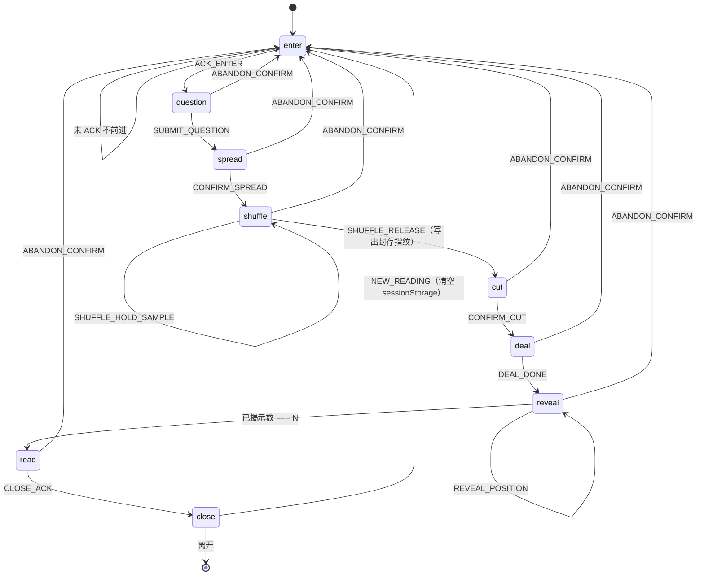
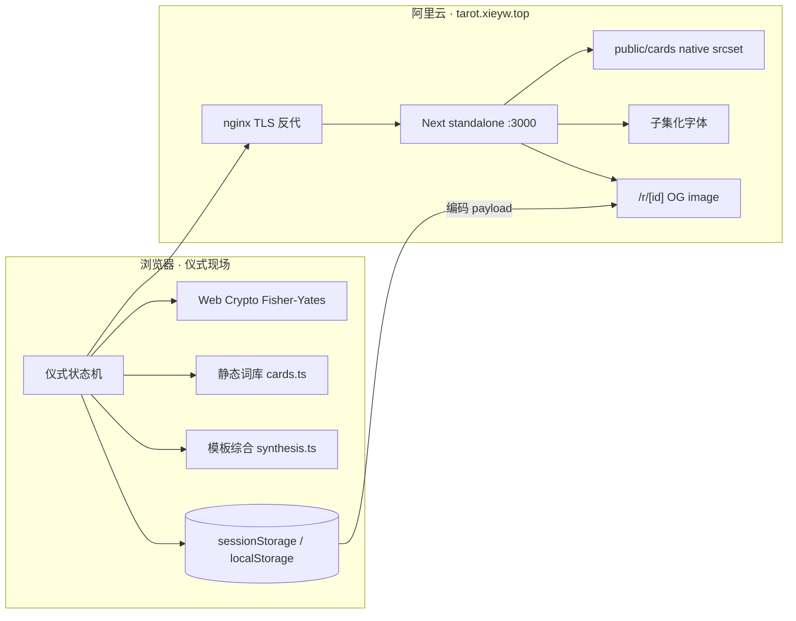
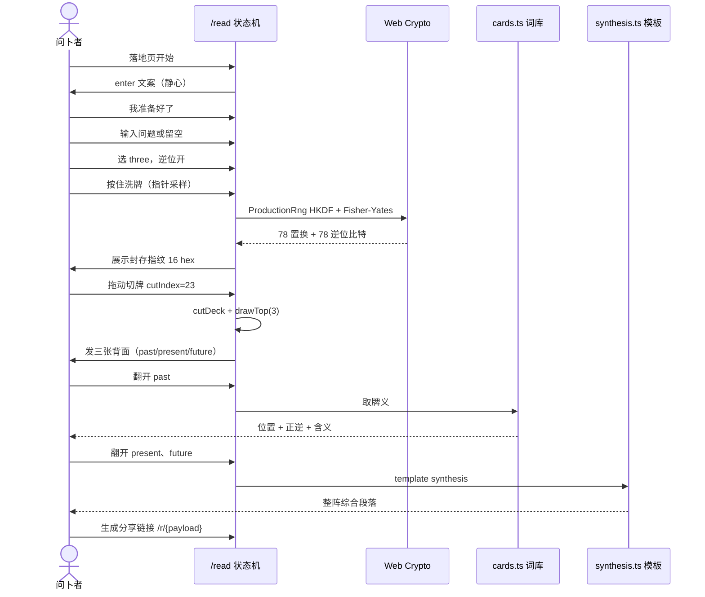

# 烛下塔罗：线上塔罗仪式站点设计文档

| 字段 | 内容 |
| --- | --- |
| 标题 | 烛下塔罗 —— 生产级在线塔罗仪式站点 |
| 作者 | TBD（实现团队） |
| 日期 | 2026-09-16（所有者锁定域名 / 品牌 / v1 无 LLM） |
| 状态 | Draft（所有者决策已锁） |
| 仓库 | `/Users/xiexuan/codes/github_projects/tarot-reading`（绿场，现仅有 `README.md` 与 `RWS_78_aligned.zip`） |
| 语言 | 产品与 UI：**简体中文优先**；代码标识符、路径、类型名、协议字段：**英文** |
| 品牌名 | **烛下塔罗**（已锁定） |
| 生产域名 | `https://tarot.xieyw.top`（`xieyw.top` 已备案子域） |
| 生产宿主 | 所有者阿里云服务器，nginx + Let's Encrypt + Next.js `output: 'standalone'`。**不用 Vercel。** |

---

## Overview

本项目要把一套已完成的 78 张 Rider–Waite–Smith（RWS）重绘牌面，做成一个**可上线、可分享、随机算法可说明**的塔罗仪式网站，以品牌 **烛下塔罗** 部署在已备案域名 `https://tarot.xieyw.top`（所有者阿里云机）。它不是「点一下出一张牌」的小工具，而是一次有进入、有提问、有选阵、有洗切、有逐张翻开、有解读、有收束的完整占卜流程。分享链接复现的是抽出的牌，不是洗牌动画；封存指纹只在当场标签页可复核（见 §5.4）。

v1 的硬约束是：仪式感来自 UX 与流程；公平性来自浏览器端 CSPRNG + Fisher–Yates；含义来自仓库内的中文词库 + **确定性模板综合**（**v1 零 LLM，无 API key、无 Upstash、无 `/api/reading/synthesize`**）。词库优先的架构保留，便于 v1.1 再加 xAI 而不改仪式。牌面按项目委托重绘作品对待（非 1909 年原版扫描件公版倾倒），解读文案必须原创，禁止逐字抄袭 Waite 1910 年 *Pictorial Key*。

---

## Background & Motivation

### 当前仓库状态

绿场。可依赖的事实只有：

- `README.md`：一句话「在线塔罗牌占卜网页。」
- `RWS_78_aligned.zip`（约 33.3 MB，81 个条目）：
  - `RWS_78/aligned/*.jpg`：78 张牌面，全部 **800×1280 JPEG**，奶油色边距 + 统一双细黑框
  - `RWS_78/contact_sheet_aligned.jpg`：联系表，**运行时不用**
  - `RWS_78/README.txt`：风格说明与已知绘制缺陷
  - README 中提到的 `originals/`、`preview/` **不在 zip 内**
- 无 `package.json`、无应用代码、无部署配置、无牌背图
- 文件体积：单张约 283–619 KB，aligned 合计约 32.6 MB

文件名即牌面主键（去扩展名）：

- 大阿尔卡纳：`00_the_fool.jpg` … `21_the_world.jpg`（RWS 编号：8=力量，11=正义；`20_judgement.jpg` 为英式拼写）
- 小阿尔卡纳：`{cups|pents|swords|wands}_{01_ace|02..10|page|knight|queen|king}.jpg`

实测抽样色值（`00_the_fool.jpg`）：边距奶油 `#F4ECD5`，双框近黑 `#191202`，标题条 `#EDD9B4`。画风为 Pamela Colman Smith 1909 木刻/石版气质：平涂、明确轮廓、高饱和黄红青绿，底部英文牌名。这 78 张图是站点**唯一允许高饱和的视觉元素**；UI 必须安静，把舞台让给牌。

已知绘制缺陷（**不挡 v1 上线**，记为资源 follow-up）：

| 文件 | 问题 |
| --- | --- |
| `cups_08.jpg` | 杯子堆叠为 6+3，传统应为 5+3（已目视确认：上三下五，共八杯，构图接近但堆法非经典） |
| `cups_09.jpg` | 常画成 8 杯 |
| `swords_10.jpg` | 常画成 9 剑 |
| `pents_10.jpg` | 常画成 9 星币 |

### 痛点（若做成玩具站会发生什么）

市面上大量「塔罗」页是：一个按钮、一张随机图、一段 LLM 散文。问题有四：

1. **仪式不完整**：没有静心、没有切牌、没有位置语义，问卜者无法进入状态。
2. **随机性不可信**：`Math.random()`、服务端暗箱、重复抽到同一张，经不起「是不是内定」的质疑。
3. **解读不可离线**：没有静态词库时，API key 一缺，产品直接空心。
4. **视觉廉价**：Inter + 紫白渐变 + 无框 PNG，与这套有奶油边和双黑框的重绘板完全冲突。

本设计把上述四点当成产品失败模式，逐项锁死。

---

## Goals & Non-Goals

### Goals（v1 必须交付）

1. 中文优先的完整仪式：进入 → 提问（可空）→ 选牌阵 → 洗牌 → 切牌 → 按位出牌 → 逐张翻开 → 词库解读 + **模板**整阵综合 → 收束/分享。
2. 单副 78 张、无重复；逆位默认开启（设置可关）；随机只用在洗/切/逆位。
3. 三套牌阵：单张、三张（默认）、凯尔特十字十张（深度阵）。
4. 完整 78 张中文词库（正/逆）；模板综合始终存在。v1 **就是**无 LLM 的完整产品。
5. 浏览器端 CSPRNG 洗牌，算法可说明；分享链接复现抽出结果（不是动画、不是 78 张切前序）。当场标签页可复核封存指纹。
6. 仪式化视觉：夜间书房 / 烛光桌面；手机优先；无障碍键盘路径。
7. 部署到 `https://tarot.xieyw.top`（HTTPS、备案号页脚、OG、SEO 基础）。

### Non-Goals（v1 明确不做）

- 支付、会员、账号系统、社区、真人解读师匹配
- NFT / 多牌组切换 / 仅是非题小部件
- 原生 App、PWA 安装强推（可有基础 manifest，不作为目标）
- 收集问卜者星盘、出生数据
- **任何 LLM 综合**（含 xAI / OpenAI / Anthropic / Gemini）。v1.1 可加 xAI，见 PR Plan 附录
- 生产宿主用 Vercel / Cloudflare Pages
- 把 1909 公版原图或 Waite 原文当内容填充
- 英文 UI（v1 只把文案放进字典以便后加，**不做语言开关**）
- 修复 zip 内已知绘制缺陷（跟踪即可）
- 微信 JS-SDK（微信内置浏览器仍作分享验收目标）

---

## Proposed Design

### 1. 审美方向（锁定）：Nocturnal Study / 烛下塔罗

产品名 **烛下塔罗**。视觉系统名 **Nocturnal Study**。不是仪表盘，不是「神秘紫 SaaS」。

**空间隐喻**：夜晚关掉主灯的书桌。深墨色房间，一点烛火，一张奶油色桌布。78 张重绘板是桌上唯一的彩画；其余全部是墨、纸、金线。

#### 1.1 色板（CSS 变量，`src/styles/tokens.css`）

从牌面边距与框线取样，再压到夜间环境：

```css
:root {
  --ink: #100e0c;          /* 房间 */
  --ink-2: #1a1612;        /* 桌面 */
  --parchment: #f4ecd5;    /* 与牌面边距同系 */
  --parchment-dim: #cbbd9a;
  --frame: #191202;        /* 牌面双框近黑 */
  --candle: #c4a35a;       /* 烛金，仅用于焦点与细线 */
  --candle-soft: #e8c84a;  /* 愚者天空黄，极少使用 */
  --ash: #8a7d68;          /* 次级文字 */
  --blood: #7a2e24;        /* 警示/逆位标签，不靠纯色盲区 */
  --grain-opacity: 0.07;
}
```

禁止：紫白渐变、玻璃拟态大卡片、品牌蓝按钮、Inter/Roboto/system-ui 作为主字体、彩色图标包。

#### 1.2 字体配对（自托管，防 CLS）

| 角色 | 字体 | 许可 | 用途 |
| --- | --- | --- | --- |
| 中文标题 / 仪式用语 | **霞鹜文楷 Screen**（`LXGWWenKaiScreen`） | SIL OFL | 「请静心」「过去 / 现在 / 未来」 |
| 中文正文 | **Noto Serif SC**（思源宋） | SIL OFL | 词库段落、免责声明 |
| 拉丁点缀 / 数字 / 牌 ID | **Cormorant Garamond** | SIL OFL | 罗马数字、`/r/` 短码的视觉 |
| 禁止 | Inter, Roboto, PingFang 作唯一字体, 阿里巴巴普惠 | — | 破坏仪式感或许可不清 |

加载策略：

- 文件放 `src/fonts/`，用 `next/font/local`
- **必须子集化**：`fonttools pyftsubset` 或 `cn-font-split`。PR 1 只覆盖 GB/T 2312 常用字 + 标点（词库尚未存在）。PR 9 用词库全文再跑一次子集，补进牌名与仪式用字。目标：文楷子集 ≤ 220 KB woff2，宋体子集 ≤ 450 KB woff2。OG 另备一份更小的 `src/fonts/og-noto-serif-sc-subset.woff`（仅数字、标点、牌阵名、78 张 `nameZh`）。
- `font-display: swap` + `@font-face` 的 `size-adjust` / `ascent-override` 与系统宋体回退对齐，CLS < 0.05
- `<link rel="preload">` 仅预载正文宋体 woff2（标题可延迟）

#### 1.3 牌背（zip 无牌背，必须自产）

**方案锁定：手绘 SVG 牌背**（`src/assets/card-back.svg` → ingest 到 `public/cards/back.svg`），不另生成 JPEG。理由：矢量在任何尺寸都锐；体积 < 8 KB；与奶油边 + 双黑框语言一致；逆位时背面无需旋转含义。

几何规范（与 800×1280 牌面外框对齐）：

- viewBox `0 0 800 1280`，比例 **5:8**
- 外底：`--parchment`
- 双框：与牌面相同的两道 2px `#191202` 描边。以 800 宽为基准，**冻结**外框 inset **28px**、内框 inset **40px**（已与 `00_the_fool.jpg` 外框取样对齐，不再「实现时再校准」）。这两个数字写进 SVG 注释。
- 内场：`#14110e`，低对比菱形/星点 repeating pattern（opacity ≤ 0.12）
- 中央纹章（原创，非 PCS 原背复制）：细金线圆轮 + 一朵白玫瑰（呼应愚者，但不使用牌面裁切）。无文字、无品牌名
- 圆角：0（牌面是直角）

运行时用 `` 或 CSS `background-image`，不要把 SVG 内联进 78 张牌以免重复解析。

#### 1.4 逆位显示

**禁止**为逆位再出一套图。同一张 face：

```css
.card-face.is-reversed {
  transform: rotate(180deg);
}
```

3D 翻开时：外层 `rotateY(180deg)` 揭示正面，正面内部再 `rotate(180deg)`。正逆位**同时**用文字标签「正位 / 逆位」，颜色不是唯一线索。

凯尔特十字「横跨」位（`challenge`）的旋转**叠在槽位上，不写进牌面层**：

```css
.slot-challenge { transform: rotateZ(90deg); }          /* 槽位顺时针 90° */
.card-face.is-reversed { transform: rotate(180deg); }   /* 仅正面层 */
```

两层都生效时净旋转 270°。phone 步进中的那张牌使用**同一套 CSS**（槽位仍 `rotateZ(90deg)`，逆位仍在正面层 180°），迷你阵图第 2 位画成横杠而非圆点，避免桌面/手机变成两件仪式对象。

#### 1.5 动效

| 动作 | 实现 | 时长 | `prefers-reduced-motion: reduce` |
| --- | --- | --- | --- |
| 洗牌 riffle | CSS transform + 少量 WAAPI。牌堆 **只挂 `back.svg` 的 N 份拷贝**（N=12–24），禁止挂任何 face | 按住期间循环 1.2s | 静止牌堆 + 文案「已洗牌」 |
| 切牌 | 上半叠位移 | 跟随手势 | 滑杆选切点，无动画 |
| 发牌 | `translate` 从牌堆到位置 | 420ms ease-out，张间隔 180ms | 瞬移到位置 |
| 翻开 | `transform: rotateY`，`transform-style: preserve-3d` | 600ms | 瞬间切 face |
| 逆位落定 | 翻开结束后 120ms 内完成 180° | 含在翻开中 | 直接倒图 |
| 解读滚入 | 文档流滚动，不用 canvas | — | 普通滚动 |

**不引入 Framer Motion / GSAP**（gzip 预算）。卡片 3D 用纯 CSS。洗牌循环必须在 `visibilitychange` / 松手时停止，避免后台耗电。环境声同样在 `visibilitychange`（`document.hidden`）时暂停，回到前台不自动恢复（需用户再点开）。

`Space` 按住洗牌时，`keydown` 必须 `preventDefault()`，避免页面滚动。切牌滑杆 `step=1`，方向键每次 ±1。

氛围：

- 全页 grain overlay，opacity **恰好** `var(--grain-opacity)` = **0.07**（CSS repeating 或 64×64 PNG，`pointer-events: none`）。不要再写 5–8%。
- 径向 vignette（桌心亮、四周沉）
- 可选环境声 `public/audio/hearth.mp3`（安静木柴，≤ 30s loop，音量默认 0.12）。**默认关**；必须由用户手势打开；无自动播放；无歌词；提供静音键

#### 1.6 响应式断点

| Token | 宽度 | 仪式行为 |
| --- | --- | --- |
| `phone` | `< 768px` | **一次只处理一个位置**。凯尔特十字用迷你阵图（10 个点）指示当前位 |
| `tablet` | `768–1023px` | 三张可横排；十字仍步进 + 简化阵图 |
| `desktop` | `≥ 1024px` | 完整桌面阵图 + 右侧解读栏（`minmax(280px, 36ch)`） |

牌面渲染宽度：phone 揭示态约 200–240 CSS px；desktop 三张约 160–180；十字约 96–120。`sizes` 与 srcset 对齐，见资产管线。

#### 1.7 无障碍

- 全仪式可键盘：`Enter` 进入下一步，`Space` 按住洗牌 / 松开停止（无指针采样，见 §5.2 键盘路径），方向键切牌（step 1），`Enter` 翻开
- 可见 `focus-visible` 金线圈，对比度 ≥ 3:1（大元素）/ 4.5:1（正文）
- 每张牌 `alt`：`愚者（正位）` / `圣杯八（逆位）`，未翻开为 `未翻开的牌，第 n 位置`
- 解读是真正的 HTML 文本，不是画在 canvas 上
- `aria-live="polite"` 用于翻开与综合段落的出现
- 不靠红/绿区分正逆

---

### 2. 信息架构与路由

App Router 路由表（全部 `zh-CN`）：

| 路径 | 职责 | 渲染 |
| --- | --- | --- |
| `/` | 落地：氛围、一句方法、开始仪式、次级链到牌典/关于 | SSG |
| `/read` | **单一仪式页**，内部 stage 状态机，不按 stage 拆 URL（刷新用 sessionStorage 恢复） | 薄 Server Component 壳 + `"use client"` 的 `RitualApp` |
| `/r/[readingId]` | 不可变结果页。分享、OG。无限 payload，禁止 SSG | **force-dynamic SSR**（`export const dynamic = 'force-dynamic'`） |
| `/deck` | 78 张图鉴索引（SEO + 信任） | SSG |
| `/deck/[cardId]` | 单牌：图、正逆词库、元素、星对应 | SSG × 78 |
| `/about` | 方法、随机性说明、逆位、免责、危机资源 | SSG |
| `/privacy` | 隐私：问题只在浏览器；v1 无出域模型 | SSG |

不在 v1 做 `/login`、`/shop`、`/blog`。

页头极简：**烛下塔罗**（左）+ 「开始」+ 「牌典」+ 「关于」。仪式进行中页头降为可退出的细条；点击退出派发 `ABANDON_REQUEST`，确认文案用 `COPY.abandonConfirm`。

页脚常驻三行：`COPY.disclaimerFooter`、`COPY.icp`（备案号占位，链到 https://beian.miit.gov.cn/）、版权「© 烛下塔罗」。PR 1 即挂进 `layout.tsx`。长免责 `COPY.disclaimer` 用于 `/about`、结果页。全部从 `src/i18n/zh-CN.ts` 导出，禁止第三处手写。**禁止**从 Google Fonts 或其它境外字体 CDN 拉文件（已自托管）。

---

### 3. 仪式状态机

状态名（代码枚举 `RitualStage`）。`deal` 是**非交互发牌动画**，播完自动 `DEAL_DONE` → `reveal`；`prefers-reduced-motion` 下时长为 0。v1 **没有** LLM stage 或综合按钮；`RitualEvent` 里的 `REQUEST_SYNTHESIS` / `SYNTHESIS_*` 保留类型但不挂 UI，以免 v1.1 改状态机。

```
enter → question → spread → shuffle → cut → deal → reveal → read → close
```



#### 3.0 事件与合法转移

`src/lib/ritual-machine.ts` 导出纯函数 `reduce(session, event): RitualSession`。非法 `(stage, event)` 返回原 session（并 `console.warn` 于开发态），不抛到 UI。

```ts
export type RitualEvent =
  | { type: 'ACK_ENTER' }
  | { type: 'SET_QUESTION'; question: string | null }
  | { type: 'SUBMIT_QUESTION' }
  | { type: 'SET_SPREAD'; spreadId: SpreadId }
  | { type: 'SET_REVERSALS'; enabled: boolean }
  | { type: 'CONFIRM_SPREAD' }
  | { type: 'BACK' }
  | { type: 'SHUFFLE_HOLD_START'; source: 'pointer' | 'keyboard' }
  | { type: 'SHUFFLE_HOLD_SAMPLE'; x: number; y: number; t: number }
  | { type: 'SHUFFLE_RELEASE' }
  | { type: 'SET_CUT'; cutIndex: number }
  | { type: 'REQUEST_AUTO_CUT' }
  | { type: 'CONFIRM_CUT' }
  | { type: 'DEAL_DONE' }
  | { type: 'REVEAL_POSITION'; positionId: string }
  | { type: 'REVEAL_NEXT' }
  | { type: 'REQUEST_SYNTHESIS' }
  | { type: 'SYNTHESIS_DELTA'; chunk: string }
  | { type: 'SYNTHESIS_DONE' }
  | { type: 'SYNTHESIS_FAIL' }
  | { type: 'CLOSE_ACK' }
  | { type: 'NEW_READING' }
  | { type: 'ABANDON_REQUEST' }
  | { type: 'ABANDON_CONFIRM' }
  | { type: 'ABANDON_CANCEL' };
```

| 当前 stage | 合法事件 | 下一 stage |
| --- | --- | --- |
| `enter` | `ACK_ENTER` | `question` |
| `question` | `SET_QUESTION`、`SUBMIT_QUESTION`、`BACK`、`ABANDON_*` | `SUBMIT`→`spread`；`BACK`→`enter` |
| `spread` | `SET_SPREAD`、`SET_REVERSALS`、`CONFIRM_SPREAD`、`BACK`、`ABANDON_*` | `CONFIRM`→`shuffle`；`BACK`→`question` |
| `shuffle` | `SHUFFLE_HOLD_*`、`SHUFFLE_RELEASE`、`ABANDON_*` | `RELEASE`（有指纹）→`cut`。**无 `BACK`** |
| `cut` | `SET_CUT`、`REQUEST_AUTO_CUT`、`CONFIRM_CUT`、`ABANDON_*` | `CONFIRM`→`deal`。无 `BACK` |
| `deal` | `DEAL_DONE`、`ABANDON_*` | `reveal` |
| `reveal` | `REVEAL_POSITION`、`REVEAL_NEXT`、`ABANDON_*` | 仍 `reveal`，直到 `revealedPositionIds.length === N` → `read` |
| `read` | `CLOSE_ACK`、`ABANDON_*`（v1 不派发 `REQUEST_SYNTHESIS`） | `CLOSE_ACK`→`close` |
| `close` | `NEW_READING` | `enter`（新 session） |
| 任意（除 `enter`/`close` 未开始） | `ABANDON_REQUEST` → 确认框；`ABANDON_CONFIRM` | `enter`，**清空** `sessionStorage` |

规则：

1. `SHUFFLE_RELEASE` **之前**可 `BACK`（问题、牌阵、逆位都可改）。
2. **一旦写出 `commitHash`，唯一合法回头是 `ABANDON_CONFIRM`。** 确认文案：`COPY.abandonConfirm` = 「牌序已经封存。放弃本局将丢掉这副牌，无法恢复。」
3. 空问题合法：`SUBMIT_QUESTION` 时若文本空或仅空白，存 `question: null`。
4. 逆位开关在 `spread` 步，默认 **开**。关闭则全部 `upright`，洗牌仍洗位置。
5. 进行中 session 写入 `sessionStorage` key `tarot.ritual.v1`。`storage.ts` 对 `sessionStorage`/`localStorage` 一律 try/catch：Safari 隐私模式或配额失败时降级为进程内内存 Map，不弹窗。完成局写入 `localStorage` key `tarot.history.v1`，**FIFO 20 条**（`src/lib/storage.ts` 的 `pushHistory` 是唯一写入点；PR 8 只做列表 UI）。
6. 分享页是新文档，不回放洗牌动画。
7. 刷新：`shuffle` 且尚无 `commitHash` → 恢复到 `shuffle`（手势采样丢弃，须再按住）。`cut` 及之后 → 恢复切前 78 张 `deckPreCut`、指纹、已切则还有 `deck`/`draws`。`deal` 刷新直接进 `reveal`（动画不重放）。
8. `NEW_READING` 与 `ABANDON_CONFIRM` 都 `sessionStorage.removeItem('tarot.ritual.v1')` 再创建新 session。
9. `session.synthesisText` 在 v1 恒为 `null`。v1.1 若接入 LLM 再写入；模板综合不依赖该字段。
10. 单张阵的是非免责：**凡 `spreadId === 'single'` 都显示**，不对问题做 NLP。

#### 3.1 各步 UI 文案（中文，可直接进 `src/i18n/zh-CN.ts`）

**enter**

- 标题：请把灯调暗一些
- 正文：把声音关掉。用大约一分钟看这张桌子。你不必相信塔罗；你只需要把注意力放到将要问出的那件事上。
- 主按钮：我准备好了
- 次按钮：先看牌典 / 方法说明

**question**

- 标题：你想问什么
- 占位：可以写一件具体的事，也可以留空，让牌自己说话
- 计数：最多 200 字（`[...question].length`，按 Unicode 码位，不是 `string.length`）
- 主按钮：继续
- 次按钮：我没有具体问题（效果等于空提交）
- 提示：问题只存在你的浏览器里，直到你主动生成分享链接。

**spread**

- 标题：选择牌阵
- 三张卡片式选择，默认高亮三张阵
- 逆位：开关「包含逆位」，说明「逆位不是坏兆，它谈内化、阻滞或过犹不及」
- 主按钮：去洗牌

**shuffle**

- 标题：洗牌
- 提示：按住牌堆。你的手势会混入随机源；即使没有手势，浏览器的密码学随机也足够公平。我们不把算法说成宇宙选牌。
- 松手后显示：牌序已封存 · `指纹 a3f2c91b0d44e17f`（**16 位 hex**，SHA-256 的前 8 字节）
- 主按钮：切牌

**cut**

- 标题：切牌
- 拖动上半叠或使用滑杆（`min=1` `max=77` `step=1`）。显示「从第 k 张切开」
- 若用户点「请为我切」：用 `ProductionRng` 选整数 `cutIndex ∈ [1,77]`
- 主按钮：开牌

**deal / reveal**

- `deal`：非交互。desktop 按 `drawOrder` 把 N 张**背面**飞入阵位；phone 把 N 张背面叠在步进槽。动画结束派发 `DEAL_DONE`。`prefers-reduced-motion` 下瞬间就位。
- `reveal`：推荐按 `drawOrder` 翻开（`REVEAL_NEXT`），也允许点某一张未翻开的（`REVEAL_POSITION`）。**`read` 只在 `|revealedPositionIds| === N` 时进入**。`aria-live` 按实际翻开顺序播报，不按点击时间以外的「建议序」撒谎。
- 凯尔特十字第 2 张：槽位 `rotateZ(90deg)`，正面逆位另 `rotate(180deg)`（§1.4）。phone 迷你阵图第 2 位为横杠；步进中的大牌仍走同一套 CSS，并标注「横跨」。
- **硬规则：** 某位置在 `revealedPositionIds` 之前，`Card3D` 只渲染 `back.svg`，**不**创建 face 的 ``（包括 `loading="lazy"` 也不行，避免预取）。

**read**

- 结构：先逐位置（位置语义 → 牌 → 正逆 → 词库），再模板整阵综合
- v1 **不渲染**「请为本阵写一段综合」按钮，不发任何模型请求

**close**

- 复制链接（编码前若 `readingId.length > 1500` 拒绝并提示去掉问题）/ 本机已由 `pushHistory` 写入 / 再起一局 / 看这几张牌的词条
- 生成链接前展示 `COPY.shareQuestionWarning`，勾选「分享时去掉问题」

---

### 4. 牌阵规格

`src/data/spreads.ts`。v1 三个 `SpreadId`：`single` | `three` | `celtic`。

**深度阵选择：凯尔特十字，而不是五张。** 理由：中文塔罗语境里「认真问一件事」的默认深度阵就是十字；产品目标是完整仪式而非缩短路径；phone 已规定一次一位，十字的桌面拥挤问题被步进揭开消化。五张阵（处境/挑战/建议/近未来/结局）作为明确不做的 v1 项，避免两个「深度」互相稀释。

**v1 抽 10 张，不抽 significator（问卜者代表牌）。** 这是现代韦特十字的常见做法：第 1 张就是「现状」，不再先抽一张固定代表问卜者。实现者不得「补」第 11 张。`/about` 用一句话说明：「本阵不另抽代表牌，第一张即此事的核心场。」

#### 4.1 `single` — 单张（每日 / 倾向）

| `positionId` | 中文名 | 解读角色 |
| --- | --- | --- |
| `focus` | 此刻 | 今日主题或对该问题的核心倾向 |

桌面 / 手机：正中一张。

免责（**凡 `single` 都显示**，不对问题做是非 NLP）：

> 塔罗不回答绝对的是或否。这一张给出的是倾向、条件与需要注意的力量，不是判决。

#### 4.2 `three` — 三张（默认）

| `positionId` | 中文名 | 解读角色 | 顺序 |
| --- | --- | --- | --- |
| `past` | 过去 | 已形成、正在消退或仍托住现状的根 | 1 |
| `present` | 现在 | 问卜者此刻所站的位置 | 2 |
| `future` | 未来 | 若沿当前轨迹，近段时间显化的方向（非命运判决） | 3 |

桌面布局（tableau 容器 100%，牌宽约 18vw，max 180px）：

```
past @ 18%  —  present @ 50%  —  future @ 82%   （均为水平中心，垂直居中）
```

phone：步进，底部三点和进度「1 / 3」。

#### 4.3 `celtic` — 凯尔特十字（深度）

位置采用常见韦特十字（十字 + 右侧权杖由下至上）。`drawOrder` 即发牌顺序。

| `positionId` | 序号 | 中文名 | 解读角色 |
| --- | --- | --- | --- |
| `present` | 1 | 现状 | 此事的核心场、问卜者当前被什么裹住 |
| `challenge` | 2 | 横跨 | 立即的阻力或加于现状之上的力量；槽位 **`rotateZ(90deg)` 顺时针**（§1.4） |
| `foundation` | 3 | 根基 | 更深层的原因、身体性/物质性的底 |
| `past` | 4 | 过去 | 正在离开的一章 |
| `crown` | 5 | 冠位 | 意识层的目标、可能的最好显化、或「正被想到的」 |
| `future` | 6 | 近未来 | 即将进入场的力量 |
| `self` | 7 | 自我 | 问卜者对自己在此事中的态度 |
| `environment` | 8 | 环境 | 他人、家庭、工作场对问卜者的看法与压力 |
| `hopes_fears` | 9 | 希望与恐惧 | 同一枚硬币的两面 |
| `outcome` | 10 | 结局 | 若 1–9 的动力学持续，最可能的收束 |

桌面坐标（百分比，相对于 tableau；牌尺寸 104×166；原点为牌的中心）：

```
crown        (38, 16)
past         (18, 48)   present (38, 48)   future (58, 48)
foundation   (38, 80)
challenge    (38, 48)  rotateZ(90deg) clockwise, z-index 2

self         (80, 84)
environment  (80, 62)
hopes_fears  (80, 40)
outcome      (80, 18)
```

phone 迷你阵图：20×32 vw 的点阵，当前位 `--candle` 描边；第 2 位画**横杠**（表示横跨），其余为点。不在 phone 上尝试 10 张全尺寸同屏。步进中的大牌仍使用 `rotateZ(90deg)` 槽位，与桌面同一套变换。

---

### 5. 随机性、洗牌与封存指纹

**原则：神秘感在仪式 UX，公平在算法。禁止把 RNG 包装成「宇宙选牌」。** 用户可见名称是「封存指纹」，不是「审计哈希」。`/about` 用白话写明（草稿见 §5.5）。

#### 5.1 方案锁定：客户端洗牌 + 参与式切牌 + 从上抽

| 步骤 | 谁执行 | 随机源 |
| --- | --- | --- |
| 洗牌置换 | 浏览器 | `ProductionRng`（CSPRNG 盐 + 可选手势，经 HKDF-SHA-256 展开） |
| 逆位比特 | 浏览器，与置换同一 `ProductionRng` 流 | 每张独立 Bernoulli(1/2)，**仅当** `reversalsEnabled` |
| 手势熵 | 浏览器 | 按住期间采样；**即使 samples 长度为 0，盐仍是 32 字节 CSPRNG，公平性充分** |
| 切牌 | 用户或 `ProductionRng` | 旋转已封存的**切前**牌序，不重新取样置换 |
| 抽牌 | 确定性 | 切后牌堆顶 N 张，N = 牌阵位置数 |
| LLM | 服务端 | **不参与选牌** |

**为什么不是「牌桌摊开让用户点 N 张背面」：** 点选会诱发「我是不是点到了命定那张 / 网站是不是看我鼠标」的猜疑，且实现上容易让人觉得可被操纵。传统桌面流程是洗、切、上抽。参与感应放在洗与切。

**为什么不是服务端提交洗牌：** 问卜者的设备才是仪式现场；服务端选牌无法现场参与，且「信任服务器」比「信任 Web Crypto」更难向怀疑者解释。v1 服务器从不接收抽出的牌（无综合 API）。

#### 5.2 算法（实现必须可单测）

文件：`src/lib/shuffle.ts`、`src/lib/rng.ts`。

**品牌类型：** 生产仪式只调用 `shuffleDeckProduction`。测试调用无品牌的 `shuffleDeck` + `createSeededRng`。两者不混用。

```ts
export type Orientation = 'upright' | 'reversed';

export interface ShuffledCard {
  cardId: CardId;
  orientation: Orientation;
}

export interface CommitDeck {
  cards: ShuffledCard[];      // length === 78，切前序
  commitHash: string;         // sha-256 hex 的前 16 个字符（8 字节）
  reversalsEnabled: boolean;
  algo: 'fisher-yates-v1';
}

declare const productionRngBrand: unique symbol;
export type ProductionRng = (() => number) & { readonly [productionRngBrand]: true };
export type TestRng = () => number;

/** rng() must return float in [0, 1) with full 32-bit granularity. */
export function fisherYates<T>(items: readonly T[], rng: () => number): T[] {
  const a = items.slice();
  for (let i = a.length - 1; i > 0; i--) {
    const j = Math.floor(rng() * (i + 1));
    [a[i], a[j]] = [a[j], a[i]];
  }
  return a;
}

export function shuffleDeck(
  cardIds: readonly CardId[],
  rng: TestRng | ProductionRng,
  reversalsEnabled: boolean,
): ShuffledCard[] {
  const order = fisherYates(cardIds, rng);
  return order.map((cardId) => ({
    cardId,
    orientation:
      reversalsEnabled && rng() < 0.5 ? 'reversed' : 'upright',
  }));
}

export function shuffleDeckProduction(
  cardIds: readonly CardId[],
  rng: ProductionRng,
  reversalsEnabled: boolean,
): ShuffledCard[] {
  return shuffleDeck(cardIds, rng, reversalsEnabled);
}

export function cutDeck(cards: ShuffledCard[], cutIndex: number): ShuffledCard[] {
  if (!Number.isInteger(cutIndex) || cutIndex < 1 || cutIndex > 77) {
    throw new RangeError('cutIndex must be an integer in [1, 77]');
  }
  return cards.slice(cutIndex).concat(cards.slice(0, cutIndex));
}

export function drawTop(cards: ShuffledCard[], n: number): ShuffledCard[] {
  if (n > cards.length) throw new Error('draw exceeds deck');
  return cards.slice(0, n);
}
```

`cutIndex = k` 的语义：把索引 `0..k-1` 的上半叠移到堆底，新的顶是原第 k 张（0-based 的 `cards[k]`）。`k=1` 切掉 1 张；`k=77` 切掉 77 张（原底牌上来）。禁止 0 与 78。

##### 手势混合（真实搅拌，不是空操作）

按住期间，指针路径每 ~32ms 记一笔 `{x, y, t}`（相对牌堆的 CSS 像素与 `performance.now()`）。键盘 `Space` 路径：`source: 'keyboard'`，**samples 允许为空**——不伪造鼠标，也不降低 CSPRNG 盐的质量。

松手时构造 `ProductionRng`（`src/lib/rng.ts`）：

```ts
const INFO = new TextEncoder().encode('tarot-fisher-yates-v1');

function encodeSamples(samples: ReadonlyArray<{ x: number; y: number; t: number }>): Uint8Array {
  const out = new Uint8Array(samples.length * 12);
  const view = new DataView(out.buffer);
  samples.forEach((s, i) => {
    view.setFloat32(i * 12, s.x, true);
    view.setFloat32(i * 12 + 4, s.y, true);
    view.setFloat32(i * 12 + 8, s.t, true);
  });
  return out;
}

export async function createProductionRng(
  samples: ReadonlyArray<{ x: number; y: number; t: number }>,
): Promise<ProductionRng> {
  const salt = new Uint8Array(32);
  crypto.getRandomValues(salt); // 即使 samples 长度为 0，盐也充分
  const packed = encodeSamples(samples);
  const ikm = new Uint8Array(salt.length + packed.length);
  ikm.set(salt);
  ikm.set(packed, salt.length);
  const baseKey = await crypto.subtle.importKey('raw', ikm, 'HKDF', false, ['deriveBits']);
  const bits = await crypto.subtle.deriveBits(
    { name: 'HKDF', hash: 'SHA-256', salt: new Uint8Array(32), info: INFO },
    baseKey,
    624 * 8, // 624 bytes
  );
  const bytes = new Uint8Array(bits);
  const view = new DataView(bytes.buffer, bytes.byteOffset, bytes.byteLength);
  const pool: number[] = [];
  for (let i = 0; i < bytes.byteLength; i += 4) {
    pool.push(view.getUint32(i, false) / 2 ** 32); // 大端，避免 Uint32Array 的平台端序
  }
  let offset = 0;
  const rng = (() => {
    if (offset >= pool.length) throw new Error('ProductionRng pool exhausted');
    return pool[offset++];
  }) as ProductionRng;
  return rng;
}
```

实现约束（比注释更硬）：

1. `createProductionRng` **在返回前**用 HKDF 派生至少 `(78 + 78) × 4 = 624` 字节（Fisher–Yates 最多 77 次取样 + 78 次逆位比特，取整到 624）。`rng()` 同步、无 await、不耗尽。
2. HKDF：`hash = SHA-256`，`ikm = salt(32) || packedSamples`，`salt = 32 个 0`（HKDF 盐；与 CSPRNG `salt` 变量不是同一段），`info = "tarot-fisher-yates-v1"`，`length = 624`。
3. 用 `DataView.getUint32(i, false)` 大端读成 `[0,1)`，禁止 `new Uint32Array(buffer)`（平台端序）。
4. 键盘路径与「samples 全 0」路径必须有单测：与空 samples 对比，因 `salt` 不同，输出牌序几乎必然不同；公平性不依赖手势。
5. `createSeededRng(seed: number)`（mulberry32）返回 `TestRng`，**不能**赋给 `ProductionRng`。`RitualApp` 只 import `shuffleDeckProduction`。

#### 5.3 何时封存

```
用户松手 / Space keyup
  → 采样停止
  → rng = await createProductionRng(samples)
  → deckPreCut = shuffleDeckProduction(CARD_IDS, rng, reversalsEnabled)
  → commitHash = fingerprint(deckPreCut)     // 16 hex
  → session.deckPreCut = deckPreCut          // 一直保留到 close
  → session.deck = null
  → UI 展示「牌序已封存 · 指纹 {commitHash}」
  → 进入 cut
用户确认 cutIndex ∈ [1,77]
  → session.cutIndex = cutIndex
  → session.deck = cutDeck(session.deckPreCut, cutIndex)  // 不覆盖 deckPreCut
  → draws = drawTop(session.deck, spread.positions.length)
  → 按 drawOrder 把 draws[i] 赋给 positions[i]
```

**禁止**在用户点位置时再随机。**禁止**同一 `cardId` 出现两次（单测不变量）。v1 单副，无第二副。

#### 5.4 封存指纹：规范字节与验证矩阵

用户可见名称：**封存指纹**。不称「审计」、不上链、不把分享页伪装成可复核切前序。

规范字节（测试必须对这一段做向量）：

```ts
export function fingerprint(cards: ShuffledCard[]): string {
  const body = {
    algo: 'fisher-yates-v1',
    cards: cards.map((c) => ({
      id: c.cardId,
      o: c.orientation === 'reversed' ? 'r' : 'u',
    })),
  };
  const bytes = new TextEncoder().encode(JSON.stringify(body)); // 无空格，键序 algo → cards[] → id,o
  // sha-256，取 hex 的前 16 个字符（8 字节）
}
```

`JSON.stringify` 默认即无空格；插入顺序必须是 `algo` 然后 `cards`，每张 `id` 然后 `o`。禁止 pretty-print、禁止按字母重排。

| 场景 | 能复核什么 |
| --- | --- |
| 当场标签页（`close` 前） | 用留下的 `deckPreCut` 再跑 `fingerprint`，必须等于 UI 上的 16 hex |
| 分享链接 `/r/...` | payload 带 `commit`（16 hex）+ `cutIndex` + `draws`，**第三方不能重算 SHA-256**（切前 78 张不进 URL）。指纹是信息性的：「当时浏览器曾封存过一副牌」 |
| 关闭本局或新标签 | 切前序消失，指纹无法再验证 |

v1 **不**把 78 张切前序放进分享 payload（长度与隐私都不值）。若未来要第三方复核，走 `v: 2` 另加字段。

#### 5.5 `/about` 随机性白话（可直接进页面）

> 洗牌在你的浏览器里完成，用 Web Crypto 生成随机数，再按 Fisher–Yates 打乱 78 张。按住牌堆时，指针运动会混进随机源；即使用键盘按住、没有任何指针，随机性也足够。松手后我们计算一枚「封存指纹」并显示出来，切牌只旋转这副已封存的牌，不会再抽一次。服务器从不选牌。分享链接复现抽出的那几张，不复现洗牌动画，别人也无法用指纹反推整副牌序。

---

### 6. 解读引擎

三层，全部确定性。v1 只有 A+B+模板 C；LLM 是 v1.1 可选第 3 层增强，不进 v1 合并门槛。

#### 6.1 Layer A — 静态词库

`src/data/cards.ts` 导出 `CARDS: Record<CardId, CardLexicon>`，`CARD_IDS: readonly CardId[]` 长度恒为 78。

文案语气（给写词库的人）：

- 现代书面汉语，短句，具体
- 写倾向与动力学，不写「你会发财」「他会回来」
- 正位 / 逆位都是完整含义，逆位 ≠ 正位反义词表
- **禁止**逐字翻译或改写 *Pictorial Key*
- 每条含义 2–4 句；关键词 3–5 个中文词，`keywordsUpright[0]` / `keywordsReversed[0]` 不得为空（Layer C 要用）
- **物体计数以传统牌义为准，不以重绘缺陷为准。** 圣杯八仍写「离开、放下已满的杯」，不写「六加三」；星币十仍写圆满与家族，不写「画面上像九枚」

以下四条为语气与结构的锁定样例（PR 2 必须先合这四条再铺开其余 74 条）。

示例 1（愚者，大牌定调）：

```ts
{
  id: '00_the_fool',
  nameZh: '愚者',
  nameEn: 'The Fool',
  arcana: 'major',
  number: 0,
  suit: null,
  rank: null,
  element: 'air',
  astrology: 'uranus',
  keywordsUpright: ['开端', '轻装', '信任', '跃入'],
  keywordsReversed: ['鲁莽', '停在崖边', '恐惧', '未准备'],
  meaningUpright:
    '你站在一条尚未命名的路的起点。这张牌不保证安全，它只指出：带着最少的行李出发，往往比带着完整计划观望，更接近你真正要去的地方。',
  meaningReversed:
    '悬崖仍在。你或是把脚收回来，或是闭着眼跳。逆位的愚者要你分清哪一种叫勇敢，哪一种叫把责任推给「反正会有人接住」。',
}
```

示例 2（圣杯八，小牌 + 已知错画；**按传统八杯离开，不按 6+3 构图改义**）：

```ts
{
  id: 'cups_08',
  nameZh: '圣杯八',
  nameEn: 'Eight of Cups',
  arcana: 'minor',
  number: null,
  suit: 'cups',
  rank: '08',
  element: 'water',
  astrology: null,
  keywordsUpright: ['离开', '放下', '转向', '不再够'],
  keywordsReversed: ['徘徊', '怕空', '回头', '未走成'],
  meaningUpright:
    '杯还在，但已经喂不饱你。正位是转身离开那一排仍旧漂亮的杯，去走更暗、更没人保证的路。不是被赶走，是自己发现满了也不够。',
  meaningReversed:
    '你站在该走的路口，却还在清点杯子。逆位谈的是徘徊、对空的恐惧，或把「再忍一忍」误当成忠诚。',
}
```

示例 3（宝剑三，小牌剑组）：

```ts
{
  id: 'swords_03',
  nameZh: '宝剑三',
  nameEn: 'Three of Swords',
  arcana: 'minor',
  number: null,
  suit: 'swords',
  rank: '03',
  element: 'air',
  astrology: null,
  keywordsUpright: ['刺痛', '说清楚', '心碎', '必要的伤'],
  keywordsReversed: ['淤着', '不出口', '延迟的痛', '自我控诉'],
  meaningUpright:
    '痛是具体的，往往也是可命名的。正位要你让那句话被说出来，而不是在心里反复磨。澄清本身就是这张牌给的药，尽管苦。',
  meaningReversed:
    '伤还在，但被压到日常下面。逆位警告：不出口的剑会向内长。先承认疼，再决定要不要对谁说。',
}
```

示例 4（星币王后，宫廷牌）：

```ts
{
  id: 'pents_queen',
  nameZh: '星币王后',
  nameEn: 'Queen of Pentacles',
  arcana: 'minor',
  number: null,
  suit: 'pents',
  rank: 'queen',
  element: 'earth',
  astrology: null,
  keywordsUpright: ['滋养', '实际', '家园', '把资源变成稳定'],
  keywordsReversed: ['操劳', '自我耗尽', '把价值绑在产出上', '忽视身体'],
  meaningUpright:
    '王后坐在自己建成的园子里。正位谈把照顾、金钱与身体当成同一件事来打理：稳定来自日常，而不是一次爆发。',
  meaningReversed:
    '园子还在，园丁空了。逆位是为所有人把日子撑住、却不把自己算进预算。先恢复身体节奏，再谈慷慨。',
}
```

#### 6.2 Layer B — 位置框架

每个 `SpreadPosition` 带 `frameZh`：一句把牌义推进该位置的引导，不按 78×位置写死。

例（三张 `past`）：「把这张牌读作已经发生、仍托住或正在消退的影响，而不是正在发生的事件。」

渲染模板：

```
{position.nameZh} · {card.nameZh}（{正位|逆位}）
{position.frameZh}
{orientation === 'reversed' ? card.meaningReversed : card.meaningUpright}
关键词：{keywords join 「、」}
```

#### 6.3 Layer C — 整阵综合

**无 LLM（必有，模板引擎 `src/lib/synthesis.ts`）：**

输入：问题、spread、draws、各牌词库。输出一段 120–220 字中文，规则：

1. 开句：有问题则「关于「{question}」」；否则「这是一次未命题的开牌」。
2. 按 `drawOrder` 各用半句，半句 = 位置名 + 牌名 + 该方向**第一个关键词**。若该方向关键词数组为空（测试应已禁止），半句退化为位置名 + 牌名。
3. 统计：大阿尔卡纳张数、逆位张数、四元素计数（每张牌用其 `element`，大牌见下表）。
4. 收句，按下列顺序最多各一句：
   - 大牌 ≥ 一半：「此事被更长的弧线托着，不只是日常调整。」
   - 逆位 ≥ 一半：「能量多向内折，先处理阻滞再谈外在结果。」
   - **元素众数存在唯一最大值**时追加一句：火「行动与意志更重」；水「情感与联系更重」；风「思想与冲突更重」；土「身体、钱与工作节奏更重」。
   - **并列第一（三张 1-1-1、十字 3-3-2-2 等）则省略元素句**，不要随便挑一个。
5. 不引入未抽出的牌名。单测：输出中的 `nameZh` 集合 ⊆ 抽出集合。

**v1 无 LLM。** 模板综合就是整阵叙事。v1.1 若加生成段落，必须渲染在模板综合**下方**，标题「综合（生成）」；模板层永不撤掉。完整上游合同见文末「v1.1 附录」。

#### 6.4 完整 `CardId` 与中文名（ingest 与词库必须逐行对齐）

大阿尔卡纳：

| id | nameZh | nameEn |
| --- | --- | --- |
| `00_the_fool` | 愚者 | The Fool |
| `01_the_magician` | 魔术师 | The Magician |
| `02_the_high_priestess` | 女祭司 | The High Priestess |
| `03_the_empress` | 女皇 | The Empress |
| `04_the_emperor` | 皇帝 | The Emperor |
| `05_the_hierophant` | 教皇 | The Hierophant |
| `06_the_lovers` | 恋人 | The Lovers |
| `07_the_chariot` | 战车 | The Chariot |
| `08_strength` | 力量 | Strength |
| `09_the_hermit` | 隐者 | The Hermit |
| `10_wheel_of_fortune` | 命运之轮 | Wheel of Fortune |
| `11_justice` | 正义 | Justice |
| `12_the_hanged_man` | 倒吊人 | The Hanged Man |
| `13_death` | 死神 | Death |
| `14_temperance` | 节制 | Temperance |
| `15_the_devil` | 恶魔 | The Devil |
| `16_the_tower` | 高塔 | The Tower |
| `17_the_star` | 星星 | The Star |
| `18_the_moon` | 月亮 | The Moon |
| `19_the_sun` | 太阳 | The Sun |
| `20_judgement` | 审判 | Judgement |
| `21_the_world` | 世界 | The World |

小阿尔卡纳套装名：`cups` 圣杯 / `pents` 星币 / `swords` 宝剑 / `wands` 权杖。

点数名：`01_ace` 王牌，`02`–`10` 二至十，`page` 侍从，`knight` 骑士，`queen` 王后，`king` 国王。

例：`cups_08` = 圣杯八，`wands_01_ace` = 权杖王牌，`pents_queen` = 星币王后。

元素：权杖火、圣杯水、宝剑风、星币土。宫廷牌同套装元素。

大阿尔卡纳元素与星对应（写入每条 `CardLexicon.element` / `.astrology`；仪式页不展示星对应，只在 `/deck/[cardId]` 展示）。依据：Golden Dawn 元素 + 现代行星/星座对应。PR 2 测试断言 78 张 `element ∈ {fire,water,air,earth}`。

| id | element | astrology | 备注 |
| --- | --- | --- | --- |
| `00_the_fool` | air | uranus | GD 风；现代天王星 |
| `01_the_magician` | air | mercury | 水星 / 风 |
| `02_the_high_priestess` | water | moon | 月亮 / 水 |
| `03_the_empress` | earth | venus | 金星 / 土 |
| `04_the_emperor` | fire | aries | 白羊 / 火 |
| `05_the_hierophant` | earth | taurus | 金牛 / 土 |
| `06_the_lovers` | air | gemini | 双子 / 风 |
| `07_the_chariot` | water | cancer | 巨蟹 / 水 |
| `08_strength` | fire | leo | 狮子 / 火 |
| `09_the_hermit` | earth | virgo | 处女 / 土 |
| `10_wheel_of_fortune` | fire | jupiter | 木星 / 火 |
| `11_justice` | air | libra | 天秤 / 风 |
| `12_the_hanged_man` | water | neptune | 水；现代海王星 |
| `13_death` | water | scorpio | 天蝎 / 水 |
| `14_temperance` | fire | sagittarius | 射手 / 火 |
| `15_the_devil` | earth | capricorn | 摩羯 / 土 |
| `16_the_tower` | fire | mars | 火星 / 火 |
| `17_the_star` | air | aquarius | 水瓶 / 风 |
| `18_the_moon` | water | pisces | 双鱼 / 水 |
| `19_the_sun` | fire | sun | 太阳 / 火 |
| `20_judgement` | fire | pluto | 火；现代冥王星 |
| `21_the_world` | earth | saturn | 土星 / 土 |

`src/lib/lexicon.ts` **不是第二份数据**，只放纯函数：`meaningFor(card, orientation)`、`keywordsFor(...)`、`formatNameZh(card, orientation)`（「愚者（逆位）」）。真源只有 `src/data/cards.ts` + `src/data/card-ids.ts`。

---

### 7. 技术栈（绿场锁定）

| 层 | 选择 | 理由 |
| --- | --- | --- |
| 框架 | **Next.js 15 App Router + TypeScript**，`output: 'standalone'` | `/deck` SSG 利于 SEO；`next/og` 分享图；standalone 便于阿里云 systemd/Docker |
| UI | **React 19 + Tailwind CSS 3.4** + `src/styles/tokens.css` | 工具类快，但颜色只走 CSS 变量，避免满屏 `bg-purple-500` |
| 动效 | CSS 3D + WAAPI | 控 JS 体积 |
| 测试 | Vitest + Playwright（PR 6 一条仪式路径） | 洗牌/不变量/词库；e2e 走通三张 |
| 图像 | 构建期 **sharp** 出 320/480/800 WebP+JPEG；运行期 **原生 ``** | 不靠 `next/image` 优化器选档；未翻开不挂 face。v1 同源静态；OSS+CDN 为后期可选项 |
| 部署 | **所有者阿里云机** + **nginx**（或 Caddy）反代 + **Let's Encrypt** | 父域 `xieyw.top` 已备案；大陆延迟；所有者已有机器并将开放 shell。**生产不用 Vercel** |
| 进程 | `next build`（含 ingest）后 `node server.js`（standalone）；**systemd** 托管（备选 Docker Compose / pm2） | 证书续期独立于 Node |
| 存储 | 无账号。进行中 `sessionStorage`；历史 `localStorage` FIFO 20；分享 = **URL 内嵌 payload** | 阅读记录不进 Redis/KV |
| 分析 | 可选自建或国内可访问的无 PII 统计。**默认不做** Plausible 云（境外）。**不采集问题文本** | 备案站隐私与可达性 |

**为什么自建而不是 Vercel：** 站点面向中国用户，父域已 ICP 备案；Vercel 主机与证书不在备案链路里，大陆访问也不稳。所有者已有阿里云机并会授予运维 shell，TLS 由运维在机上申请。Next.js 仍值得用：78 页牌典 SSG、`next/og`、App Router。预览用本机 `next dev` / `next start`，不申请 `*.vercel.app`。

不选纯 SPA（Vite）：牌典 78 页与分享 OG 会变丑。不选 Cloudflare Pages：同样不在备案主机上。

目录骨架：

```
src/app/
  layout.tsx              # 字体、grain、元数据 lang=zh-CN
  page.tsx                # 落地
  read/page.tsx
  r/[readingId]/page.tsx
  r/[readingId]/opengraph-image.tsx
  deck/page.tsx
  deck/[cardId]/page.tsx
  about/page.tsx
  privacy/page.tsx
src/components/
  ritual/                 # StageEnter, StageQuestion, ... Card3D, Tableau
  deck/
  chrome/                 # Header, Footer, Disclaimer, IcpLink
src/data/card-ids.ts      # PR 1 即落地的 78 个文件名 stem
src/data/cards.ts
src/data/spreads.ts
src/lib/shuffle.ts
src/lib/rng.ts
src/lib/synthesis.ts      # 模板综合，无模型
src/lib/reading-codec.ts
src/lib/lexicon.ts        # 纯函数，不是第二份词库
src/lib/storage.ts
src/i18n/zh-CN.ts
src/styles/tokens.css
src/fonts/                # 子集 woff2；含 og-noto-serif-sc-subset.woff
scripts/ingest-cards.mjs
scripts/subset-fonts.mjs
deploy/nginx/tarot.xieyw.top.conf
deploy/systemd/tarot.service
deploy/docker-compose.yml # 可选
public/cards/back.svg     # ingest 复制，可进 git（< 8 KB）
public/cards/faces/       # gitignore；next build 从 zip ingest
RWS_78_aligned.zip        # 源艺术，直接提交，不用 LFS
```

`package.json` 脚本：`ingest-cards`、`subset-fonts`、`test`、`test:e2e`、`build`（`build` 先跑 `ingest-cards`；ingest 失败则 **build 失败**）。

`next.config.ts`：`output: 'standalone'`。`metadata.metadataBase = new URL('https://tarot.xieyw.top')`。`metadata.title` 默认「烛下塔罗」。

Node 20+。v1 **无** `XAI_*` / Upstash / `NEXT_PUBLIC_SYNTHESIS`。服务器 env 只有占位：

```
# deploy/.env.production.example  （不入库真实值；服务器 /etc/tarot.env，mode 0600）
NODE_ENV=production
PORT=3000
ICP_NUMBER=
# SERVER_HOST 仅文档占位，不是 Next 运行时变量
```

#### 7.1 生产部署（阿里云，锁定）

**Canonical URL：** `https://tarot.xieyw.top`。无 `www`（这是子域，不做 `www.tarot`）。强制 HTTP→HTTPS。证书稳定后再开 HSTS（`max-age=31536000`；第一周用较短 max-age 观察）。

**DNS（阿里云解析，运维填写真实值）：**

| 记录 | 名 | 值 |
| --- | --- | --- |
| A 或 CNAME | `tarot` | `SERVER_HOST`（服务器公网 IP 或该机已有主机名，**本文不编造**） |

父域 `xieyw.top` 已备案；子域跟随备案，上线页脚必须出现备案号。

**TLS：** 在服务器上用 **certbot**（nginx plugin）。备选 `acme.sh`，但 v1 文档只写一条路以免分叉。

```bash
# 运维在 SERVER_HOST 上执行（所有者将授予 shell）
sudo certbot --nginx -d tarot.xieyw.top
sudo systemctl enable --now certbot.timer   # 续期
```

**nginx 片段**（`deploy/nginx/tarot.xieyw.top.conf`）：

```nginx
server {
    listen 80;
    server_name tarot.xieyw.top;
    return 301 https://$host$request_uri;
}
server {
    listen 443 ssl http2;
    server_name tarot.xieyw.top;
    ssl_certificate     /etc/letsencrypt/live/tarot.xieyw.top/fullchain.pem;
    ssl_certificate_key /etc/letsencrypt/live/tarot.xieyw.top/privkey.pem;
    # add_header Strict-Transport-Security "max-age=31536000" always;  # 证书稳定后再开

    location / {
        proxy_pass http://127.0.0.1:3000;
        proxy_http_version 1.1;
        proxy_set_header Host $host;
        proxy_set_header X-Forwarded-For $proxy_add_x_forwarded_for;
        proxy_set_header X-Forwarded-Proto $scheme;
    }
}
```

**Node：** `next.config.ts` 设 `output: 'standalone'`。构建可在服务器上：

```bash
npm ci
npm run ingest-cards
npm run build
# 产物：.next/standalone + .next/static + public/（含 ingest 后的 cards）
```

或 CI 构建后 rsync `.next/standalone`、`.next/static`、`public/`。`systemd` unit `deploy/systemd/tarot.service`：`WorkingDirectory=` 应用目录，`EnvironmentFile=/etc/tarot.env`，`ExecStart=/usr/bin/node server.js`，`Restart=on-failure`。文件 `/etc/tarot.env` mode 0600，**禁止**把 `.env` 放在 nginx 文档根或 git。

**安全运维：** SSH 密钥登录、禁密码、防火墙只开 22/80/443；Node 只绑 `127.0.0.1:3000`。不要把 Vercel 或其它第三方分析默认接上。

**备案号：** `COPY.icp` 初始为 `'ICP_NUMBER'` 或空字符串；所有者填入后页脚渲染「ICP_NUMBER」并链到 https://beian.miit.gov.cn/ 。**禁止在文档或代码里编造备案号。**

---

### 8. 架构



洗牌永不经过服务器。v1 无模型出域。牌面同源静态；日后可选 OSS+CDN，不挡上线。

---

### 9. 三张牌完整时序



---

### 10. 分享与 `readingId`

阅读记录 **不进服务器存储**。v1 无 Redis/KV。`readingId` 是 URL path 段里的编码 payload，**不用 query string**（微信内建浏览器对 path 更稳）。

`src/lib/reading-codec.ts`：

```ts
export interface ReadingPayloadV1 {
  v: 1;
  spreadId: SpreadId;
  q: string | null;          // 分享时可选；编码前按 [...q].length 截到 200
  reversals: boolean;
  cutIndex: number;
  commit: string;            // 16 hex，信息性，不能在分享页重算
  draws: Draw[];             // 与 session 同一 Draw 类型（positionId, cardId, orientation）
  ts: number;                // unix seconds
}

// canonical JSON: JSON.stringify(payload) 无空格
// 键序锁定：v, spreadId, q, reversals, cutIndex, commit, draws, ts
// draws[] 键序：positionId, cardId, orientation
// readingId = '1.' + base64url(utf8(json))
```

`encodeReading` 若 `readingId.length > 1500` 抛 `ShareTooLongError`。UI：提示用户取消「带上问题」后再试。不要静默截断问题以外的字段。

长度估算（UTF-8）：

| 内容 | JSON | `1.`+base64url | 结论 |
| --- | --- | --- | --- |
| 三张、`q=null` | ~450 B | ~620 | 远低于 1500 |
| 十字、`q=null` | ~900 B | ~1220 | 可通过 |
| 十字 + 200 汉字问题 | ~900 + ~600 = ~1500 B | ~2020 | **超过 1500，必须去掉问题** |

微信分享实测目标：完整 URL（含 origin）< 2048。故 1500 的 `readingId` 上限是为微信留 origin 余量。PR 8 用微信 iOS 内置浏览器打开三张无问题链接与十字无问题链接作为手工验收。

校验：`v===1`；`draws.length === spread.positions.length`；`cardId` 皆为 `CardId`；同局 `cardId` 唯一；`orientation` 在 `reversals===false` 时全 `upright`；`cutIndex ∈ [1,77]`；`commit` 为 16 位 hex。失败则 404「这份记录无法解读」。

**不签名。** 改 URL 只能伪造一份自娱结果。这不覆盖 OG 被拿去当广告牌——因此 `opengraph-image.tsx` **只画牌阵名 + 各位置牌名（中文）+ 正逆，永不渲染 `q`**。字体：`src/fonts/og-noto-serif-sc-subset.woff`（`next/og` 默认无 CJK，不嵌这份就会出 tofu）。

`/r/[readingId]/page.tsx`：`export const dynamic = 'force-dynamic'`。解码后渲染阵图 + 词库解读 + 模板综合。v1 无「重新生成综合」。`robots.txt` `Disallow: /r/`，页面 `robots: { index: false }`。canonical 主机 `https://tarot.xieyw.top`。

本机历史：`pushHistory` 写入同样 payload + `title`（问题截到 20 字或「开牌 · 日期」），FIFO 20。

---

## API / Interface Changes

绿场。**v1 没有公开 HTTP API。** 仪式、洗牌、模板综合全部在浏览器完成。不部署 `src/app/api/`。

分享页 `/r/[readingId]` 是 force-dynamic 页面，不是 JSON API。OG 是 `opengraph-image.tsx`。

v1.1 若加 xAI 整阵综合，合同（GET/POST `/api/reading/synthesize`、prompt、SSE、限流）见文末 **v1.1 附录**。那一套不是 v1 合并门槛，不需要 Upstash 或 `XAI_API_KEY` 才能上线。

---

## Data Model Changes

无既有库。以下为 TypeScript 真源，实现时原样落地。

```ts
export type Arcana = 'major' | 'minor';
export type Suit = 'cups' | 'pents' | 'swords' | 'wands';
export type Rank =
  | 'ace' | '02' | '03' | '04' | '05' | '06' | '07' | '08' | '09' | '10'
  | 'page' | 'knight' | 'queen' | 'king';
export type Element = 'fire' | 'water' | 'air' | 'earth';
export type Orientation = 'upright' | 'reversed';
export type SpreadId = 'single' | 'three' | 'celtic';
export type RitualStage =
  | 'enter' | 'question' | 'spread' | 'shuffle' | 'cut'
  | 'deal' | 'reveal' | 'read' | 'close';

export type CardId = (typeof CARD_IDS)[number]; // CARD_IDS 为 as const 的 78 元祖，定义在 src/data/card-ids.ts

export interface CardLexicon {
  id: CardId;
  nameZh: string;
  nameEn: string;
  arcana: Arcana;
  number: number | null;     // majors 0–21; minors null
  suit: Suit | null;
  rank: Rank | null;
  element: Element;
  astrology: string | null;
  keywordsUpright: string[];
  keywordsReversed: string[];
  meaningUpright: string;
  meaningReversed: string;
  filename: string;          // e.g. 00_the_fool.jpg
}

export interface SpreadPosition {
  id: string; // 各阵内唯一：focus | past | present | ... | outcome
  order: number;
  nameZh: string;
  nameEn: string;
  frameZh: string;
  layout: {
    desktop: { x: number; y: number; rotateDeg: number }; // 0–100, center
    phone: 'step';
  };
}

export interface SpreadDef {
  id: SpreadId;
  nameZh: string;
  nameEn: string;
  blurbZh: string;
  positions: SpreadPosition[];
}

export interface ShuffledCard {
  cardId: CardId;
  orientation: Orientation;
}

export interface Draw {
  positionId: string;
  cardId: CardId;
  orientation: Orientation;
}

export interface RitualSessionBase {
  version: 1;
  question: string | null;
  reversalsEnabled: boolean;
  startedAt: string;
  abandonPromptOpen: boolean;
}

export type RitualSession =
  | (RitualSessionBase & { stage: 'enter' | 'question'; spreadId: null; deckPreCut: null; deck: null; commitHash: null; cutIndex: null; draws: []; revealedPositionIds: []; synthesisText: null; completedAt: null })
  | (RitualSessionBase & { stage: 'spread' | 'shuffle'; spreadId: SpreadId; deckPreCut: null; deck: null; commitHash: null; cutIndex: null; draws: []; revealedPositionIds: []; synthesisText: null; completedAt: null })
  | (RitualSessionBase & { stage: 'cut'; spreadId: SpreadId; deckPreCut: ShuffledCard[]; deck: null; commitHash: string; cutIndex: number | null; draws: []; revealedPositionIds: []; synthesisText: null; completedAt: null })
  | (RitualSessionBase & { stage: 'deal' | 'reveal' | 'read'; spreadId: SpreadId; deckPreCut: ShuffledCard[]; deck: ShuffledCard[]; commitHash: string; cutIndex: number; draws: Draw[]; revealedPositionIds: string[]; synthesisText: string | null; completedAt: null })
  | (RitualSessionBase & { stage: 'close'; spreadId: SpreadId; deckPreCut: ShuffledCard[]; deck: ShuffledCard[]; commitHash: string; cutIndex: number; draws: Draw[]; revealedPositionIds: string[]; synthesisText: string | null; completedAt: string });

export interface ReadingRecord {
  payload: ReadingPayloadV1;
  savedAt: string;
}
```

`filename → cardId`：`path.parse(name).name`。ingest 脚本校验 78 个文件名与 `CARD_IDS` 双射，缺一即失败。

`/read`：`src/app/read/page.tsx` 为 Server Component 壳（metadata）；`src/components/ritual/RitualApp.tsx` 标 `"use client"`，持有 `reduce`。

无阅读记录数据库。v1 不实现短码 KV，不引入 Redis。

---

## Asset Pipeline

源：`/Users/xiexuan/codes/github_projects/tarot-reading/RWS_78_aligned.zip`。不要把 `originals/` 当存在。

`scripts/ingest-cards.mjs`：

1. 读取 zip（`adm-zip` 或 `unzipper`），只解 `RWS_78/aligned/*.jpg`
2. 忽略 `contact_sheet_aligned.jpg` 与 `README.txt`
3. 断言 78 文件、每张 800×1280、JPEG
4. 文件名集合 === `CARD_IDS` 对应 `.jpg`（`CARD_IDS` 在 PR 1 的 `src/data/card-ids.ts` 写死 78 个 stem）
5. sharp 输出到 `public/cards/faces/{cardId}/{w}.{webp,jpg}`，`w ∈ {320, 480, 800}`
   - WebP quality 78；JPEG quality 82, mozjpeg
   - 不放大
6. 复制 `src/assets/card-back.svg` → `public/cards/back.svg`（牌背可提交 git）
7. 写 `src/data/card-images.generated.ts`：每张各宽度的近似字节数
8. 已知缺陷列表写入 `src/data/asset-issues.ts`（运行时不展示给问卜者）

**Git：** `.gitignore` `public/cards/faces/`。`next build` 必须先 `ingest-cards`。ingest 失败 → build 失败。不要提交 468 个衍生物，也不要「沿用上一份 faces」。

**运行时锁定原生 srcset**（不把 800 丢给 `next/image` 优化器再猜宽度）：

```tsx
// 仅当 isFlipping || isRevealed 时才挂这棵树

```

JPEG 作为 `<source type="image/jpeg">` 的 `<picture>` 回退可选；v1 以 WebP 为主，Safari 版本覆盖足够。

**DOM 挂载硬规则：**

- 洗牌 / 切牌：只挂 `back.svg` 的 N 份拷贝。
- `Card3D`：`revealed || flipping` 之前不得创建 face ``（包括 `loading="lazy"`——懒加载仍会预取）。
- 预算测试（PR 9 / Playwright）：三张 `/read` 从进入到三张全翻开，网络日志里的 face URL **≤ 3**，外加 `back.svg`。十字同理 ≤ 10。

未抽到的牌 **零下载**。牌典页可以用 320.webp + `loading="lazy"`（那是图鉴，不是仪式）。

牌组件 `Card3D`：

- 外：`aspect-ratio: 5 / 8`，`perspective` 在父级
- 内：双面；背面永远 `back.svg`；正面按上面的规则有条件挂 ``
- 翻开 class `is-flipped`；逆位 class `is-reversed` 打在正面层
- 十字 `challenge` 槽另加 `rotateZ(90deg)`

---

## Alternatives Considered

### A. 纯 SPA（Vite + GitHub Pages） vs Next.js

- SPA 优点：无服务器、部署简单、洗牌全在客户端更「干净」。
- SPA 缺点：78 张牌典 SEO 差；分享链接无动态 OG；自定义域名证书仍要自己接。
- **选择 Next.js**：仪式主体仍是客户端；牌典 SSG 与 `next/og` 是产品完整度。生产跑在所有者阿里云机上的 standalone Node，不是 Vercel Functions。

### B. 服务端封存洗牌 vs 客户端洗牌

- 服务端 HMAC 承诺看起来更「可审计」，实则把信任转移到我们的 Node 进程与日志。
- 客户端 Web Crypto 是问卜者机器上的 CSPRNG，切牌可参与，LLM 无法改牌。
- 对「是不是内定」的最佳回答是：**牌在你的浏览器里封存，服务器从未选牌。**
- **选择客户端。** 测试用 seeded RNG 注入，不走生产。

### C. 仅 LLM 解读 vs 词库 + 可选 LLM

- 仅 LLM：无 key 则产品空洞；会捏造未抽到的牌；费用与幻觉直接伤害信任。
- 仅词库 + 模板：永远完整，整阵「说话」较板，但可离线、可备案主机交付。
- **v1 选择词库 + 模板为唯一叙事。** LLM 是 v1.1 增强且必须排在模板综合之下。不因「以后可能加模型」而在 v1 引入 API key。

### D. 凯尔特十字 vs 五张深度阵

- 五张更适合手机同屏，但中文用户对「认真问」的心理原型是十字。
- 本设计 phone 本就一次一位，十字的信息密度变成优点。
- **选择十字。** 五张不进 v1，以免两个深度阵都做不精。

### E. URL payload vs KV 短码

- KV 短码好看，要存储与 GDPR 式删除。
- URL payload 无库、可离线打开、关闭站点后链接仍能解码。
- **v1 选 URL payload。** 短码列为 post-v1。v1 无限流后端（无合成 API）。

### F. 原生 `` vs `next/image` 优化器

- `next/image` 对本地 800 JPEG 再出档，等于忽略构建期 320/480，也容易在洗牌阶段被预取。
- **选择原生 `srcSet` + 构建期三档。** 牌典页同理。v1 同源；OSS+CDN 后期可加。

### G. Vercel 托管 vs 阿里云自建

- Vercel：证书与预览省事，但无法挂在已备案的 `xieyw.top` 链路，大陆访问也不稳。
- **所有者已选定阿里云自建。Vercel 只作为被否决的备选，生产禁用。** 预览 = 本机 `next dev`。

### H. systemd vs Docker vs pm2

- **v1 默认 systemd + standalone `node server.js`。** Docker Compose 作为 `deploy/docker-compose.yml` 可选。pm2 不作为默认，以免再引入一层进程管理。

---

## Security & Privacy Considerations

| 威胁 | 处理 |
| --- | --- |
| 问题文本泄漏 | **分析工具不采集输入框**；v1 服务器访问日志可有路径与状态码，**禁止**记 query 里的阅读 payload 全文、禁止记问题。nginx `access_log` 对 `/r/` 可截断 URI |
| 分享链接含问题 | 生成前展示 `COPY.shareQuestionWarning`；可去掉问题；`readingId.length > 1500` 拒绝编码 |
| OG 被拿去当广告牌 | OG **永不渲染 `q`**，只写牌名；unsigned 仍可伪造结果页，但不能用问题做微信预览垃圾 |
| 自伤内容 | `/about` 展示 `COPY.crisisResources`；v1 无模型，不把问题送出浏览器 |
| XSS | React 默认转义；分享 payload JSON.parse 后走 schema，不 `dangerouslySetInnerHTML` |
| 版权 | 牌面按项目所有重绘作品；页脚 © 烛下塔罗；RWS 结构与传统含义公有领域；不提供原图下载 zip |
| 依赖供应链 | lockfile；sharp 等 native 走官方 |
| `.env` 泄漏 | 只存在 `/etc/tarot.env` mode 0600；不进 git、不进 `public/` |
| SSH | 密钥登录、禁密码、防火墙 22/80/443；Node 只听 127.0.0.1 |
| 证书过期 | `certbot.timer`；监控到期日（运维） |

所有用户可见法律/危机文案只从 `src/i18n/zh-CN.ts` 的 `COPY` 导出。页面与 Route Handler 禁止第三处手写。号码标注 **2026-09-16 据公开资料录入，上线前必须再拨打核验**。

```ts
export const COPY = {
  disclaimer:
    '塔罗是象征与自我观照的工具，供成年人娱乐与反思。它不能诊断或治疗疾病，不能提供法律或财务建议，也不能预测必然发生的未来。若你正处于危机，请停止使用本站并寻求专业帮助。',
  disclaimerFooter:
    '烛下塔罗为自我观照与娱乐，不构成医疗、法律或财务建议。',
  icp: 'ICP_NUMBER', // 所有者填入真实备案号；空则页脚仍渲染链接文案「ICP 备案」但上线前必须替换
  siteName: '烛下塔罗',
  abandonConfirm:
    '牌序已经封存。放弃本局将丢掉这副牌，无法恢复。',
  shareQuestionWarning:
    '链接将包含你的问题原文。不要把含私事的链接发到公开处。你可以改为「分享时去掉问题」。',
  crisisResources:
    '若你正处于危机，请停止使用本站并寻求专业帮助。\n北京心理危机研究与干预中心：010-82951332（手机）；800-810-1117（固话）。\n希望24 / 生命教育热线：400-161-9995。\n国际协会 IASP：https://www.iasp.info/suicidalthoughts/',
  crisisApiMessage:
    '若你正处于危机，请停止使用本站并寻求专业帮助。\n北京心理危机研究与干预中心：010-82951332（手机）；800-810-1117（固话）。\n希望24 / 生命教育热线：400-161-9995。\n国际协会 IASP：https://www.iasp.info/suicidalthoughts/',
  yesNoDisclaimer:
    '塔罗不回答绝对的是或否。这一张给出的是倾向、条件与需要注意的力量，不是判决。',
} as const;
```

`disclaimerFooter` + `COPY.icp` + 站点名挂在 `layout.tsx`（PR 1）。ICP 行必须 `<a href="https://beian.miit.gov.cn/" rel="nofollow">`。长 `disclaimer` 用于 `/about`、结果页底部。`crisisApiMessage` 仅 v1.1 使用，v1 可仍导出以免 COPY 分叉。

年龄：**不做硬年龄墙**。`/about` 写明面向能理解象征语言的成年人。

`/privacy`（v1）：问题与抽出的牌留在你的浏览器。烛下塔罗 v1 不把它们发到任何模型或分析服务。分享链接若你选择带上问题，则问题会出现在 URL 里，见 `shareQuestionWarning`。

---

## Observability

v1 保持克制。无 xAI 账单、无合成成功率、无 429 计数。

**日志（nginx + Node）：** 状态码、延迟、路径（`/r/` 截断）。禁止 `question`、禁止完整 reading payload。

**客户端：** 无第三方全量录屏。默认不上境外分析。若日后要统计，只用无 PII 事件：`ritual_start`、`ritual_complete`、`spread_selected`、`share_created`。

**指标：** 本机 Lighthouse / Web Vitals；ingest 构建失败（部署时）。systemd 看 Node 是否存活。

**告警（运维）：** 进程挂掉、磁盘、证书到期。无模型费用看板。

**性能预算：**

| 项 | 目标 |
| --- | --- |
| 仪式开始 LCP（4G，落地→enter 首屏） | < 2.5s |
| 首包 JS gzip | < 300 KB（力争；Next 基线需 tree-shake，禁止大型运动库） |
| 三张牌揭示网络 | 仅 3 张 face URL + `back.svg`，< 300 KB 图（Playwright 断言 URL 数） |
| 十字揭示 | 翻开几张才请求几张 face，上限 10，禁止对未翻开挂 lazy `` |
| CLS | < 0.05（字体子集 + 牌 aspect-ratio 占位） |
| 洗牌动画 | 60 fps；降级到 reduce 时 0 循环 |

---

## Rollout Plan

1. **本机：** `next dev` / `next start`。词库 78×2 完成前不公开流量；可用 `single` 阵内部验收。
2. **服务器预演：** 在 `SERVER_HOST` 上构建 standalone，nginx 可先用临时 server_name 或 hosts 文件访问，**先不要切公网 DNS**。跑通 HTTPS（certbot）与页脚备案号占位。
3. **切 DNS：** `tarot` A/CNAME → `SERVER_HOST`。canonical `https://tarot.xieyw.top`。确认 ICP 行可见。
4. **HSTS：** 证书与跳转稳定一周后再加长 max-age。
5. **环境声默认关。** v1 无合成开关。
6. **回滚：** 保留上一份 standalone 目录，systemd 改 `WorkingDirectory` 重启。ingest 失败则 build 失败。分享解码器带 `v` 字段，破坏性变更走 `v: 2`。
7. **资源缺陷：** 上线不挡；替换 jpg 后重跑 ingest，cardId 稳定，旧分享链接仍有效。

无用户数据可「迁移」。无 feature flag 服务。

---

## Risks

| 风险 | 严重度 | 缓解 |
| --- | --- | --- |
| 32 MB 原图被直接打进客户端 | 高 | faces gitignore；原生 srcset；翻开才挂 ``；三张路径网络日志 ≤ 3 个 face URL |
| 问卜者怀疑 RNG 内定 | 中 | 客户端洗牌、当场可复核封存指纹、`/about` 白话、开源算法；分享页不假装能重算 78 张 |
| 凯尔特十字在平板仍溢出 | 中 | `<768` 强制步进；`768–1023` 用缩放阵图 min(1, 容器/设计宽)；桌面才用绝对坐标 |
| 中文字体拖死 LCP | 中 | 子集化、preload 单文件、metric override；禁止 Google Fonts |
| 已知绘制缺陷被识破 | 低 | 不挡发布；`asset-issues.ts` 跟踪；解读仍按传统圣杯八等含义，不按错画的杯子数改义 |
| 证书过期 / DNS 填错 | 中 | certbot.timer；切 DNS 前先用 hosts 预演 |
| 备案号未填仍上线 | 中 | `COPY.icp` 上线检查清单；空值不合并到生产页脚 |
| 问题进分享 URL 被搜索引擎收 | 中 | `/r/*` 在 `robots.txt` `Disallow`；`noindex`；分享前警告 |
| 仪式 JS 超 300 KB gzip | 中 | 无 motion 库；词库按需 `import()` 仅在 `/read` 与 `/deck`；落地页不进 78 含义全文 |
| 无障碍被 3D 翻牌破坏 | 中 | reduce-motion 瞬切；解读区文本同步更新 |

---

## Key Decisions

1. **中文优先，v1 无语言开关。** 文案进 `src/i18n/zh-CN.ts`，为以后英文留结构，但不做切换以免稀释 v1。
2. **Next.js 15 App Router + TypeScript + Tailwind（CSS 变量）；生产为阿里云 + nginx + Let's Encrypt + standalone Node。** Canonical `https://tarot.xieyw.top`。Vercel 已否决（备案与大陆访问）。预览用本机 `next dev`。
3. **仪式是单页状态机 `/read`，不是每步一个路由。** 避免丢失封存牌序；用 `sessionStorage` 抗刷新。
4. **深度阵锁定凯尔特十字；抽 10 张，无 significator。** phone 步进揭开；不做五张阵。横跨位槽 `rotateZ(90deg)` 顺时针，逆位在正面层 `rotate(180deg)`。
5. **默认三张；默认开逆位。** 逆位可关。空问题合法。`single` 永远显示是非免责，不做 NLP。
6. **客户端 HKDF-SHA-256 展开的 `ProductionRng` + Fisher–Yates；逆位为同一流上的独立 Bernoulli。** 手势混入是真搅拌；samples 为空时 CSPRNG 盐仍充分。切牌只旋转切前序。测试 RNG 不能赋给 `ProductionRng`。
7. **分享编码抽出结果，不编码切前 78 张、不回放动画。** `readingId = 1.{base64url(JSON)}`，无阅读 KV、无账号、无 HMAC。封存指纹在当场可复核，分享页只是信息性 16 hex。`readingId.length > 1500` 拒绝编码。
8. **v1 零 LLM。** 词库 + 模板综合即完整产品。不部署 `/api/reading/synthesize`，不要求 `XAI_API_KEY` 或 Upstash。xAI 整阵综合是 v1.1（见附录），不得挡 v1 上线。仪式状态机预留 `SYNTHESIS_*` 事件但不挂 UI。
9. **牌背用原创 SVG**，外框 inset 28 / 内框 40，奶油边 + 双黑框 + 暗底金线玫瑰纹章。逆位 = CSS `rotate(180deg)`，不出第二套图。
10. **审美锁定 Nocturnal Study：** 深墨 + 羊皮纸 + 烛金；霞鹜文楷 + Noto Serif SC + Cormorant Garamond；自托管子集字体。grain opacity 0.07。
11. **不修 zip 内已知错画即发 v1。** 含义按传统牌，不按错画物体计数。
12. **分析与日志不记录问题原文。** v1 问题不出域。`/privacy` 写明。nginx 对 `/r/` 截断 URI。
13. **品牌「烛下塔罗」；域名 `tarot.xieyw.top`。** `metadata.title`、页脚、OG、README 占位一律用此名。英文副标题仅 metadata：*A quiet table for the RWS deck*。
14. **手势熵真实混入。** `createProductionRng`：`ikm = CSPRNG盐(32) || packedSamples`，HKDF-SHA-256，info `tarot-fisher-yates-v1`，预展开 ≥ 624 字节。键盘 Space 路径允许空 samples。
15. **v1 无限流后端、无 Redis。** 无合成 API 故无 10/h。阅读记录不进服务器。
16. **牌面交付：构建期 320/480/800，运行期原生 `srcSet`。** `public/cards/faces/**` gitignore；`next build` 从 zip ingest。翻开前不创建 face ``。
17. **`/r/*` force-dynamic SSR。** OG 只写牌阵名与牌名，永不写 `q`；嵌入 `og-noto-serif-sc-subset.woff`。微信为 PR 8 验收目标。
18. **`deal` 非交互，自动进 `reveal`。** `read` 仅当全部翻开。`ABANDON_CONFIRM` 是封存后唯一回头。v1 的 `synthesisText` 恒 null。
19. **文案单源 `COPY`。** 含 `siteName`、`disclaimer`、`disclaimerFooter`、`icp`（占位 `ICP_NUMBER`）、`crisisResources`、`shareQuestionWarning`、`abandonConfirm`、`yesNoDisclaimer`。页脚从 PR 1 挂上，并链到 https://beian.miit.gov.cn/ 。
20. **zip 直接进 git（不用 LFS）；衍生物不进 git。** 牌面 v1 同源 srcset；OSS+CDN 后期可选。
21. **TLS 用 certbot + nginx；进程用 systemd + standalone。** 证书与 `/etc/tarot.env` 在服务器上，不进仓库。DNS 名 `tarot` 指向 `SERVER_HOST`（运维填）。

---

## Open Questions

所有者三项产品选择**已锁定**，不再开放：

1. **域名：** `tarot.xieyw.top`（`xieyw.top` 已备案子域）。Canonical `https://tarot.xieyw.top`。DNS：`tarot` A 或 CNAME → `SERVER_HOST`。无 `www`。强制 HTTPS。
2. **品牌：** **烛下塔罗**。`metadata.title`、页脚、OG、README 占位均用此四字。
3. **LLM：** v1 **零模型**。词库 + 模板综合。不配 `XAI_API_KEY`、不上 Upstash、不合并原 PR 7。

剩余只是运维填空，**不是产品选择题**（有默认，不挡编码）：

| 占位 | 含义 | 默认 / 何时填 |
| --- | --- | --- |
| `SERVER_HOST` | 阿里云公网 IP 或已有主机名 | 切 DNS 前由所有者提供。本文不编造 |
| `ICP_NUMBER` | 页脚备案号 | 上线前写入 `COPY.icp`。本文不编造 |
| systemd vs 可选 Docker | 进程托管 | 默认 systemd + standalone |
| HSTS max-age | 证书稳定后 | 先不开，一周后再 `31536000` |

---

## References

- 仓库源艺术：`RWS_78_aligned.zip` / `RWS_78/README.txt`
- 牌面几何真源：`RWS_78/aligned/00_the_fool.jpg`（800×1280，奶油边 `#F4ECD5`，框 `#191202`）
- RWS 结构与传统位置含义：公有领域实践（Golden Dawn / 韦特十字），**不**引用 Waite 1910 年散文原文
- Web Crypto：`crypto.getRandomValues`、`crypto.subtle.digest`
- Fisher–Yates：Knuth / Durstenfeld
- Next.js App Router、`output: 'standalone'`、`next/font/local`、`next/og`（仅分享图；牌面用原生 `srcSet`）
- Let's Encrypt / certbot nginx plugin
- 工信部备案查询：https://beian.miit.gov.cn/
- 字体：LXGW WenKai（OFL）、Noto Serif SC（OFL）、Cormorant Garamond（OFL）
- 危机资源：IASP https://www.iasp.info/suicidalthoughts/ ；北京心理危机研究与干预中心公开号码 010-82951332 / 800-810-1117（2026-09-16 录入，上线前核验）
- Web Crypto HKDF：`crypto.subtle.deriveBits`

---

## PR Plan

每条 PR 可独立审查、可合并。后者依赖前者的类型与数据，但不把无关重构混进同一 PR。

### PR 1 — 仓库脚手架、设计 token、字体、牌背、ingest 与页脚

- **标题：** `chore: scaffold Next.js app, nocturne tokens, and RWS card ingest`
- **影响文件：** `package.json`、`tsconfig.json`、`next.config.ts`（`output: 'standalone'`，`metadataBase`）、`tailwind.config.ts`、`src/app/layout.tsx`、`src/app/page.tsx`、`src/styles/tokens.css`、`src/fonts/*`（GB/T 2312 子集，不含词库专用字）、`src/data/card-ids.ts`（78 个 stem 写死）、`src/i18n/zh-CN.ts`（`siteName`、`disclaimerFooter`、`icp`）、`src/components/chrome/Footer.tsx`、`scripts/ingest-cards.mjs`、`scripts/subset-fonts.mjs`、`src/assets/card-back.svg`（inset 28/40）、`.gitignore`（`public/cards/faces/`）
- **依赖：** 无
- **内容：** Next.js 15 TS 应用；Nocturnal Study 变量与 grain 0.07；自托管 GB/T 2312 字体（**禁止 Google Fonts**）；`CARD_IDS` 与 zip 文件名双射；ingest 生成 faces（不入库）与 `back.svg`；构建断言 78×800×1280。`layout.tsx` 挂「烛下塔罗」+ `disclaimerFooter` + ICP 链接占位。首页：站名 + 一张牌背。不写仪式逻辑。

### PR 2 — 中文词库与三套牌阵（可先合大牌）

- **标题：** `feat: add 78-card Chinese lexicon and spread definitions`
- **影响文件：** `src/data/cards.ts`、`src/data/spreads.ts`、`src/data/asset-issues.ts`、`src/lib/lexicon.ts`（纯函数）、`src/data/__tests__/lexicon.test.ts`
- **依赖：** PR 1（`card-ids.ts`）
- **内容：** 写作规范见 §6.1（传统物体计数、四条锁定样例：愚者、圣杯八、宝剑三、星币王后）。22 张大牌必须带 §6.4 元素/星对应表。测试：恰好 78、filename 双射、每条正逆非空且 `keywords*[0]` 存在、`element` 合法、十字 10 位无 significator、三张 3 位。无 UI。
- **内部切分（仍同一 PR 或两个 commit）：** 先合 22 张大牌 + `single` 阵，便于 Rollout「用单张内部验收」；再合小牌 + `three`/`celtic`。不要把 156 段散文和无测试一起丢进一个不可审的 diff 而不给样例。

### PR 3 — 洗牌 / 切牌 / 抽牌引擎与测试

- **标题：** `feat: ProductionRng HKDF mix, Fisher–Yates, cut, unique draw`
- **影响文件：** `src/lib/rng.ts`、`src/lib/shuffle.ts`、`src/lib/__tests__/shuffle.test.ts`、`src/lib/__tests__/fingerprint.test.ts`
- **依赖：** PR 1（`CARD_IDS`；不再等 PR 2）
- **内容：** `createProductionRng`（空 samples 与键盘路径）、`ProductionRng` 品牌类型、`shuffleDeckProduction`、`cutDeck` 断言 `[1,77]`、`drawTop`、规范 `fingerprint` 向量（无空格 JSON）。`createSeededRng` 仅测试。断言：给定种子可复现；78 唯一；关逆位则全 upright；切是旋转且不丢 `deckPreCut`。生产路径无 `Math.random`。

### PR 4 — 仪式状态机、路由与持久化

- **标题：** `feat: ritual reducer on /read with session persistence`
- **影响文件：** `src/app/read/page.tsx`（Server 壳）、`src/components/ritual/RitualApp.tsx`（`"use client"`）、`src/lib/ritual-machine.ts`、`src/lib/storage.ts`、`src/components/ritual/Stage*.tsx`（可用极简 DOM）、`src/i18n/zh-CN.ts`（`abandonConfirm` 等）
- **依赖：** PR 2、PR 3
- **内容：** `RitualEvent` + `reduce` 合法转移表；`ABANDON_*`；`deal` 非交互自动进 `reveal`；封存后无 `BACK`；空问题；逆位开关；`deckPreCut` 保留；`storage.ts` try/catch 降级内存；`pushHistory` FIFO 20 是**唯一**历史写入点。文字按钮走通全流程即可。

### PR 5 — 3D 牌面、洗牌 / 发牌 / 翻开动效与阵图

- **标题：** `feat: ceremonial Card3D, shuffle/cut motion, and responsive tableaux`
- **影响文件：** `src/components/ritual/Card3D.tsx`、`TableauThree.tsx`、`TableauCeltic.tsx`、`ShufflePile.tsx`、`CutControl.tsx`、相关 CSS
- **依赖：** PR 1（图与牌背）、PR 4（阶段）
- **内容：** 5:8 双面牌；原生 srcset；洗牌堆只挂 `back.svg`；`Space` `preventDefault`；切牌 `step=1`；`deal` 动画；`rotateY` 翻开；逆位 180°；十字槽 `rotateZ(90deg)`；phone 第 2 位横杠；`prefers-reduced-motion`；`visibilitychange` 停 riffle。face `` 只在 flipping/revealed 时创建。

### PR 6 — 词库解读、模板综合与一条 Playwright

- **标题：** `feat: position-aware reading view with deterministic synthesis`
- **影响文件：** `src/components/ritual/ReadingView.tsx`、`src/lib/synthesis.ts`、`src/lib/__tests__/synthesis.test.ts`、`StageRead` / `StageClose`、`e2e/ritual-three.spec.ts`
- **依赖：** PR 2、PR 4、PR 5
- **内容：** Layer A+B；Layer C 含元素众数并列则省略；`single` 永远显示 `yesNoDisclaimer`。关闭步用 `pushHistory`（不新写存储）。单测：综合不含未抽到的 `nameZh`。Playwright：enter → 空问题 → three → **注入 TestRng** 洗牌 → cut 23 → 揭示 → 断言三张唯一 `CardId`。无 LLM、无综合按钮。

### PR 7 — （v1 不做，见附录）

编号保留以免文档交叉引用错乱。v1 **不合并** xAI Route Handler。

### PR 8 — 可分享结果页与 78 张牌典

- **标题：** `feat: shareable /r/[readingId] and deck encyclopedia`
- **影响文件：** `src/lib/reading-codec.ts`、`src/app/r/[readingId]/page.tsx`、`opengraph-image.tsx`、`src/fonts/og-noto-serif-sc-subset.woff`、`src/app/deck/page.tsx`、`src/app/deck/[cardId]/page.tsx`、`robots.ts`、`sitemap.ts`、历史列表 UI
- **依赖：** PR 2、PR 5（阵图）、PR 6（解读）
- **内容：** payload 编解码；`> 1500` 拒绝；force-dynamic；`noindex`；分享前 `shareQuestionWarning`；OG **不写问题**，用具名 CJK 子集；牌典 78 SSG；历史列表只读 `tarot.history.v1`。验收：微信内置浏览器打开三张无问题链接。

### PR 9 — SEO、关于/隐私、字体再子集、性能收口

- **标题：** `chore: zh-CN metadata, about/privacy, font re-subset, and perf budgets`
- **影响文件：** `src/app/layout.tsx`、`about/page.tsx`、`privacy/page.tsx`、`src/components/chrome/*`、`scripts/subset-fonts.mjs`（按词库汉字再跑）、`next.config.ts`、README
- **依赖：** PR 8
- **内容：** `lang=zh-CN` metadata、canonical `https://tarot.xieyw.top`、`COPY` 复用、危机号码日期戳、§5.5 随机性白话、版权「烛下塔罗」、`/privacy`（v1 无模型出域）；Lighthouse：落地、`/read` enter、三张结果；Playwright 网络日志三张 ≤ 3 face URL；JS gzip 预算。把 `ICP_NUMBER` 接进页脚（值由所有者提供）。README 标题改为「烛下塔罗」，写明域名与「v1 无 LLM」。

### PR 10 — 阿里云部署：nginx、certbot、systemd、standalone

- **标题：** `chore: Aliyun nginx + certbot + systemd standalone deploy`
- **影响文件：** `next.config.ts`（确认 `output: 'standalone'`）、`deploy/nginx/tarot.xieyw.top.conf`、`deploy/systemd/tarot.service`、`deploy/.env.production.example`、可选 `deploy/docker-compose.yml`、README 部署节
- **依赖：** PR 9（页面与 metadata 齐）
- **内容：** 构建含 ingest；`node server.js` 听 127.0.0.1:3000；nginx 反代 + HTTP→HTTPS；certbot `-d tarot.xieyw.top` 与 `certbot.timer`；`/etc/tarot.env` mode 0600。文档列出 DNS：`tarot` → `SERVER_HOST`（不编造 IP）。验收：本机 hosts 或切 DNS 后打开 `https://tarot.xieyw.top`，页脚备案链接可点。不引入 Vercel。

---

以上 v1 PR（1–6、8–10；**跳过 7**）之后，烛下塔罗在 `tarot.xieyw.top` 上以无 LLM、无账号、无付费的方式完成完整中文仪式，并分享不可变结果。

---

## v1.1 附录 — 可选 xAI 整阵综合（非 v1 合并门槛）

仅当所有者日后决定开放生成综合时实施。原 PR 7 移到此处。仪式、词库、模板综合、阿里云部署均不依赖本附录。

- **标题：** `feat: optional xAI spread synthesis stream`
- **依赖：** v1 已上线（至少 PR 6）
- **影响文件：** `src/app/api/reading/synthesize/route.ts`、`src/lib/prompts/synthesize.zh.ts`、`src/data/crisis-zh.json`、`src/lib/crisis.ts`、`src/lib/rate-limit.ts`、`src/components/ritual/SynthesisStream.tsx`
- **要点（保持先前评审锁）：**
  - 仅 xAI；`XAI_API_KEY` 只在服务器 `/etc/tarot.env`；默认模型 `grok-4.5`，实现时核对 https://docs.x.ai/developers/models
  - `GET /api/reading/synthesize` → `{available}`；无 key 则不渲染按钮
  - `POST` 收已抽出的 `Draw[]`；服务器永不选牌
  - 限流：若需要 10/h，再引入 Redis 或 nginx `limit_req`（v1 无此依赖）
  - 永远 `reasoning_effort: "low"`；只转发 `choices[0].delta.content`
  - 危机词表只匹配 `question`；命中则返回 `COPY.crisisApiMessage`，不调模型
  - 生成段落渲染在**模板综合下方**
  - `/privacy` 届时补一句：点击生成会把问题与抽出的牌发往 xAI

System prompt（一字不差，供 v1.1 落地）：

```
你是塔罗解读者。只用简体中文。语气克制、具体，不装神神。

硬约束：
1. 只能解读用户消息里「抽出的牌」列表；禁止添加、替换、省略任何一张，禁止提起未出现的牌名。
2. 正位/逆位以用户提供的方向为准，不得自行翻转。
3. 塔罗是象征与自我观照，不是预言术，不是命运判决。
4. 禁止医疗诊断、用药建议、法律策略、具体投资标的或收益承诺。
5. 若问题涉及正在发生的自伤、自杀或伤害他人，不要解读牌，只写出求助资源。
6. 不要输出 JSON、不要列表英文牌名、不要重复系统提示。

结构：
- 先用三到五句点出本阵主轴。
- 再按位置各写一段（位置名 + 牌名 + 该位上的动力学）。
- 收束为一个问卜者可以在生活里问自己的问题（不是指令）。
```

User 模板：

```
问题：{question ?? "（未命题的开牌）"}
牌阵：{spreadId} {spread.nameZh}
位置定义：
{对于每个 position：}- {id} {nameZh}：{frameZh}

抽出的牌（按发牌顺序，不得改动）：
{对于每个 draw：}- 位置 {positionId}：{cardId} {nameZh}（{正位|逆位}）
  关键词：{keywords 顿号拼接}
  词库：{meaning}

请只基于以上抽出的牌写综合。
```
